==================
Anatomist tutorial
==================

Foreward
========

In order to work through the following sections, please download the demonstration data from one of the following links:

* ftp://ftp.cea.fr/pub/dsv/anatomist/data/demo_data.zip

* Section *Exemple data* from `the download page of the BrainVisa web site <http://brainvisa.info/downloadpage.html>`_

For more information concerning the installation, please refer to :axonman:`the manual of BrainVISA <index.html>`.

Introduction to Anatomist
=========================

Description of Anatomist features:
----------------------------------

* Handling different objects: 3D volume, 4D volume sulcus, ROI, ...
* Handling different coordinate systems and transformations, for instance, you can load transformation matrix to change the object coordinate systems.
* Building/assembling/fusioning or superimposing objects in arbitrary number of views.
* Toolboxes: ROI, mathematic morphology, manual registration ...

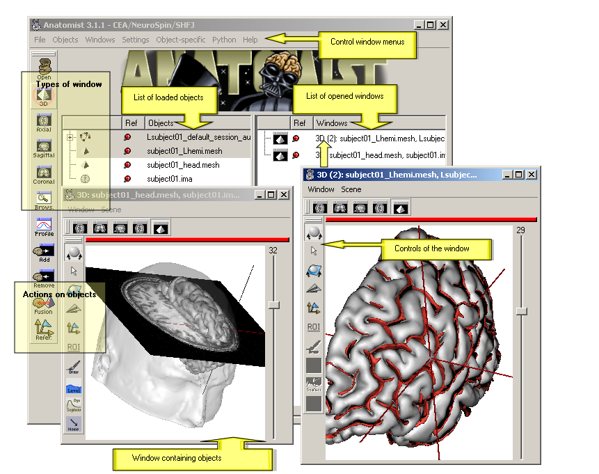

  Anatomist control window

See :anaman:`the manual<index.html>`.

Basic level
===========

Anatomist settings
------------------

In order to change the preferences:

* *Settings => Preferences*.
* Change what you need: display the linked cursor, display convention ...
* Save modifications for the next sessions in *File => Save global settings*.

.. _load_object:

Load an object
--------------

* *File => Open*.

* Select your object with the file browser, for instance:

  ``data_for_anatomist/subject01/subject01.nii``

* This object appears in the left list of the control window.

See :pyanatomist:`corresponding python script <pyanatomist_tutorial.html#load-an-object>`.

.. _view_object:

View an object
--------------

* Load ``data_for_anatomist/subject01/subject01.nii``
* Open an axial window by clicking on |window-axial-small|.
* Put the object (the volume) into this window: drag and drop this object into the window.

.. |window-axial-small| image:: ../ana_man/en/html/images/window-axial-small.png
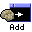

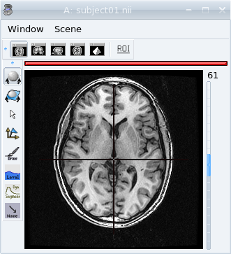

  View of a T1 MRI in an axial window.

* Open other types of windows (sagittal, coronal)
* Put the object into these windows by selecting the object and the windows and clicking on |window-add|.
* Click in one window. Notice that the cursor moves also in the other windows.
* It is possible to open several views using the menu *Windows -> Open 3D standard views* or *Open a 4 views block*. A block is a window that can contain several views. To add a window in a block, drag and drop the window item from Anatomist's list of windows to the block. To remove it, use the window menu *Window => Detach window*

.. figure:: ../ana_man/en/html/images/windows_block.png

  4 views block

:pyanatomist:`corresponding python script <pyanatomist_tutorial.html#view-an-object>`.

.. _zoom_trans_rotation:

Zoom, translation and rotation of a volume
------------------------------------------

* Load any volume.
* Place your cursor on |fb_trackball| to get information about shorcuts for zoom, rotations, etc.
* For example, try to do a rotation: click on the middle button and move simultaneously on the mouse.

.. |fb_trackball| image:: ../ana_man/en/html/images/fb_trackball.png

See :pyanatomist:`corresponding python script <pyanatomist_tutorial.html#camera>`.

.. _reader_header:

Read header information (voxel_size, dimension image ...)
---------------------------------------------------------

* Load ``data_for_anatomist/subject01/subject01.nii``
* Drag and drop on &window-browser-small;.
* Unroll the tree and read the information.

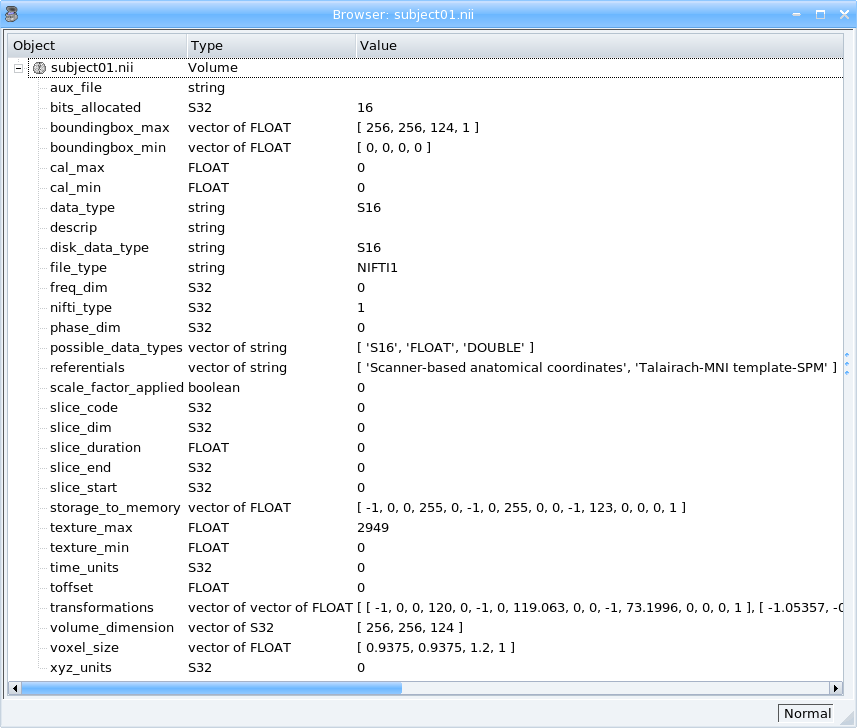

  Read header information

See :pyanatomist:`corresponding python script <pyanatomist_tutorial.html#view-header-information>`.

.. _change_palette:

Modification of color palette
-----------------------------

* Load and visualize a volume.
* Right-click on this object and choose *Color => Palette*.
* Change the palette by selecting of a new palette in the bottom left list.
* Try to change the values of *1st dimension settings* and see the effects on the volume display.

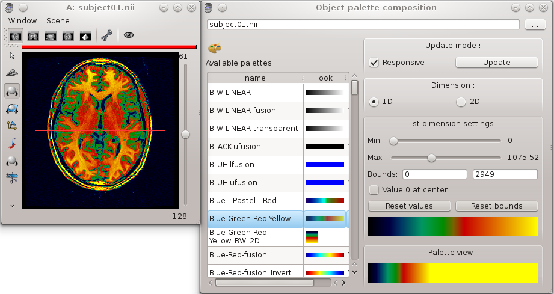

  Color Palette

Try to change the palette boundaries using the following **keyboard shortcuts**:

* *CTRL* key + right button click and move the mouse up and down: you change the **max** boundary of the palette.
* *CTRL* key + right button click and move the mouse left and right: you change the **min** boundary of the palette.

See :pyanatomist:`corresponding python script <pyanatomist_tutorial.html#change-the-color-palette>`.

Gradient Palette
++++++++++++++++

If you want to create a custom palette, you can use the Gradient palette module.

* Right-click on the object and choose *Color => gradient palette*.
* Change the palette by modifying the curves of the red, green and blue component.
* Save the palette image in ``$HOME/.anatomist/rgb``. It will be available in the list of palettes the next time you run anatomist and you will be able to modify it later by choosing this palette in the list and opening again the gradient palette module.

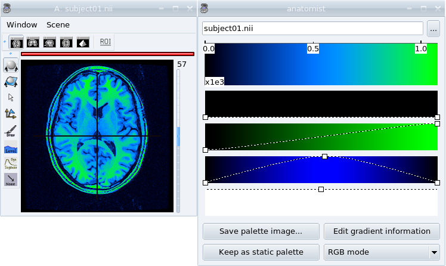

  Gradient Palette

.. _view_meshes:

View meshes
-----------

* Load:

  * ``data_for_anatomist/subject01/subject01_Lwhite.mesh``
  * ``data_for_anatomist/subject01/subject01_Rwhite.mesh``

* Open a 3D window by clicking on |window-3d-small|.
* Put the objects into this window: drag and drop them into the 3d window.

.. |window-3d-small| image:: ../ana_man/en/html/images/window-3d-small.png

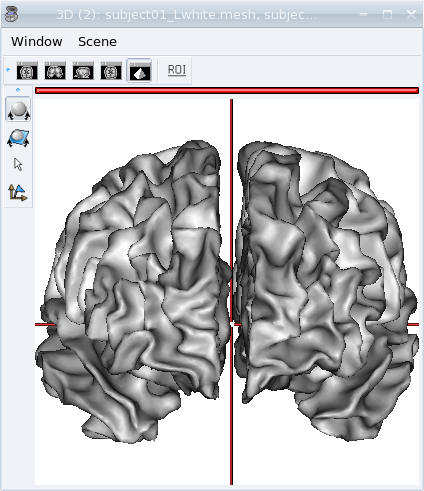

  View of white matter meshes in 3D window.

See :pyanatomist:`corresponding python script <pyanatomist_tutorial.html#view-meshes>`.

.. _superimpose:

Superimposing objects
---------------------

You can have several objects of different types in the same view. Lets superimpose a T1 MRI and the white matter meshes.

* Load:

  * T1 MRI: ``data_for_anatomist/subject01/subject01.nii``
  * Right white matter mesh: ``data_for_anatomist/subject01/subject01_Rwhite.mesh``
  * Left white matter mesh: ``data_for_anatomist/subject01/subject01_Lwhite.mesh``

* Open a 3D window by clicking on |window-3d-small|.
* Drag and drop the 3 objects into the 3D window.
* You can see the meshes but the T1 MRI is "hidden":
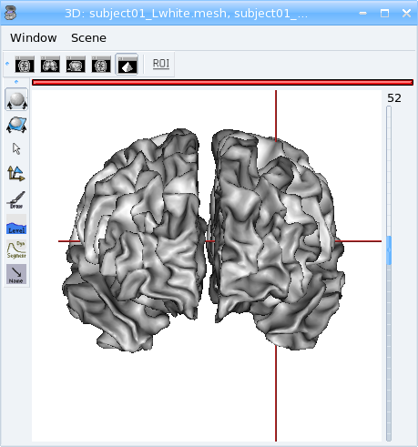

* To view it, use the middle button of your mouse to rotate the objects of this window, and now:
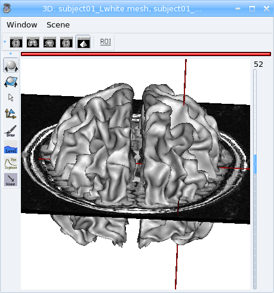

See :pyanatomist:`corresponding python script <pyanatomist_tutorial.html#superimposing>`.

.. _change_opacity_mesh:

Change the mesh material
------------------------

The color and opacity of a mesh can be changed using the right-click menu *Color => Material*.

* Load ``data_for_anatomist/subject01/subject01_head.mesh``
* Add it to the previous 3D window.
* Right-click on ``data_for_anatomist/subject01_head.mesh`` object and choose *Color => Material*.
* Change the opacity value.
* Change its color using the cursor red, green and blue

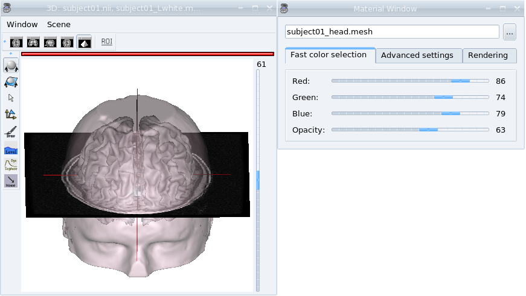

  Change the mesh material

See :pyanatomist:`corresponding python script <pyanatomist_tutorial.html#change-mesh-material>`.

.. _make_fusion:

Fusion between 2 volumes
------------------------

* Load:

  * Brain mask: ``data_for_anatomist/subject01/brain_subject01.nii``
  * T1 MRI: ``data_for_anatomist/subject01/subject01.nii``

* Put the 2 objects in the same window.

  What do you see ?

  You only see one of both volumes...

* Superimposing does not work here, we have to create a new object that mixes the 2 volumes.
* Select the 2 objects in the object list using **Ctrl + left buton**.
* Clik on the fusion button |fusion|.
* A new window is diplayed which allows to select some fusion parameters. Click just on *Ok* to create the fusion object:

.. |fusion| image:: ../ana_man/en/html/images/fusion.png

.. figure:: ../ana_man/en/html/images/fusion1.png

  Fusion window.

* Place this new object in a window.
* By default, all volumes have the same color palette. So we will `need to change this <change_palette_>`_ for one of the two volumes to help differentiate them. For instance, choose the *GREEN-ufusion* palette for the brain mask. Note that it is also possible to use the contextual menu *Color => Set distinct palette*, Anatomist will try to set automatically an appropriate palette for the object.
* It is possible to change the parameters of the fusion by right-clicking on the fusion object (Fusion2D) and select *Fusion => Control 2D fusion*.
* Set the *mapping mode* to *Linear* or *Linear / A if B is white*. Many modes have been added in Anatomist 4.3, allowing more flexibility according to the data to mix.
* You can change the *mixing rate* between objects to see more one or the other.

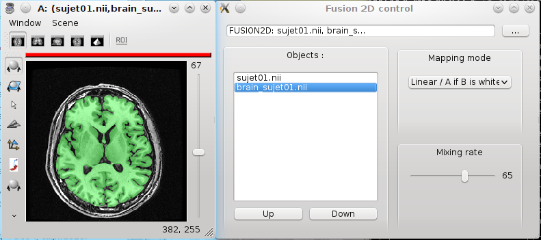

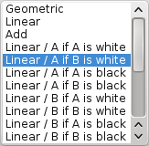

  Fusion volume/volume

See :pyanatomist:`corresponding python script <pyanatomist_tutorial.html#fusion-between-two-volumes>`.

Handling referentials and transformations
=========================================

In the previous examples, data came from one subject and one modality, so all images were in the same referential. With data from different subjects and modalities, it is more complicated, we have to take care about the different referentials. See :anaman:`Anatomist manual <ch08.html#ana_man%load_and_display_objects>` and `a presentation <../anatomist_referentials.pdf>`_ for details about referentials management.

.. _load_transformation:

Load a transformation
---------------------

**Visualization of the anatomical MRI of 2 subjects in a common referential (Talairach AC/PC-Anatomist)**

* Load:

  * subject01 T1 MRI: ``data_for_anatomist/subject01/subject01.nii``
  * subject02 T1 MRI: ``data_for_anatomist/subject02/subject02.ima``

* `Fusion the 2 images <make_fusion_>`_. Notice that they are not well superimposed because they are not in the same referential.

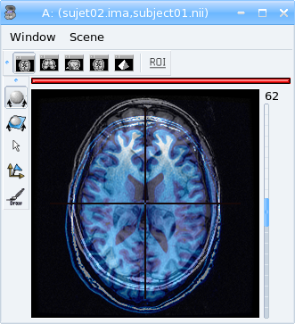

  Fusion between anatomical MRI of 2 subjects

* Right-click on each image then *Referential => Load => New*.
* Open the referentials window: *Windows => Referential windows*.
* Draw a line with the mouse from the referential of subject01 to the red referential named Talairach AC/PC-Anatomist and choose the tranformation file: ``data_for_anatomist/subject01/RawT1-subject01_default_acquisition_TO_Talairach-ACPC.trm``
* Draw a line with the mouse from the referential of subject02 to the red referential named Talairach AC/PC-Anatomist and choose the tranformation file: ``data_for_anatomist/subject02/RawT1-subject02_200810_TO_Talairach-ACPC.trm``
* Return to the window that displays the fusion and click on the menu *Scene => Focus view on objects*.
* Now, the display of the 2 images must be consistent.

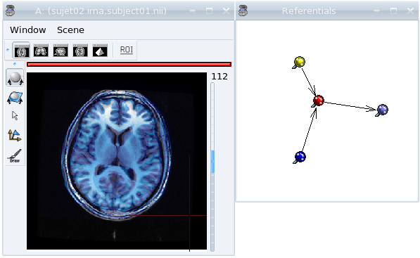

  Anatomical MRI of 2 subjects in a common referential

See :pyanatomist:`corresponding python script<pyanatomist_tutorial.html#load-a-transformation>`.

.. _load_existing_referential:

Load an existing referential
----------------------------

You can set an existing referential to an object when several objects are in the same "real world". For example, a mesh created from a T1 MRI is in the same referential as the MRI.

* Load subject01 white mesh: ``data_for_anatomist/subject01/subject01_Lwhite.mesh``.
* Put it in the previous window containing the fusion between the MRI of the 2 subjects. Notice that it is not displayed at the same place as the MRIs.

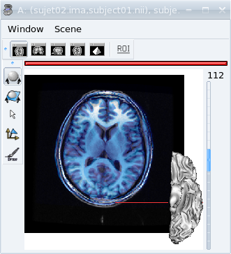

  Before loading referential

* Apply the referential of subject01.nii to this mesh with right-click menu *Referential => Load*.
* Now, the display is correct.

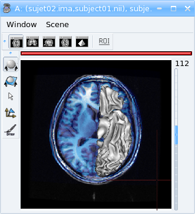

  After loading referential

See :pyanatomist:`corresponding python script<pyanatomist_tutorial.html#load-an-existing-referential>`.

.. _load_referential_info:

Load referential information from file header
---------------------------------------------

The option *Referential => Load information from file header* extracts information about referentials and transformations which are stored in the image files. Indeed, some formats like DICOM or Nifti enable to store this kind of information. Theses transformations are not applied automatically by anatomist by default, but it is possible to change that in *Settings => Preferences => Volume*.

**Fusion between an anatomical volume and an activation map**

* Load:

  * T1 MRI: ``data_for_anatomist/subject01/subject01.nii``
  * Activation map: ``data_for_anatomist/subject01/Audio-Video_T_map.nii``

* `Fusion the 2 images <make_fusion_>`_. Note that they are not well superimposed because they are not in the same referential. But they are in Nifti format and contain information about a transformation to the referential *Talairach-MNI Template-SPM*.
* For each volume, right-click *Referential => Load information from file header*.
* Look at the fusion, the 2 images are now well superimposed.
* Change the point of view by changing the referential of the window: click on the colored bar at the top of the window and choose *Talairach-MNI Template-SPM*. Notice the change of orientation.

.. figure:: ../ana_man/en/html/images/fusion_map_anat_1.png

  Fusion between an activation map and a T1 MRI

.. note:: **Note about SPM2**

  SPM2 can use a .mat file to store the origin information, so the information in the regular Analyze header is not always reliable. Anatomist cannot read .mat (matlab) files, but .trm files. To :axontuto:`convert the .mat file to .trm<ch07.html#bv_training%convert_matTOtrm>`, and then `load a transformation <load_transformation_>`_.

.. note:: **Note about SPM5 / SPM8**

  In this example, the 2 images contain information about the transformation to a common referential *Talairach-MNI template-SPM*. Be careful, this information is not in all images and the destination referential is not always the same. SPM8 for example, doesn't always set this normalized MNI template referential as the destination referential when it normalizes an image. In this case, Anatomist creates to different destination referentials. To indicate that these referentials are identical, you can put an identity transformation between the 2 referentials: draw a line with the mouse between the 2 referentials while pressing the *Ctrl key*.

Manual registration with the transformation control
---------------------------------------------------

.. |fb_control_transfo| image:: ../ana_man/en/html/images/fb_control_transfo.png

* Load:

  * T1 MRI: ``data_for_anatomist/subject01/subject01.nii``
  * Activation map: ``data_for_anatomist/subject01/Audio-Video_T_map.nii``

* Put each volume into a window.
* Change the activation map `color palette <change_palette_>`_.
* `Make a fusion <make_fusion_>`_ between the 2 volumes.
* Right-click on the window of the functional volume and select *View / Select object*.
* Select the object in the browser.
* Click on |fb_control_transfo|.
* Now you can move the functional volume as you like, notice that the object also moves in the fusion window.

  * A `translation <zoom_trans_rotation_>`_ is done using **ctl + middle mouse button + mouse move**.
  * To do other operations like scaling and rotation, see the help on the control button tooltip.

* *Settings => Referential window*.
* A new transformation has been created. Right-click on the black line and select *Save transformation*.
* You will be able to `reload this transformation <load_transformation_>`_ later or for instance read/use the information file to initiate a registration algorithm.

.. warning::

  Use this toolbox carefully because you **manually** handle the registration. In fact the human eye cannot drive a registration as well as a specific algorithm. For instance, images may seem aligned in an axial slice, but contain some drifts in sagittal and coronal orientations. Anyway this tool can be helpful, and may be used to initiate a coregistration algorithm.

.. _radio_neuro_aimsrc:

Radiological/neurological convention and usage of aimsrc configuration
----------------------------------------------------------------------

.. warning::

  This part of the tutorial is related to flipped display problems that may occur, **especially when using the Analyze format**. It is highly recommended to use the Nifti format instead of Analyze format. Indeed, Analyze format used to lack information about convention, which leads to ambiguities in the way of displaying images.

Before beginning, please note the difference between the Anatomist display, how data are stored and how data are read:

* **What does "the Anatomist display" mean**: the display is independant of storing and reading data on your disk. You can display data in neurological convention even if they are stored and read like radiological data. It depends on settings (*Settings -> Preferences -> Windows*).
* **How data is stored**: this corresponds to the file organization.
* **How data is read**: Anatomist and the underlying (AIMS) library, will always try to load data in computer memory in radiological convention, as long as it can determine the file orientation. This may be tricky for formats not specifying it, such as Analyze. Attributes contained in .aimsrc and .minf file can give additional information. For instance, the *spm_radio_convention* indicates that the data is in radiological convention if value is 1 otherwise SPM data will read in neurological convention.

So, in our tools two files may provide information about reading data, in addition to native formats information: the .minf and the .aimsrc files. The .minf file has priority since it is specific to a data file, whereas .aimsrc is the global default fallback. To summarize, volumes are considered in radiological convention, then information from .minf and/or .aimsrc file are read and data is displayed according to Anatomist settings.

Here we have many examples of configurations. Tests are run with an analyze data set with or without the .minf file. If you want to try them, then you must create the .minf file (<data_name>.img.minf) and the .aimsrc file (if your user account doesn't already have it) with a text file editor. In order to try the configurations, you can use the following demonstration data, which can be found in the ``data_for_anatomist/right_and_left`` directory. A correct display will be checked by visualizing a lesion located in the right hemisphere. Note that the data is stored in radiological convention and normalized with SPM2. In other words, normalized data is in radiological convention, but **WARNING**: the output convention after normalization depends on your SPM configuration. In our case, we considere that the input and output convention after SPM2 normalization are the same.

.. raw:: html

    <table id="minf/aimsrc files">
        <thead>
          <tr class="row-odd">
            <th class="head">Configuration</th>
            <th class="head">Normalized data and display with radiological convention</th>
            <th class="head">Non-normalized data and display with radiological convention</th>
          </tr>
        </thead>
        <tbody>
          <tr>
            <td>
              
<b>.minf file:</b> none

              

                <b>.aimsrc file</b>
                <pre>attributes = {
                  '__syntax__' : 'aims_settings',
                  'spm_input_radio_convention' : 1,
                  'spm_input_spm2_normalization' : 0,
                  'spm_output_radio_convention' : 1,
                  'spm_output_spm2_normalization' : 0,
                  }</pre>

            </td>
            <td>
              <mediaobject>
                <imageobject role="fop"><imagedata fileref="&DIR_IMG;case_1_norm.png" format="PNG"  width="55"/></imageobject>
                <imageobject role="html"><imagedata fileref="&DIR_IMG;case_1_norm.png" format="PNG" width="70"/></imageobject>
              </mediaobject>
              
The display is not correct. <b>Why</b>: data is normalized with SPM2 and the settings indicate the SPM99 mode use with spm_input_spm2_normalization = 0 (thus a flip on x axis is done).

            </td>
            <td>
              <mediaobject>
                <imageobject role="fop"><imagedata fileref="&DIR_IMG;case_1_nonorm.png" format="PNG"  width="70"/></imageobject>
                <imageobject role="html"><imagedata fileref="&DIR_IMG;case_1_nonorm.png" format="PNG" width="85"/></imageobject>
              </mediaobject>
              
The display is correct.

            </td>
          </tr>
          <tr>
            <td>
              
<b>.minf file:</b> none

              
<b>.aimsrc file</b>
                <pre>attributes = {
                  '__syntax__' : 'aims_settings',
                  'spm_input_radio_convention' : 1,
                  'spm_input_spm2_normalization' : 1,
                  'spm_output_radio_convention' : 1,
                  'spm_output_spm2_normalization' : 1,
                  }</pre>

            </td>
            <td>
              <mediaobject>
                <imageobject role="fop"><imagedata fileref="&DIR_IMG;case_2_norm.png" format="PNG"  width="55"/></imageobject>
                <imageobject role="html"><imagedata fileref="&DIR_IMG;case_2_norm.png" format="PNG" width="70"/></imageobject>
              </mediaobject>
              
The display is correct.

            </td>
            <td>
              <mediaobject><imageobject role="fop">
                  <imagedata fileref="&DIR_IMG;case_2_nonorm.png" format="PNG"  width="70"/></imageobject>
                <imageobject role="html"><imagedata fileref="&DIR_IMG;case_2_nonorm.png" format="PNG" width="85"/></imageobject></mediaobject>
              
The display is correct.

            </td>
          </tr>
          <tr>
            <td>
<b>.minf file (for each volume)</b>
                <pre>attributes = {
                  'spm_spm2_normalization': 1
                  }</pre>

              
<b>.aimsrc file</b>
                <pre>attributes = {
                  '__syntax__' : 'aims_settings',
                  'spm_input_radio_convention' : 1,
                  'spm_input_spm2_normalization' : 0,
                  'spm_output_radio_convention' : 1,
                  'spm_output_spm2_normalization' : 0,
                  }</pre>

            </td>
            <td>
              <mediaobject>
                <imageobject role="fop"><imagedata fileref="&DIR_IMG;case_3_norm.png" format="PNG"  width="55"/></imageobject>
                <imageobject role="html"><imagedata fileref="&DIR_IMG;case_3_norm.png" format="PNG" width="70"/></imageobject>
              </mediaobject>
              
The display is correct. <b>But</b>: information between the .minf and the .aimsrc are different. The correct information is contained in the .minf file, which is read in priority.

            </td>
            <td>
              <mediaobject><imageobject role="fop"><imagedata fileref="&DIR_IMG;case_3_nonorm.png" format="PNG"  width="70"/></imageobject>
                <imageobject role="html"><imagedata fileref="&DIR_IMG;case_3_nonorm.png" format="PNG" width="85"/></imageobject></mediaobject>
              
The display is correct. <b>But</b>: information contained in the .minf file is not adapted to the volume.

            </td>
          </tr>
          <tr>
            <td>
<b>.minf file (for each volume)</b>
                <pre>attributes = {
                  'spm_spm2_normalization': 0
                  }</pre>

              
<b>.aimsrc file</b>
                <pre>attributes = {
                  '__syntax__' : 'aims_settings',
                  'spm_input_radio_convention' : 1,
                  'spm_input_spm2_normalization' : 1,
                  'spm_output_radio_convention' : 1,
                  'spm_output_spm2_normalization' : 1,
                  }</pre>

            </td>
            <td>
              <mediaobject>
                <imageobject role="fop"><imagedata fileref="&DIR_IMG;case_4_norm.png" format="PNG"  width="55"/></imageobject>
                <imageobject role="html"><imagedata fileref="&DIR_IMG;case_4_norm.png" format="PNG" width="70"/></imageobject>
              </mediaobject>
              
The display is not correct. <b>Why</b>: data is normalized with SPM2 and the settings indicate the SPM99 mode use with spm_spm2_normalization = 0 (thus a flip on x axis is done).

            </td>
            <td>
              <mediaobject>
                <imageobject role="fop"><imagedata fileref="&DIR_IMG;case_4_nonorm.png" format="PNG"  width="70"/></imageobject>
                <imageobject role="html"><imagedata fileref="&DIR_IMG;case_4_nonorm.png" format="PNG" width="85"/></imageobject></mediaobject>
              
The display is correct. <b>But</b>: information contained in the .minf file is not adapted to the volume.

            </td>
          </tr>
          <tr>
            <td>
<b>.minf file (for each volume)</b>
                <pre>attributes = {
                  'spm_radio_convention' : 1
                  }</pre>

              
<b>.aimsrc file</b>
                <pre>attributes = {
                  '__syntax__' : 'aims_settings',
                  'spm_input_radio_convention' : 1,
                  'spm_input_spm2_normalization' : 0,
                  'spm_output_radio_convention' : 1,
                  'spm_output_spm2_normalization' : 0,
                  }</pre>

            </td>
            <td>
              <mediaobject>
                <imageobject role="fop"><imagedata fileref="&DIR_IMG;case_5_norm.png" format="PNG"  width="55"/></imageobject>
                <imageobject role="html"><imagedata fileref="&DIR_IMG;case_5_norm.png" format="PNG" width="70"/></imageobject>
              </mediaobject>
              
The display is correct. <b>But</b>: information contained in the .minf file is not adapted to the volume.

            </td>
            <td>
              <mediaobject><imageobject role="fop"><imagedata fileref="&DIR_IMG;case_5_nonorm.png" format="PNG"  width="70"/></imageobject>
                <imageobject role="html"><imagedata fileref="&DIR_IMG;case_5_nonorm.png" format="PNG" width="85"/></imageobject></mediaobject>
              
The display is correct.

            </td>
          </tr>
        </tbody></table>

Handling regions of interest and sulci graphs
=============================================

            <sect1 id='ana_training%draw_roi'><title>Draw regions of interest (graph of ROIs)</title>
              <itemizedlist>
                <listitem><para>Load any volume.</para></listitem>
                <listitem><para>Place it into a window.</para></listitem>
                <listitem><para>Click on &fb_roi; of this window.</para></listitem>
                <listitem><para>Select the <emphasis>RoiManagement</emphasis> panel.</para></listitem>
                <listitem><para><emphasis>Session =&gt; New</emphasis>.</para></listitem>
                <listitem><para><emphasis>Region =&gt; New</emphasis> and provide a name.</para></listitem>
                <listitem><para>Change the brush: <emphasis>Paint =&gt; Disk</emphasis>, <emphasis>Bush Radius = 7</emphasis>.</para></listitem>
                <listitem><para>Draw your region on the window.</para></listitem>
                <listitem><para><emphasis>Session =&gt; Save As</emphasis>.</para></listitem>
                <listitem><para>Click <emphasis>Ok</emphasis>.</para></listitem>
              </itemizedlist>
              <warning>Be careful to draw in a window which is in the same referential than the volume. Indeed, the voxels are drawn in the referential of the view, so, if it is not the referential of the volume, the voxels of the ROI and the voxels of the volume won't be in the same orientation.</warning>
              <para>See the <ulink url="#ana_man%roi_toolbox">ROI drawing toolbox chapter</ulink> in Anatomist manual for more details about the ROI drawing toolbox.</para>
            </sect1>

            <sect1 id="ana_training%view_roi"><title>Display a graph of ROI</title>
              <itemizedlist>
                <listitem><para>Load <filename>&data_ana;roi/basal_ganglia.arg</filename>.</para></listitem>
                <listitem><para>Place the graph into a 3D window &window-3d-small;.</para></listitem>
                <listitem><para>To select a specific region, click on the <emphasis>view/select object</emphasis> menu by right-clicking on the 3D window. A browser with the graph object is now diplayed.</para></listitem>
                <listitem><para>To select one or several regions, unroll the graph and select the corresponding nodes.</para></listitem>
              </itemizedlist>
              <mediaobject>
                <imageobject role="fop"><imagedata fileref="&DIR_IMG;ana_training_exo_roi-1.png" format="PNG"  width="250"/></imageobject>
                <imageobject role="html"><imagedata fileref="&DIR_IMG;ana_training_exo_roi-1.png" format="PNG"/></imageobject>
              </mediaobject>
              <para>See <ulink url="#sphinxpyanatomist%tutorial_display-a-roi-graph">corresponding python script</ulink>.</para>
            </sect1>

            <sect1><title>Display a meshed graph of ROI</title>
              <itemizedlist>
                <listitem><para>Load <filename>&data_ana;roi/mbasal_ganglia.arg</filename>.</para></listitem>
                <listitem><para>Place the graph into a 3D window &window-3d-small;.</para></listitem>
                <listitem><para>To select a specific region, click on the <emphasis>view/select object</emphasis> menu by right-clicking on the 3D window. A browser with the graph is now diplayed.</para></listitem>
                <listitem><para>To select one or several regions, unroll the graph and select the corresponding nodes.</para></listitem>
              </itemizedlist>
              <mediaobject>
                <imageobject role="fop"><imagedata fileref="&DIR_IMG;ana_training_exo_roi-2.png" format="PNG"  width="250"/></imageobject>
                <imageobject role="html"><imagedata fileref="&DIR_IMG;ana_training_exo_roi-2.png" format="PNG"/></imageobject>
              </mediaobject>
            </sect1>

            <sect1><title>Display only selected nodes of a sulci graph</title>
              <itemizedlist>
                <listitem><para>Load <filename>&data_ana;subject01/sulci/Lsubject01_default_session_auto.arg</filename>.</para></listitem>
                <listitem><para>Open a 3D window &window-3d-small;.</para></listitem>
                <listitem><para>Select your graph in the list of objects and the new 3D window &window-3d-small; with the mouse.</para></listitem>
                <listitem><para>Select <emphasis>Display =&gt; Add without nodes</emphasis> menu by right-clicking on the sulci graph.</para></listitem>
                <listitem><para>An empty window is displayed. To view a sulcus, you have to select it in the graph.</para></listitem>
                <listitem><para>Select <emphasis>view/select object</emphasis> menu by right-clicking on the 3D window. A browser with the graph is now diplayed.</para></listitem>
                <listitem><para>To display one or several nodes, unroll the graph and select them.</para></listitem>
              </itemizedlist>
              <para>
              <mediaobject>
                <imageobject role="fop"><imagedata fileref="&DIR_IMG;ana_training_display_nodes.png" format="PNG"  width="250"/></imageobject>
                <imageobject role="html"><imagedata fileref="&DIR_IMG;ana_training_display_nodes.png" format="PNG"/></imageobject>
              </mediaobject>
              </para>
              <para>
              <mediaobject>
                <imageobject role="fop"><imagedata fileref="&DIR_IMG;ana_training_display_nodes2.png" format="PNG"  width="250"/></imageobject>
                <imageobject role="html"><imagedata fileref="&DIR_IMG;ana_training_display_nodes2.png" format="PNG"/></imageobject>
              </mediaobject>
              </para>
            </sect1>

            <sect1><title>Change the name attribute of a graph node</title>
              <itemizedlist>
                <listitem><para>Load a sulci graph: <filename>&data_ana;subject01/sulci/Lsubject01_default_session_auto.arg</filename>.</para></listitem>
                <listitem><para>Place it into a &window-browser-small;.</para></listitem>
                <listitem><para>Select a node.</para></listitem>
                <listitem><para><emphasis>Right-click =&gt; Modify name</emphasis>.</para></listitem>
                <listitem><para>Enter a new value.</para></listitem>
                <listitem><para>Place your cursor on the graph object (to right) in Anatomist control window.</para></listitem>
                <listitem><para><emphasis>Right-click =&gt; File =&gt; Save</emphasis>.</para></listitem>
                <listitem><para>Provide a new name if you don't want to erase the original file.</para></listitem>
              </itemizedlist>
            </sect1>

            <sect1><title>Copy label values between sulci graph nodes</title>
             <para>To perform manual labelling (or to correct automatic labellings) in sulci graphs, you can copy and paste label values between graph nodes (inside the same graph or between different graphs). The attribute used to pick / store label values depends on the the label_property (name or label) of the global attributes for each graph, just like nomenclature colors application. Note that if your graph does not have the label_property attribute, then the default value is the value of graph parameters =&gt; Use attribute =&gt; label or name.</para>
             <para>For instance, to copy/paste bewteen different graphs:</para>
             <itemizedlist>
                <listitem><para>Load 2 sulci graphs.</para></listitem>
                <listitem><para>Change or check the value of label_property by clicking on Graph =&gt; Labelling =&gt; Use Automatic Labelling.</para></listitem>
                <listitem><para>Place each graph into a &window-3d-small;.</para></listitem>
                <listitem><para>Select a node from graph A (make sure the window is in selection control mode).</para></listitem>
                <listitem><para>Click on space key (to store the attribute value). The label value and color should appear in a small box in the top toolbar of the window.</para></listitem>
                <listitem><para>Select a node from graph B.</para></listitem>
                <listitem><para>Click on &lt;ctrl&gt; and &lt;enter&gt; keys (to copy the attribute value).</para></listitem>
                <listitem><para><emphasis>Don't forget to save the graph and provide a new name if you don't want to erase the original file</emphasis>.</para></listitem>
              </itemizedlist>
            </sect1>

            <sect1><title>Nomenclature and graph</title>
              <sect2><title>Load and use a nomenclature</title>
              <itemizedlist>
                <listitem><para>Load <filename>&data_ana;roi/basal_ganglia.hie</filename>.</para></listitem>
                <listitem><para>Place the nomenclature into a browser &window-browser-small;.</para></listitem>
                <listitem><para>Load <filename>&data_ana;roi/basal_ganglia.arg</filename>.</para></listitem>
                <listitem><para>Place the graph into a 3D window &window-3d-small;.</para></listitem>
                <listitem><para>Select <emphasis>central</emphasis>, <emphasis>hemisph_left</emphasis> <!-- and <emphasis>hemisph_right</emphasis>--> in the browser of the <filename>basal_ganglia.hie</filename>.</para></listitem>
                <listitem><para>Note that you can handle the ROIs by using the <emphasis>selection control</emphasis>  &fb_select; of the 3D window. Click on this control, and now select different parts of the graph.
                    <!-- To view the specific colors by clicking on <emphasis>selection control</emphasis>  &fb_select; of the 3D window and then click on any ROI.--></para></listitem>
              </itemizedlist>
              <mediaobject>
                <imageobject role="fop"><imagedata fileref="&DIR_IMG;ana_training_exo_roi-3.png" format="PNG"  width="300"/></imageobject>
                <imageobject role="html"><imagedata fileref="&DIR_IMG;ana_training_exo_roi-3.png" format="PNG"/></imageobject>
              </mediaobject>
              <warning>If the specific colors are not displayed, see <emphasis>Settings =&gt; Graph parameters  =&gt; Colors 2D/3D</emphasis>
                and activate/deactivate the <emphasis>Use nomenclature / Colors binding</emphasis> option.</warning>
            </sect2>

            <sect2 id='ana_training%write_nomenclature' infoid='Write a nomenclature'><title>Write a simple nomenclature (.hie) </title>

              <para>KEYWORDS: .hie file.</para>

              <para>Here is the syntax for a nomenclature with 2 regions: region_A and region_B.</para>
              <screen>
                # tree 1.0

                *BEGIN TREE hierarchy
                graph_syntax RoiArg

                *BEGIN TREE fold_name
                name  region_A
                color 170 85 255

                *END

                *BEGIN TREE fold_name
                name  region_B
                color 255 170 0

                *END

                *END
              </screen>

              <itemizedlist>
                <listitem><para>Copy those lines into a new text file. <!-- with an text editor such as wordpad under windows or nedit if you work with linux.--></para></listitem>
                <listitem><para>Save the file with the following name: <emphasis>my_nomenclature.hie</emphasis>. Under Windows, be careful with the file extension: Windows sometimes hides extensions or adds its own, so you may have to check or fix it.<!--Be aware that the file extension under Windows because
                                                                    sometimes it is not display and the file can not used. In this case, you can try to rename it with the extension.--></para></listitem>
                <listitem><para>Open an Anatomist session.</para></listitem>
                <listitem><para>Open any volume.</para></listitem>
                <listitem><para>Draw a ROI graph with 2 regions. The names must be exactly region_A and region_B to link with the nomenclature.</para></listitem>
                <listitem><para>Load <emphasis>my_nomenclature.hie</emphasis> in your Anatomist session.</para></listitem>
                <listitem><para>Update the display by selecting and de-selecting of <emphasis>Use Nomenclature/colors bindings</emphasis>  in the <emphasis>Settings -&gt; graph paremeters</emphasis> <!-- and check that <emphasis>Use attribute</emphasis> is set to <emphasis>name</emphasis> in <emphasis>Settings =&gt; Graph parameters</emphasis>. In fact, the <emphasis>name/label</emphasis> values can be a source of mistakes.--><!-- Label attribute is used in advanced level.--></para></listitem>
                <listitem><para>You can switch to the selection mode with &fb_select;.</para></listitem>
              </itemizedlist>

              <!--<figure><title>Two regions with a basic nomenclature</title>
                <mediaobject>
                  <imageobject role="fop"><imagedata fileref="&DIR_IMG;my_nomenclature.png" format="PNG"  width="100"/></imageobject>
                  <imageobject role="html"><imagedata fileref="&DIR_IMG;my_nomenclature.png" format="PNG"/></imageobject>
                </mediaobject>
              </figure>-->

    </sect2>
  </sect1>

  <sect1><title>SULCI GRAPH: copy the label values to name values</title>
    <para>After an automatic recognition of sulci, it is possible to switch between automatic labelling and manual labelling modes, that is, use the 'name' (manual) or 'label' (automatic) attribute to store labels in graph nodes. You can copy all label values into name values. After that, you can modify the name attributes and keep the original value in the label attribute.</para>
    <itemizedlist>
      <listitem><para>Open a sulci graph.</para></listitem>
      <listitem><para>Click on graph =&gt; Labelling =&gt; Move automatic labelling ('label') to manual ('name').</para></listitem>
    </itemizedlist>

  </sect1>

  <sect1><title>Surface paint module</title>
    <para>A surface painting module is present in Anatomist. This tool allows to draw textures on a mesh, using several drawing tools. This module has been primarily developed in the specific aim of drawing sulcal constraints to build a 2D coordinates system on the brain (see the Cortical Surface toolbox in BrainVisa), but can be used in a general way to draw any texture values.</para>
    <para>A demonstration video is available here: <ulink url="http://pages-perso.esil.univmed.fr/~le-troter/movies/files/page4-1006-pop.html">Surface Paint movie</ulink>.</para>

    <sect2><title>Basic drawing</title>
    <itemizedlist>
      <listitem><para>Load a mesh: <filename>&data_ana;subject01/subject01_Lwhite.mesh</filename>.</para></listitem>
      <listitem><para>Select it and click on &sulci;.</para></listitem>
      <listitem><para>Click on the <emphasis>Ok</emphasis> button on the new popup window. The options in this window are useful only to build a 2D coordinates system on the cortical surface.</para></listitem>
      <listitem><para>A new 3D window containing the mesh opens.</para></listitem>
      <listitem><para>A new control &palette; should be available in the 3D window. Select it.</para></listitem>
      <listitem><para>Several new icons and parameters are now available in the 3D window to allow drawing on the surface.</para></listitem>
      <listitem><para>To draw, click on the &stylo; icon and maintain left mouse button while moving the mouse on the mesh.</para></listitem>
      <listitem><para>The drawing will be saved in a texture file which associates a value to each point of the mesh. You can change the current texture value in the text field labelled <emphasis>Texture value</emphasis>. The colors associated to each texture value depends on the color palette of the texture. To change it, select the object <emphasis>TexConstraint</emphasis> in Anatomist main window and use the contextual menu <emphasis>Color -> Palette</emphasis></para></listitem>
      <listitem><para>To erase a drawing, click on the &erase; icon and maintain left mouse button while moving the mouse on the mesh.</para></listitem>
      <listitem><para>It is possible to fill a closed region using the magic wand icon &magic;, then clicking on the region to fill and validate the selection with &valide; icon.</para></listitem>
      <listitem><para>When the drawing is finished, save it in a texture file using the &surfpaint_save; icon. Select the location, type a file name. It is possible to save in tex (<emphasis>*.tex</emphasis>) or gifti (<emphasis>*.gii</emphasis>) formats.</para></listitem>
    </itemizedlist>
    <figure><title>Surface paint window</title>
      <mediaobject><imageobject role="fop"><imagedata fileref="&DIR_IMG;surfpaint.png" format="PNG" width="600"/></imageobject>
        <imageobject role="html"><imagedata  fileref="&DIR_IMG;surfpaint.png" format="PNG"/></imageobject></mediaobject>
    </figure>

  </sect2>
    <sect2><title>Constrained drawing</title>
      <para>It is also possible to draw according anatomical constraints. For example, following the depth of the sulci or the top of the gyri.</para>
    <itemizedlist>
      <listitem><para> To do so, select a constraint by choosing an icon among &shortest; for unconstrained path, &sulci; for drawing paths following the sulci or &gyri; for drawing paths following the gyri.</para></listitem>
      <listitem><para> Then draw on the mesh by clicking on a first point that will be the beginning of the path and a second that will be the end of the path, the tool will automatically compute a path between the 2 points according to the selected constraint.</para></listitem>
      <listitem><para> To really write the computed path, you have to validate it using the &valide; icon.</para></listitem>
      <listitem><para> If you want to remove the computed path, you can use the &clear; icon.</para></listitem>
    </itemizedlist>
  </sect2>
  <sect2><title>Reload a drawing</title>
    <itemizedlist>
      <listitem><para> Load the mesh: <filename>&data_ana;subject01/subject01_Lwhite.mesh</filename>.</para></listitem>
      <listitem><para> Load the previously saved texture file.</para></listitem>
      <listitem><para> Do a <link linkend="ana_training%fusion_mesh_tex">FusionTexSurfMethod fusion</link> between the mesh and the texture.</para></listitem>
      <listitem><para> Select the fusion object in Anatomist main window and click on the &sulci; icon.</para></listitem>
      <listitem><para>A new 3D window containing the mesh opens.</para></listitem>
      <listitem><para>The new control &palette; should be available in the 3D window. Select it.</para></listitem>
      <listitem><para>You can now go on with the drawing on the surface of the mesh.</para></listitem>
    </itemizedlist>
    <note><para>When visualizing such a texture on a mesh, it is better to check the option <emphasis>RGB space interpolation (label textures)</emphasis> in the texturing params of the texture object (<emphasis>Contextual menu -> Color -> Texturing</emphasis>). This way, the interpolation is done on the RGB colors of the palette, not on the value of the texture.</para></note>
  </sect2>
  <para>More functionalities are available in the SurfPaint module but will not be discussed here in the tutorial. Please refer to <ulink url='#ana_man%book'>the complete manual</ulink> to get more information.
  </para>
  </sect1>

  <sect1><title>Extraction and merging of sulci meshed (from sulci graph) and fusion between them</title>
    <para>This exercise shows how to extract a graph node mesh (ie sulcus or sulcus part), and merge or rather concatenate several such meshes. Note this example only works on graphs containing meshes.</para>

    <para><emphasis role="bold">EXTRACTION OF EACH MESH FROM A GRAPH</emphasis></para>
    <itemizedlist>
      <listitem><para>Put your sulci graph into a browser.</para></listitem>
      <listitem><para>Select a node and save its mesh by right-clicking on the mesh (aims_Tmtktri) in a browser and selecting <emphasis>Object-specific</emphasis> <emphasis>File</emphasis>=&gt;<emphasis>Save</emphasis>.</para></listitem>
      <listitem><para>specify an output file name as <emphasis>NameSulcus1.mesh</emphasis>.</para></listitem>
    </itemizedlist>

    <para><emphasis role="bold">CONCATENATION OF ALL SAVED MESHES</emphasis></para>
    <itemizedlist>
      <listitem><para>Usage of the AimsZcat command line:</para>
        <screen>AimsZCat -i NameSuclcus1.mesh NameSuclcus2.mesh NameSuclcus3.mesh -o AllMesh.mesh</screen>This command has other options, but here we need:
        <itemizedlist>
          <listitem><para><emphasis>-i option</emphasis>: list of meshes to concatenate.</para></listitem>
          <listitem><para><emphasis>-o option</emphasis>: output filename for the concatenated mesh.</para></listitem>
        </itemizedlist>
      </listitem>
    </itemizedlist>
  </sect1>

Combining objects
=================

  <sect1 id='ana_training%FusionSliceMethod' infoid='Fusion a volume with itself'><title> <inlinemediaobject> <imageobject role="fop"><imagedata fileref="&DIR_IMG;fusion_slice_method_little.png" format="PNG" width="30"/></imageobject><imageobject role="html"><imagedata fileref="&DIR_IMG;fusion_slice_method_little.png" format="PNG"  /></imageobject></inlinemediaobject> Fusion a volume with itself </title>

    <para>KEYWORDS:  FusionSliceMethod.</para>

    <itemizedlist>
      <listitem><para>Load a T1 MRI: <filename>&data_ana;subject01/subject01.nii</filename></para></listitem>
      <listitem><para>Select the object in the Anatomist objects list.</para></listitem>
      <listitem><para>Click on &fusion; to create a <emphasis>Slice</emphasis> object.</para></listitem>
      <listitem><para>Select the <emphasis>Slice</emphasis> and O1 objects and drag them into a sagittal window.</para></listitem>
      <listitem><para>Rotate the objects to view the two planes (click on the middle button and move simultaneously on the mouse).</para></listitem>
      <listitem><para>To change the slice plane, activate it by right-click on the window and select <emphasis>view/select object</emphasis> menu. Then select the new control &control-cut; and use the keyboard shortcuts to move the plane (Ctrl key + middle mouse button for translation for example).</para></listitem>
    </itemizedlist>

    <figure><title>FusionSliceMethod: cut a volume across itself</title>
      <mediaobject><imageobject role="fop"><imagedata fileref="&DIR_IMG;fusion_slice_method2.png" format="PNG"
                                                      width="200"/></imageobject>
        <imageobject role="html"><imagedata  fileref="&DIR_IMG;fusion_slice_method2.png" format="PNG"/></imageobject></mediaobject>
    </figure>

  </sect1>

  <sect1 id='ana_training%fusion_whitemesh_map' infoid='Fusion between a cortical surface mesh and an activation map'><title>
      <inlinemediaobject><imageobject role="fop"><imagedata fileref="&DIR_IMG;fusion_map_whitemesh_little.png" format="PNG" width="30"/></imageobject><imageobject role="html"><imagedata fileref="&DIR_IMG;fusion_map_whitemesh_little.png" format="PNG"/></imageobject></inlinemediaobject>
      Fusion between a cortical surface mesh and an activation map</title>

    <para>KEYWORDS:  Fusion3Dmethod.</para>

    <itemizedlist>
      <listitem><para>Load:
        <itemizedlist>
          <listitem>White matter mesh: <filename>&data_ana;subject01/subject01_Lwhite.mesh</filename></listitem>
          <listitem>Activation map: <filename>&data_ana;subject01/Audio-Video_T_map.nii</filename></listitem>
          <listitem>T1 MRI: <filename>&data_ana;subject01/subject01.nii</filename></listitem>
        </itemizedlist>
      </para>
      </listitem>
      <listitem><para>Change the <link linkend='ana_training%change_palette'>color palette</link> of the map.</para></listitem>
      <listitem><para><link linkend='ana_training%load_referential_info'>Load referential information from file header</link> for the map and the T1 MRI.</para></listitem>
      <listitem><para><link linkend='ana_training%load_existent_referential'>Apply the T1 MRI referential to the white matter mesh</link>.</para>
        <figure><title>After loading referentials</title>
          <mediaobject>
            <imageobject role="fop"><imagedata fileref="&DIR_IMG;fusion_map_whitemesh_3.png" format="PNG"  width="200"/></imageobject>
            <imageobject role="html"><imagedata fileref="&DIR_IMG;fusion_map_whitemesh_3.png" format="PNG" /></imageobject>
          </mediaobject>
        </figure>
      </listitem>
      <listitem><para>Make a fusion between the mesh and the map (click on &fusion;).</para></listitem>
      <listitem><para>Select the <emphasis>Fusion3DMethod</emphasis> and click <emphasis>OK</emphasis>. A new <emphasis>FUSION3D</emphasis> object is created.</para></listitem>
      <listitem><para>Place the <emphasis>FUSION3D</emphasis> object into a &window-3d-small;.</para></listitem>
      <listitem><para>Right-click on the <emphasis>FUSION3D</emphasis> object, then select <emphasis>Fusion =&gt; Control 3d fusion</emphasis>.</para></listitem>
      <listitem><para>Select <emphasis>Fusion mode =&gt; Linear</emphasis> and <emphasis>Rate = 50</emphasis>.</para></listitem>
    </itemizedlist>
    <figure><title>Fusion between a cortical surface mesh and an activation map</title>
      <mediaobject>
        <imageobject role="fop"><imagedata fileref="&DIR_IMG;fusion_map_whitemesh_4.png" format="PNG"  width="200"/></imageobject>
        <imageobject role="html"><imagedata fileref="&DIR_IMG;fusion_map_whitemesh_4.png" format="PNG" /></imageobject>
      </mediaobject>
    </figure>
  </sect1>

  <sect1 id='ana_training%fusion_iwhitemesh_map' infoid='Fusion between a mesh and an activation map'><title><inlinemediaobject> <imageobject role="fop"><imagedata fileref="&DIR_IMG;fusion_map_iwhitemesh_little.png" format="PNG" width="30"/></imageobject><imageobject role="html"><imagedata fileref="&DIR_IMG;fusion_map_iwhitemesh_little.png" format="PNG"  /></imageobject></inlinemediaobject> Fusion between an inflated cortical surface mesh and an activation map
    </title>

    <para>KEYWORDS:  Fusion3Dmethod, FusionTexSurfMethod.</para>

    <itemizedlist>
      <listitem><para>Load</para>
        <itemizedlist>
          <listitem>White matter mesh: <filename>&data_ana;subject01/subject01_Lwhite.mesh</filename></listitem>
          <listitem>Inflated white mesh: <filename>&data_ana;subject01/subject01_Lwhite_inflated.mesh</filename></listitem>
          <listitem>Activation map: <filename>&data_ana;subject01/Audio-Video_T_map.nii</filename></listitem>
          <listitem>T1 MRI: <filename>&data_ana;subject01/subject01.nii</filename></listitem>
        </itemizedlist>
      </listitem>
      <listitem><para>Do a fusion between white matter mesh and the activation map as described in the <link linkend='ana_training%fusion_whitemesh_map'>previous section</link>. You now have a <emphasis>Fusion3D</emphasis> object.</para></listitem>
      <listitem><para><link linkend='ana_training%load_existent_referential'>Load the referential ot the T1 MRI to the inflated mesh</link>.</para></listitem>
      <listitem><para>Do a fusion between the <emphasis>Fusion3D</emphasis> object and the inflated white mesh. The mode will be <emphasis>FusionTexSurfMethod</emphasis>. You now have a <emphasis>TEXTURED SURF</emphasis> object.</para></listitem>
      <listitem><para>Place the <emphasis>TEXTURED SURF</emphasis> object into a &window-3d-small;.</para></listitem>
    </itemizedlist>

    <figure><title>Fusion between an inflated cortical surface mesh and an activation map.</title>
      <mediaobject>
        <imageobject role="fop"><imagedata fileref="&DIR_IMG;fusion_map_iwhitemesh_1.png" format="PNG"  width="200"/></imageobject>
        <imageobject role="html"><imagedata fileref="&DIR_IMG;fusion_map_iwhitemesh_1.png" format="PNG"/></imageobject>
      </mediaobject>
    </figure>

    <warning>The steps order is very important because if you directly do a fusion between the inflated mesh and the map, then the result will be
      wrong. In fact the white mesh and the inflated mesh are two meshes sharing the same structure (number of vertices and polygons), only the location of vertices differ, so they can be assigned the same textures. But 3D fusions for mesh-map and inflated mesh-map do not produce the same result since in a 3D fusion, the 3D location of points is actually taken into account.
      So you have to fusion first mesh and map to make an activation texture processing the correct points location, and then report this texture onto the inflated mesh in the second fusion (textured surface).
    </warning>

  </sect1>

  <sect1><title>Extract a texture</title>
    <itemizedlist>
      <listitem><para><link linkend='ana_training%fusion_whitemesh_map'>Do a fusion between a mesh and a volume</link>.</para></listitem>
      <listitem><para>Right-click on the FUSION3D object.</para></listitem>
      <listitem><para>Select <emphasis>File -&gt; Export texture</emphasis>.</para></listitem>
    </itemizedlist>

    <note>This texture corresponds solely to meshes with the same structure.</note>
  </sect1>

  <sect1 id='ana_training%fusion_mesh_tex' infoid='Fusion between a mesh and texture'><title><inlinemediaobject> <imageobject role="fop"><imagedata fileref="&DIR_IMG;fusion_mesh_tex_little.png" format="PNG" width="30"/></imageobject><imageobject role="html"><imagedata fileref="&DIR_IMG;fusion_mesh_tex_little.png" format="PNG"  /></imageobject></inlinemediaobject> Fusion between an inflated cortical surface mesh and a texture</title>

    <para>KEYWORDS: FusionTexSurfMethod.</para>

    <itemizedlist>
      <listitem><para>Load</para>
        <itemizedlist>
          <listitem>Inflated white mesh: <filename>&data_ana;subject01/subject01_Lwhite_inflated.mesh</filename> or <filename>subject01_Lwhite_inflated_4d.mesh</filename></listitem>
          <listitem>Cortical curvature texture: <filename>&data_ana;subject01/subject01_Lwhite_curv.tex</filename></listitem>
        </itemizedlist>
      </listitem>
      <listitem><para>Select the mesh and the texture to do a fusion (click on &fusion;).</para>
      </listitem>

      <listitem><para>Click on <emphasis>OK</emphasis>.</para></listitem>
      <listitem><para>Place the <emphasis>TEXTURED SURF</emphasis> object into a &window-3d-small;.</para></listitem>
    </itemizedlist>

    <figure><title>Fusion between an inflated cortical surface mesh and a texture</title>
      <mediaobject>
        <imageobject role="fop"><imagedata fileref="&DIR_IMG;fusion_mesh_tex_2.png" format="PNG"  width="200"/></imageobject>
        <imageobject role="html"><imagedata fileref="&DIR_IMG;fusion_mesh_tex_2.png" format="PNG"/></imageobject>
      </mediaobject>
    </figure>

    <note>This kind of fusion is only possible if the texture has been specifically made for the corresponding mesh: the number of vertices, and their order, must match.</note>
  </sect1>

  <sect1 id='ana_training%fusion_multitexture'><title><inlinemediaobject> <imageobject role="fop"><imagedata fileref="&DIR_IMG;fusion_multitexture_little.png" format="PNG" width="30"/></imageobject><imageobject role="html"><imagedata fileref="&DIR_IMG;fusion_multitexture_little.png" format="PNG"  /></imageobject></inlinemediaobject> Multitexture : Inflated cortical surface mesh with an activation map and a curvature texture</title>

    <para>KEYWORDS: Fusion3DMethod, FusionTexSurfMethod and
      FusionMultiTextureMethod.</para>

    <itemizedlist>

      <listitem><para>Load</para>
        <itemizedlist>
          <listitem>Left cortical mesh: <filename>&data_ana;subject01/subject01_Lwhite.mesh</filename></listitem>
          <listitem>Left inflated cortical mesh: <filename>&data_ana;subject01/subject01_Lwhite_inflated.mesh or subject01_Lwhite_inflated_4d.mesh</filename></listitem>
          <listitem>Activation map: <filename>&data_ana;subject01/Audio-Video_T_map.nii</filename></listitem>
          <listitem>T1 MRI: <filename>&data_ana;subject01/subject01.nii</filename></listitem>
          <listitem>Mean curvature texture: <filename>&data_ana;subject01/subject01_Lwhite_curv.tex</filename></listitem>
        </itemizedlist>
      </listitem>

      <listitem><para><link linkend='ana_training%fusion_whitemesh_map'>Do a fusion between a cortical surface mesh and an activation map</link>.</para></listitem>
      <listitem><para>A <emphasis role='bold'>FUSION3D</emphasis> object is created, which should look like this:</para>
        <mediaobject>
          <imageobject role="fop"><imagedata fileref="&DIR_IMG;fusion_map_whitemesh_4.png" format="PNG"  width="200"/></imageobject>
          <imageobject role="html"><imagedata fileref="&DIR_IMG;fusion_map_whitemesh_4.png" format="PNG"/></imageobject>
        </mediaobject>
      </listitem>

      <listitem><para>Do a FusionMultiTextureMethod fusion between the FUSION3D and the texture. A Multitexture is created. This object cannot be visualized into a window.</para></listitem>

      <listitem><para>Do a FusionTexSurfMethod fusion between the Multitexture and the inflated mesh.</para></listitem>

            <listitem><para>Place the <emphasis role='bold'>TEXTURED SURF.</emphasis> object in a &window-3d-small;.</para></listitem>
            <listitem>
              <mediaobject>
                <imageobject role="fop"><imagedata fileref="&DIR_IMG;fusion_multitexture_2.png" format="PNG"  width="200"/></imageobject>
                <imageobject role="html"><imagedata fileref="&DIR_IMG;fusion_multitexture_2.png" format="PNG" /></imageobject>
              </mediaobject>
            </listitem>

          </itemizedlist>

          <note>In the snapshot above, we used the 4D objects.</note>

  </sect1>

  <sect1 id='ana_training%FusionCutMeshMethod_planar' infoid='Mesh cutting and planar'><title> <inlinemediaobject> <imageobject role="fop"><imagedata fileref="&DIR_IMG;fusion_meshcutting_planar_little.png" format="PNG" width="30"/></imageobject><imageobject role="html"><imagedata fileref="&DIR_IMG;fusion_meshcutting_planar_little.png" format="PNG"  /></imageobject></inlinemediaobject> Fusion Mesh cut by a plane </title>

    <para>KEYWORDS:  FusionCutMeshMethod.</para>

    <itemizedlist>
      <listitem><para>Load:
          <itemizedlist>
            <listitem>T1 MRI:<filename>&data_ana;subject01/subject01.nii</filename></listitem>
            <listitem>Right cortical mesh:<filename>&data_ana;subject01/subject01_Rwhite.mesh</filename></listitem>
          </itemizedlist>
        </para></listitem>
      <listitem><para>Select the 2 objects in the anatomist objects list.</para></listitem>
      <listitem><para>Click on &fusion; and select <emphasis>FusionCutMeshMethod</emphasis> to create a <emphasis>CutMesh</emphasis> object.</para></listitem>
      <listitem><para>Drag and drop the <emphasis>CutMesh</emphasis> object into a 3d window.</para>
        <mediaobject>
          <imageobject role="fop"><imagedata fileref="&DIR_IMG;fusion_cutmesh1.png" format="PNG"  width="100"/></imageobject>
          <imageobject role="html"><imagedata fileref="&DIR_IMG;fusion_cutmesh1.png" format="PNG"/></imageobject>
        </mediaobject>
      </listitem>
      <listitem><para>Rotate the <emphasis>CutMesh</emphasis> into the window by clicking on the middle button and move simultaneously on the mouse.</para>
        <mediaobject>
          <imageobject role="fop"><imagedata fileref="&DIR_IMG;fusion_cutmesh_planar2.png" format="PNG"  width="100"/></imageobject>
          <imageobject role="html"><imagedata fileref="&DIR_IMG;fusion_cutmesh_planar2.png" format="PNG"/></imageobject>
        </mediaobject>
      </listitem>
      <listitem><para>Unroll the <emphasis>CutMesh</emphasis> of the anatomist object list and drag and drop the <emphasis>BorderPloygon</emphasis> into the 3d window.</para>
        <mediaobject>
          <imageobject role="fop"><imagedata fileref="&DIR_IMG;fusion_cutmesh_planar3.png" format="PNG"  width="100"/></imageobject>
          <imageobject role="html"><imagedata fileref="&DIR_IMG;fusion_cutmesh_planar3.png" format="PNG"/></imageobject>
        </mediaobject>
      </listitem>
      <listitem><para>Drag and drop the <emphasis>subject01.nii</emphasis> into the 3d window.</para></listitem>
      <listitem><para>Activate the <emphasis>Mesh cutting</emphasis> control: </para>
        <itemizedlist>
          <listitem><para>Right-click on 3d window and select <emphasis>View / Select object</emphasis>.</para></listitem>
          <listitem><para>Activate the <emphasis>CutMesh</emphasis> object via this browser by selecting with the mouse (the line becomes blue).</para></listitem>
          <listitem><para>Click on &control-cut; of the 3d window.</para></listitem>
          <listitem><para>Move the cutting plane on the cut mesh as you like. Please refere to the mesh cutting control section of <emphasis>Manual of Anatomist</emphasis> to know the shortcuts.</para></listitem>
        </itemizedlist>
        <mediaobject>
          <imageobject role="fop"><imagedata fileref="&DIR_IMG;fusion_cutmesh_planar4.png" format="PNG"  width="150"/></imageobject>
          <imageobject role="html"><imagedata fileref="&DIR_IMG;fusion_cutmesh_planar4.png" format="PNG"/></imageobject>
        </mediaobject>
      </listitem>
    </itemizedlist>

  </sect1>

  <sect1>
    <title>
      <inlinemediaobject>
        <imageobject role="fop"><imagedata fileref="&DIR_IMG;fusion_cutmesh_small.png" format="PNG" width="30"/></imageobject>
        <imageobject role="html"><imagedata fileref="&DIR_IMG;fusion_cutmesh_small.png" format="PNG"  /></imageobject>
      </inlinemediaobject>
       Mesh cut by a fusion between an anatomical MRI and an activation map </title>

    <itemizedlist>
      <listitem>Load:
        <itemizedlist>
          <listitem>
            T1 MRI: <filename>&data_ana;subject01/subject01.nii</filename>
          </listitem>
          <listitem>
            Activation map: <filename>&data_ana;subject01/Audio-Video_T_map.nii</filename>
          </listitem>
          <listitem>
            Head mesh: <filename>&data_ana;subject01/subject01_head.mesh</filename>
          </listitem>
        </itemizedlist>
      </listitem>
      <listitem>
        <link linkend="ana_training%load_referential_info">Load referential information from file header</link> for the 2 volumes.
      </listitem>
      <listitem>
        <link linkend="ana_training%load_existent_referential">Set the referential of the T1 MRI to the head mesh</link>.
      </listitem>
      <listitem>
        <link linkend="ana_training%FusionCutMeshMethod_planar">Make a fusion <emphasis>FusionCutMesh</emphasis></link> between the T1 MRI and the head mesh. A new object <emphasis>CutMesh</emphasis> is created.
      </listitem>
      <listitem>
        Put this object <emphasis>CutMesh</emphasis> in a 3D window.
      </listitem>
      <listitem>
        Select in this window the <emphasis>Cut Control</emphasis>: &control-cut;.
      </listitem>
      <listitem>
        Move the slice plane: <emphasis role="bold">Shift key + middle button + mouse move</emphasis> (rotation) and <emphasis role="bold">Ctrl Key + middle button + mouse move</emphasis>.(translation)
      </listitem>
      <listitem>
        Make a fusion between the T1 MRI and activation map.
      </listitem>
      <listitem>
        Make a fusion <emphasis>CutMesh</emphasis> between this <emphasis>FUSION2D</emphasis> object et the head mesh and visualize the result.
        <mediaobject>
          <imageobject role="fop"><imagedata fileref="&DIR_IMG;fusion_cutmesh_1.png" format="PNG"  width="200"/></imageobject>
          <imageobject role="html"><imagedata fileref="&DIR_IMG;fusion_cutmesh_1.png" format="PNG" /></imageobject>
        </mediaobject>
      </listitem>
      <listitem>
        Make a fusion on the <emphasis>CutMesh</emphasis> object alone: it will be cut again by a second slice plane. It is possible to change the orientation of this second plane also.
        <mediaobject>
          <imageobject role="fop"><imagedata fileref="&DIR_IMG;fusion_cutmesh_2.png" format="PNG"  width="200"/></imageobject>
          <imageobject role="html"><imagedata fileref="&DIR_IMG;fusion_cutmesh_2.png" format="PNG" /></imageobject>
        </mediaobject>
      </listitem>

    </itemizedlist>

</sect1>

  <sect1>
    <title>
      <inlinemediaobject>
        <imageobject role="fop"><imagedata fileref="&DIR_IMG;fusion_volrender_small.png" format="PNG" width="30"/></imageobject>
        <imageobject role="html"><imagedata fileref="&DIR_IMG;fusion_volrender_small.png" format="PNG"  /></imageobject>
      </inlinemediaobject>
      Volume Rendering
    </title>

    <para>The volume rendering feature enables to see the content of a volume in 3D by transparency. It is a way to have a look at the data without segmentation steps, but it can be difficult to choose the correct color palette and opacity.
    </para>
    <warning>This feature uses a lot of graphical card power and a correct driver. So, it may not work or it may be slow on some computers.
    </warning>

    <itemizedlist>
      <listitem>Load a T1 MRI: <filename>&data_ana;subject01/subject01.nii</filename>.
      </listitem>
      <listitem>Select the volume, click on &fusion; and choose VolumeRendering.
      </listitem>
      <listitem>Put the VolumeRendering object in a 3D window.
      </listitem>
      <listitem>In this window, open the menu <emphasis>Scene =&gt; Tools</emphasis>.
      </listitem>
      <listitem>Check <emphasis>Clipping plane =&gt; Single plane</emphasis>.
      </listitem>
      <listitem>Select the oblique view control &fb-oblique;
      </listitem>
      <listitem>Rotate the cut plane: <emphasis role="bold">Shift Key + middle button + mouse move</emphasis>.
      </listitem>
      <listitem>Modify the color palette, the bounds. You can also create a custom palette with the gradient palette editor.
      </listitem>
    </itemizedlist>
    <mediaobject>
      <imageobject role="fop"><imagedata fileref="&DIR_IMG;fusion_volrender_1.png" format="PNG" width="150"/></imageobject>
      <imageobject role="html"><imagedata fileref="&DIR_IMG;fusion_volrender_1.png" format="PNG"  /></imageobject>
    </mediaobject>
    <para>There is another way cut a volume rendering object by a plane:
      <itemizedlist>
      <listitem>Select the volume rendering object and click on &fusion;</listitem>
      <listitem>Choose <emphasis>FusionClipMethod</emphasis>. It creates a <emphasis>Clipped object</emphasis>.</listitem>
      <listitem>Put the object in a 3D window. You can move the cut plane with the control &control-cut;.</listitem>
    </itemizedlist>
    </para>
  </sect1>

  <sect1 id='ana_training%FusionMSliceMethod' infoid='Fusion a volume across many planes'><title> <inlinemediaobject> <imageobject role="fop"><imagedata fileref="&DIR_IMG;fusion_mslice_method_little.png" format="PNG" width="30"/></imageobject><imageobject role="html"><imagedata fileref="&DIR_IMG;fusion_mslice_method_little.png" format="PNG"  /></imageobject></inlinemediaobject> Fusion a volume with itself across many planes </title>

    <para>KEYWORDS:  FusionSliceMethod.</para>

    <itemizedlist>
      <listitem><para>Load a volume: <filename>&data_ana;subject01/subject01.nii</filename></para></listitem>
      <listitem><para>Select the volume in the Anatomist objects list.</para></listitem>
      <listitem><para>Click on &fusion; to create a <emphasis>Slice</emphasis> object.</para></listitem>
      <listitem><para>Click on &fusion; to create a <emphasis>Slice (2)</emphasis> object.</para></listitem>
      <listitem><para>Select the <emphasis>Slice</emphasis>, the <emphasis>Slice (2)</emphasis> and the initial volume objects and drag them into a sagittal window.</para></listitem>
      <listitem><para>Rotate the objects to view the two planes (click on the middle button and move simultaneously on the mouse).</para></listitem>
      <listitem><para>To view the third plane, we handle the <emphasis>mesh cutting control</emphasis>. To activate/handle this control, select <emphasis>view/select</emphasis> object menu by right-clicking on the window. A browser with the objects list is now diplayed.</para></listitem>
      <listitem><para>Select <emphasis>Slice (2)</emphasis>.</para></listitem>
      <listitem><para>Active by clicking the <emphasis>mesh cutting control</emphasis> &control-cut;.</para></listitem>
      <listitem><para>Move the object with <emphasis role='bold'>Shift + mouse middle button</emphasis>. For more information about this control, place your mouse above the &control-cut; to read the help.</para></listitem>
    </itemizedlist>

    <figure><title>FusionSliceMethod: cut a volume across many planes</title>
      <mediaobject><imageobject role="fop"><imagedata fileref="&DIR_IMG;fusion_mslice_method.png" format="PNG"
                                                      width="200"/></imageobject>
        <imageobject role="html"><imagedata  fileref="&DIR_IMG;fusion_mslice_method.png" format="PNG"/></imageobject></mediaobject>
    </figure>

  </sect1>

  <sect1><title><inlinemediaobject> <imageobject role="fop"><imagedata fileref="&DIR_IMG;fusion_several_cuttingplanes_little.png" format="PNG" width="30"/></imageobject><imageobject role="html"><imagedata fileref="&DIR_IMG;fusion_several_cuttingplanes_little.png" format="PNG"  /></imageobject></inlinemediaobject> Handle several cutting planes</title>
    <itemizedlist>
      <listitem><para>Performe 2 <link linkend='ana_training%FusionCutMeshMethod_planar'>FusionCutMeshMethod with the usage of PlanarFusion3D</link>.</para></listitem>
      <listitem><para>Do a fusion between them and obtain a <emphasis>CutMesh(3) (available from 3.1.0 version)</emphasis>.</para></listitem>
      <listitem><para>Place each fusion in a 3d window.</para></listitem>
      <listitem><para>Set a different color for <emphasis>BorderPloygon</emphasis> of each fusion.</para></listitem>
      <listitem><para>Drag and drop each <emphasis>BorderPloygon</emphasis> in each fusion.</para></listitem>
      <listitem><para>Active the &control-cut; of each <emphasis>CutMesh</emphasis> fusion.</para></listitem>
      <listitem><para>Handle any <emphasis>CutMesh</emphasis> fusion and follow the cutting planes in 3d windows.</para></listitem>
    </itemizedlist>

    <figure><title>Handle several cutting planes</title>
      <mediaobject>
        <imageobject role="fop"><imagedata fileref="&DIR_IMG;fusion_several_cuttingplanes2.png" format="PNG"  width="200"/></imageobject>
        <imageobject role="html"><imagedata fileref="&DIR_IMG;fusion_several_cuttingplanes2.png" format="PNG"/></imageobject>
      </mediaobject>
    </figure>

  </sect1>

Save Anatomist session
======================

  <para>It can be useful to save the current state of Anatomist (loaded objects, opened windows...) to reload it later without having to do again all actions.</para>
  <sect1><title>Save the session</title>
          <itemizedlist>
                  <listitem><para>After your working session, don't remove objects and windows.</para></listitem>
                  <listitem><para>Close the Anatomist session.</para></listitem>
                  <listitem><para>Windows: save the following file, <emphasis role='bold'>C:\Documents and Settings\&lt;user&gt;\.anatomist\history.ana</emphasis>.</para></listitem>
                  <listitem><para>Linux: save the following file, <emphasis role='bold'>/home/&lt;user&gt;/.anatomist/history.ana</emphasis>.</para></listitem>
          </itemizedlist>
  </sect1>

  <sect1><title>Reload the session</title>
          <para>Open the Anatomist session with the .ana file, like this:</para>
          <screen>anatomist my_history_file.ana</screen>
          <para>You can also load a .ana file from <emphasis>file  =&gt; open</emphasis> or <emphasis>Replay scenario</emphasis>.</para>
  </sect1>

.. _anaSimpleViewer:

AnaSimpleViewer: A simplified version of Anatomist
==================================================

<para>Since Anatomist 3.2.1, a new simplified viewer application has been developed: <emphasis>anasimpleviewer.py</emphasis>. It offers a simple and easy interface in a single window using a fixed 4-views layout, which is more classical and more convenient for inexperienced users. It is a restricted and constrained use of Anatomist capabilities. It has been developed quickly, at first to show that developing simple custom applications using Anatomist libraries is not so difficult and may be done quite fast in Python language. But the resulting application can be quite useful and easier to use for people who use mainly basic features of Anatomist.</para>

<para>This application is inlcuded in BrainVISA package and can be run using the script <emphasis>anasimpleviewer.py</emphasis> which is located in the <emphasis>bin</emphasis> directory of the BrainVISA package.</para>

<para>To visualize an image in the 4 classical views with this tool, just click on the menu <emphasis>File -&gt; Open</emphasis> and select the file in the file browser.</para>

<section><title>Grahical user interface</title>

    <figure><title>Anatomist Simple Viewer user interface</title>
      <mediaobject>
        <imageobject role="fop"><imagedata fileref="&DIR_IMG;anasimpleviewer.png" format="PNG"  width="600"/></imageobject>
        <imageobject role="html"><imagedata fileref="&DIR_IMG;anasimpleviewer.png" format="PNG"/></imageobject>
      </mediaobject>
    </figure>

    <para><emphasis role="bold">1</emphasis>: This panel contains the list of loaded images. It is possible to hide or visualize an image by selecting it in the panel and using the toolbar buttons &window-remove; and &window-add;.</para>

    <para><emphasis role="bold">2</emphasis>: This panel displays the coordinates at the current cursor position in millimeters in the MNI referential. It is also possible to change manually the coordinates indicated in the x, y, z and t fields to change the cursor position.</para>

    <para><emphasis role="bold">3</emphasis>: This panel displays the voxel value at the current position of the cursor in the visible objects.</para>

    <para><emphasis role="bold">4</emphasis>: 4 windows representing the images according 4 views: coronal, sagittal, axial and 3D. A few actions are possible on these viewers:</para>
    <itemizedlist>
    <listitem><emphasis role="bold">Zoom</emphasis>: using the mouse wheel.</listitem>
    <listitem><emphasis role="bold">Move the camera</emphasis>: only possible in the 3D view by moving the mouse while the middle button is clicked.</listitem>
    <listitem><emphasis role="bold">Change the contrast</emphasis>: it is possible to change the minimum and maximum values of the color palette by moving the mouse while clicking on the right button of the mouse. Moving horizontally from left to right increases the minimum border of the palette. Moving from vertically from bottom to top decreases the maxiumum border of the color palette and so increases the contrast.</listitem>
    </itemizedlist>

    <para>It is possible to open several images, they will be automatically added to the views using superimposing of fusion when needed. AnaSimpleViewer also tries to set a suited palette to volumes according to their types. See an example below with an MRI, a brain mask and an hemisphere mesh:</para>

    <figure><title>Visualizing several images with AnaSimpleViewer</title>
      <mediaobject>
        <imageobject role="fop"><imagedata fileref="&DIR_IMG;anasimpleviewer_multiobjects.png" format="PNG"  width="600"/></imageobject>
        <imageobject role="html"><imagedata fileref="&DIR_IMG;anasimpleviewer_multiobjects.png" format="PNG"/></imageobject>
      </mediaobject>
    </figure>

    <para>This simplified version of Anatomist has been developped using PyAnatomist, the Python API for Anatomist. To know more about how to program your own application with this API, see the <ulink url="#sphinxpyanatomist%tutorial">PyAnatomist tutorials</ulink>.</para>
</section>

<!--

A documenter

Visualiser l'activation de facon "saturee" par rapport au fond des sillons :_
1) placer le fichier joint (Blue.....) dans un dossier $HOME/.anatomist/rgb. Il s'agit d'une palette 2D pour texture 2D.
2) fusion entre la carte d'activation et le maillage de la matiere blanche (qqs chose comme Lwhite.mesh) = FUSION3D
3) extraire la texture de la FUSION3D comme un nouvel objet
4) fusion (FusionTextureMethod) entre la nouvelle texture et la texture du fond des sillons (qqs chose comme Lwhite_curv.tex) = TEXTURE
5) fusion entre TEXTURE et le maillage gonfle (qqs chose comme Lwhite_inflated.mesh) = TEXTURED SURF.
6) placer le TEXTURED SURF dans une fenetre 3D
7) modifier la palette de TEXURE en choisissant le fichier mis dans le dossier rgb (s'il n'apparait pas dans la liste des palettes, c'est que vous l'avez mal place ou essayer de relancer anatomist)
8) voila ce j'obtiens avec mes donees cf : fond_sillon+act.jpg
9) vous pouvez jouer sur les bornes de la palette la '1st dimension setting' et egalement avec la '2nd dimension setting'
10) A vous de jouer !

 Selection d'1 point depuis des coordonnees :_
Je vous ai montre comment positionner un point (des coordonnees) par le menu  'scene -> Manually specify linked cursor position'.
Il faut bien comprendre que ces coordonnees font reference au curseur liée qui fait lui mm reference au referentiel de la fenetre. Petite subtlite au passage, le referentiel de la fenetre n'est pas forcement celui de l'objet qu'il contient. Cad que mon objet (mon image) peut etre dans un referentiel rouge et ma fenetre dans un referentiel jaune.  On peut modifier le referentiel de la fenetre en cliquant sur la barre de couleur situee sur la fenetre.
Donc si on veut chercher un point par rapport aux coordonnees SPM_Talairach, il faut etre capable de placer notre objet dans ce referentiel.
Si je prends l'exemple d'une anatomie (T1) traitee par brainvisa, je vous ai explique que nous pouvions recuperer une transfo qui va de la T1_TO_Talairach.trm.
Puis dans le pakage, il y a la transfo cartopack-stable/share/shfj-3.1/transformation/talairach_TO_spm_template_novoxels.trm.
Ce qu'il faut faire :
1) charger la T1(referential 1)
2) charger un nouveau referential pour identifier le (Aims)Talairach (referentiel 2)
3) charger T1_TO_Talairach.trm de referential 1 à referentiel 2
4) charger un nouveau referential pour identifier le (SPM)Talairach (referentiel 3)
5) charger talairach_TO_spm_template_novoxels.trm de referential 2 à referentiel 3
6)  charger la T1 dans une fenetre
7) modifier le referentiel de la fenetre en cliquant sur la barre de couleur situee sur la fenetre par exemple la couleur du referentiel 3
8) utiliser le menu  'scene -> Manually specify linked cursor position' pour rechercher par exemple 0 0 0
9) Vous pouvez utiliser dans les donnees de demos : data_for_anatomist/referential/ref_TO_talairach

