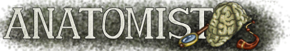

.. toctree::
   :maxdepth: 3

Anatomist developers documentation
==================================

Anatomist is written in C++ language, and has Python bindings.

.. |anadox| image:: ../html/images/program.png
  :height: 64pt
  :target: ../doxygen/index.html
.. |pyana| image:: ../html/images/program.png
  :height: 64pt
  :target: ../../pyanatomist/sphinx/index.html

Links to API docs
-----------------

|anadox| `C++ API <../doxygen/index.html>`_

|anadox| :pyanatomist:`PyAnatomist: Anatomist in Python <index.html>`

Other programming tips (C++)
----------------------------

Mainly for C++, but some things are language-independent or also appy to the low-level Python layer.

General structure
+++++++++++++++++

* Objects : :anadox:`AObject <classanatomist_1_1AObject.html>` base class
* Windows: :anadox:`AWindow <classanatomist_1_1AWindow.html>` base class
* Application and global registry : :anadox:`Anatomist <classanatomist_1_1Anatomist.html>` class
* Main control window: :anadox:`ControlWindow <classControlWindow.html>` class
* There are also a set of static :ref:`global variables, registry systems and customizable factories <dev_static_global>`

Configuration options
+++++++++++++++++++++

:ref:`Configuration options <config_options>`

Commands system
+++++++++++++++

`Commands system and commands list <../html/fr/programmation/commands.html>`_ (mainly in french...)

More or less obsolete docs
++++++++++++++++++++++++++

and in french...

* `Programming a new object type <../html/fr/programmation/new_aobject.html>`_
* `Programming a new window type <../html/fr/programmation/new_awindow.html>`_
* `Adding a new property on an object <../html/fr/programmation/new_optionTree.html>`_ (right-click and *Object specific* menus)
* `Making a new module <../html/fr/programmation/new_module.html>`_

* `Vew / controler model in Anatomist <html/fr/programmation/controls.html>`_

