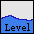
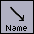

.. _ana_user_manual:

=====================
Anatomist user manual
=====================

Introduction
============

Anatomist software enables objects visualization and handling for medical imaging. These objects are various representations of anatomical and functional information coming from images (T1 MRI, activation image issued from a parametrical statistical map, PET, hemispheres mesh, fibers bundles obtained from BrainVISA tracking process, sulci graph representation extracted from a T1 MRI image...).

Features and originality of Anatomist are based on:

* Management of several types of objects: structured (sulci, ROI graphs...) or not (3D, 4D volumes, mesh ...)
* Management of coordinate systems and transformations, for instance, you can load transformation matrix to change the object coordinate systems. For example, it is possible to merge a non normalized anatomical volume and a normalized activation map (functional data), and to have a coherent display if we load the transformation from the normalized image to the non normalized anatomical image or the reverse.
* Possibility of building complex 3D scenes with several objects of any type (merging, superimposing...).
* A lot of tools: color palettes, region of interest module, mathematic morphology, manual registration (transformation control) ...

Anatomist control window (main window) enables to have a general view of loaded objects and opened windows, to choose actions for combining objects (merging...), or controls to use on windows according to contained objects. Here's Anatomist control window:

.. figure:: _images/control_window0.png

  Anatomist control window

The general purpose is to load objects (volume, ROI graph, mesh...), change their referential (coordinate system) if needed, modify their characteristics, combining them (merging, superimposing...), and put them in windows in order to visualize them.

So, here are some base principles for using Anatomist:

* Load **objects** that represent volumes, meshes ...
* These **objects** are put in **windows**  for visualization. At a more advanced level of use, it is possible to put several objects in the same windows, for example to superimpose a mesh and a volume.
* It is also possible to handle **objects** characteristics as **referential** (coordinate system) or **colors**, for example by modifying a volume's palette.
* A window offers different **control** modes according to the type of its contained objects. For example, if a window contains a ROI graph, the *selection control* will be available and will enable to select regions in the graph.

Here are some examples about typical actions in Anatomist, for example to look at a volume:

.. raw:: html

  

    

      <object type="application/x-shockwave-flash" data="_static/images/intro.swf" width="563" height="541">
        <param name="movie" value="_static/images/intro.swf"><param name="loop" value="true">
      </object>
    

    Visualize and handle a volume with Anatomist
  

Install and start Anatomist software
====================================

* Download: see the `BrainVISA web site download page <http://brainvisa.info/download.html>`_
* See also the :doc:`anatomist_tutorial`
* And the :axonman:`BrainVISA installation section <ch02.html>`

Configuration
=============

Configuration panel
-------------------

When starting to use Anatomist, you may need to configure some options. The most important is to choose (or to check if several users share the same Anatomist configuration) how to display axial and coronal views: either in radiological convention or in neurological convention.

To go to preferences pannel, click on *Settings* and on *Preferences*. Let's see the different tabs:

*Application* tab
+++++++++++++++++

  *Application* tab

* *Language*: *default* (system language) / *en* (english) / *fr* (french).
* *HTML browser command line*: the browser that will be used to see HTML documentation (firefox / konqueror ...).
* *User level*: basic, advanced or expert. Some features are available only in advanced or expert mode, for example flight simulator control and storage to memory transformation automatic loading.
* *Default referentials*: this advanced option enables to choose a default referential for loaded object and for new windows independently. By clicking on the grey button, you can choose them with:

  Default referentials configuration

*Linked cursor* tab
+++++++++++++++++++

* *Display linked cursor*: if enabled, a symbol is displayed to represent the linked cursor position when you click on a window.
* *Cursor shape*: several shapes are available (arrow, cross, multicross ...). It is also possible to load a cursor (regular Anatomist object).
* *Size*: set cursor size.
* *Cursor color*: default color is red. You can choose another color.

*Windows* tab
+++++++++++++

  *Windows* tab

* *Axial/coronal slices orientation*: selection of images display convention.
* *Default windows size*: windows zoom factor, by default the value is 1 for a volume whose voxels size is (1x1x1). So on screen, a pixel size is 1mm.

*Control window* tab
++++++++++++++++++++

  *Control window* tab

* *Display nice logo*: enable displaying of Anatomist logo on top of the main window.

*Volumes* tab
+++++++++++++

  *Volumes* tab

* *Interpolation on volumes when changing referential*: on loading a referential for an image (applying a transformation) or during a fusion, the volume is resampled by a trilinear interpolation or by the closest sibling value.
* *Use referential / transformations information found in objects headers (SPM, NIFTI...)*: if a loaded image has *spm_origin, transformations, or referentials* attributes in its header, it is possible to automatically load the corresponding referentials and transformations in Anatomist. See :ref:`Loading referential information <load_referential_info_man>` to know more about this feature.
* *Assume all "scanner-based" referentials are the same*: by default they are considered all different.

*OpenGL* menu
+++++++++++++

  *OpenGL* tab

Used in advanced level user to set the number of texture in case of graphic card problems.

Preferences validation
----------------------

To keep these preferences for further sessions, you must save them:

  *Preferences* validation

If the configuration file is shared between several users, make sure that you all use the same preferences and regularly check that your parameters haven't been changed. Indeed, if a user modifies a parameter like the  display convention (neurological or radiological), images display will change. Configuration is shared if you are identified as the same user.

Customized configuration
------------------------

You can start Anatomist with a customized configuration even if you share the same user with other people. To use a particular profile, start Anatomist with a profile name (even if it doesn't exists yet). For example:

::

  anatomist -u toto

and then save preferences to keep them for a further session.

Every profile has its own configuration directory, which is localized according to the system (*user* is the login used to connect to the computer, it can be for example your name):

* Under Linux/Mac:
  ::

    /home/user/.anatomist-toto

* Under Windows:
  ::

    C:\Documents and Settings\user\.anatomist-toto\

To start Anatomist with this profile:
::

  anatomist -u toto

Configuration file and options
------------------------------

The configuration file format and options :doc:`is decribed in this document <config_file>`

Windows
=======

A window enables to visualize one or several objects. These objects can have the same type (e.g.: 2 meshes for the brain hemispheres) or different types (e.g.: a mesh and a volume). Windows have a name, for example  ``A(2):anat.vimg``. This name means that the window is the second axial window and contains the volume ``anat.vimg``. It is possible to handle windows individually or in groups.

There are several ways to open a window:

* Menu *Windows => <window type>*
* Click on window type icon

Finding windows
---------------

When using Anatomist intensively, users often get entangled in several dozens of Anatomist windows. Windows titles and numbering is often not enough to distinguish them in the main control window and on the desktop. To help finding out the correspondance between windows listed in the control window and the actual displayed ones, there are some hints:

* Moving the mouse cursor over a window name in the main control window should highlight the corresponding view (in light blue). (this feature appeared in Anatomist 4.3).

* In the same way, when dragging objects onto windows in the control window, the target window(s) will also highlight in light blue.

* double-clicking on a window in the list will make the corresponding window to get displayed on top, and to un-iconify if it was iconified or hidden.

Windows types
-------------

Windows enable to visualize objects after their loading. Note that visualization is different from loading. Indeed, loading gives raw data that can be visualized in various way. For example, you can change the display convention without modifying the data. See :ref:`Load and display objects <load_and_display_objects>` for more details.

The table below shows the different window types.

.. |histo| image:: images/window-histogram-small.png

+-------------------+---------------------------------------------------------+
| Icon              | Description                                             |
+===================+=========================================================+
| |axial|           | 2D Axial window - Visualization of volumes.             |
+-------------------+---------------------------------------------------------+
| |coronal|         | 2D Coronal window - Visualization of volumes.           |
+-------------------+---------------------------------------------------------+
| |sagittal|        | 2D Sagittal window - Visualization of volumes.          |
+-------------------+---------------------------------------------------------+
| |oblique|         | 2D `Oblique window`_                                    |
+-------------------+---------------------------------------------------------+
| |win3d|           | 3D window - Visualization of 2D objects and 3D objects  |
|                   | (for example meshes).                                   |
+-------------------+---------------------------------------------------------+
| |browser|         | Browser - Visualization of object attributes, window    |
|                   | content or structured objects.                          |
+-------------------+---------------------------------------------------------+
| |profile|         | Profile - Visualization of grey levels range along an   |
|                   | axis.                                                   |
+-------------------+---------------------------------------------------------+
| |histo|           | Histogram - Visualization of grey levels histogram.     |
+-------------------+---------------------------------------------------------+
| |mpprofile|       | Matplotlib-based histogram                              |
+-------------------+---------------------------------------------------------+
| |mphisto|         | Matplotlib-based histogram                              |
+-------------------+---------------------------------------------------------+

Additional windows types may be provided in plugins.

2D and 3D windows are actually different modes of the same window type: you can switch from one type to another by clicking on the icons on window's top bar.

Oblique window
++++++++++++++

This type of window enables to see an oblique slice and *buckets* (set of voxels), that are displayed differently in 2D and in 3D. This window enables to keep the slice orientation as if you were in a 3D window but to display buckets as if you were in a 2D window.

The following images show the difference between 3D, 2D and oblique windows for MRI and ROI visualization:

  3D window

  Oblique window

  Axial window (2D)

Histogram, Profile, and Matplotlib-based variants
+++++++++++++++++++++++++++++++++++++++++++++++++

The "older" *Profile* and *Histogram* windows were somewat limited: interactions were not really allowed on these kind of windows. Moreover, coordinates transformations were not properly handled in *Profile* windows.

Newer modules, programmed in Python language, make use of the `Matplotlib <http://matplotlib.org>`_ library and provide newer alternatives for profile and histogram fully support interactive zooming, clicking on positions, and coordinates transformations.

Windows groups
--------------

Windows can be grouped in order to:

* Use a linked cursor specific for the group (don't forget to enable *Settings => Preferences => Linked  cursor => Display linked cursor* option).

* Handle the same object in all windows of the group: click on *View / select objects* contextual menu in a window of the group, a browser appears. Select the object in the browser. Note: by default all windows are considered to be in the same group and objects can be selected in all windows via any browser window.

**To create a windows group:**

#. Select the windows to link in the windows panel (on the right). For multiple selection, press *Ctrl* key and click.
#. Then create the group with *Windows => Link windows* menu.

**To undo a windows group:**

#. Select the group on right panel.
#. Undo the group with *Windows => Unlink windows*

Windows blocks
--------------

A windows block is a window that can contain several views.

Select the image you want to visualize. Open a 4 views block using the *Windows => Open a 4 views block* menu.

  4 views block

You can add a new window to the block by dragging the window item from Anatomist's list of windows and dropping it in the block.

To remove a window from the block, use the window menu *Window => Detach view*.

It is also possible to reorganize the block by changing the views layout, using the options in the block window menu.

Window contextual menu
----------------------

Each window has a contextual menu that appears when right-clicking on the window. The menu contents may vary according to the type of selected objects, but will generally look as this:

.. raw:: html

  <table class="docutils">
    <thead valign="bottom">
      <tr class="row-odd">
        <th> Option</th>
        <th> Description</th>
      </tr>
    </thead>
    <tbody valign="top">
      <tr class="row-even">
        <td>
          <emphasis>View / select objects</emphasis>
        </td>
        <td>
          Opens a <emphasis>browser</emphasis> window that lists the window contained objects. Enables to select an object in the list in order to handle it in the window.
        </td>
      </tr>
      <tr class="row-odd">
        <td>
          <emphasis>Unselect</emphasis>
        </td>
        <td>
          Unselects all selected objects in the window.
        </td>
      </tr>
      <tr class="row-even">
        <td>
          <emphasis>Select all</emphasis>
        </td>
        <td>
          Selects all objects contained in the window.
        </td>
      </tr>
      <tr class="row-odd">
        <td>
          <emphasis>Remove from windows of this group</emphasis>
        </td>
        <td>
           Removes selected objects from all windows of the group.
        </td>
      </tr>
      <tr class="row-even">
        <td>
          <emphasis>Remove from this window</emphasis>
        </td>
        <td>
          Removes selected objects from this window.
        </td>
      </tr>
      <tr class="row-odd">
        <td>
          <emphasis>Objects manipulations</emphasis>
        </td>
        <td>
          Shows a menu that offers some actions on selected objects.
        </td>
      </tr>
      <tr class="row-even">
        <td>
          <emphasis>Select neighbours</emphasis>
        </td>
        <td>
          This menu appears if the window contains a graph with selected nodes. Graphs are structured objects compound of nodes, which have their own properties, and relations between nodes. This menu shows and selects neighbouring nodes in the graph. It is useful to explore a region without missing a node.
        </td>
      </tr>
      <tr class="row-odd">
        <td>
          <emphasis>Select nodes of attributes...</emphasis>
        </td>
        <td>
          This menu appears when window contains a graph with selected nodes. Enables to search for nodes and select them on node attribute criterion (name...)
        </td>
      </tr>
    </tbody>
  </table>

Objects
=======

.. _objects_formats:

Objects handled by Anatomist
----------------------------

Object stands for all type of data that Anatomist can handle. This software manages volumes (T1, fMRI, ...), meshes, textures (to stick on other objects), structured objects like sulci graphs or ROI graphs. All these objects can be visualized and combined (merging, superimposing...). Some data types and formats are peculiar to Anatomist, like for example meshes (.mesh or .tri), or nomenclature (.hie).

Main objects handled by Anatomist are listed below (the list is not exhaustive because there are also merged objects, volume slices...):

.. raw:: html

  <table class="docutils">
    <thead>
      <tr class="row-odd">
        <th>Icon</th>
        <th>Anatomist data type</th>
        <th>Description and Format / Extension</th>
      </tr>
    </thead>
    <tbody>
      <tr class="row-even">
        <td></td>
        <td>
          2D, 3D and 4D volume.
        </td>
        <td>
          Formats list, non exhaustive, according to the operating system ad installed plugins:
          <ul>
            <li>
              GIS/tivoli: <tt>.ima</tt> (volume data), <tt>.dim</tt> (header file) and <tt>.minf</tt> (attributes list).
            </li>
            <li>
              Analyze (SPM): <tt>.img</tt> (volume data) <tt>.hdr</tt> (header file).
            </li>
            <li>
              NIFTI-1: <tt>.nii</tt> or <tt>.nii.gz</tt> (only one file).
            </li>
            <li>
              Genesis (old GE scanners): <tt>.adv</tt>
            </li>
            <li>
              CAPP/ECAT: <tt>.v</tt> or <tt>.i</tt>
            </li>
            <li>
              DICOM: <tt>.dcm</tt> or no extension
            </li>
            <li>
              VIDA: <tt>.vimg</tt> (volume data), <tt>.vdhr</tt> (header file) et <tt>.vinfo</tt> (attributes list).
            </li>
            <li>
              MINC: <tt>.mnc</tt>
            </li>
            <li>
              FDF: <tt>.fdf</tt>
            </li>
            <li>
              JPEG, GIF, PNG .....: <tt>.jpg</tt>, <tt>.jpeg</tt>, <tt>.gif</tt>, <tt>.png</tt> .....
            </li>
            <li>
              TIFF: <tt>.tiff</tt> or <tt>.tif</tt>
            </li>
            <li>
              OpenSlide
            </li>
          </ul>
        </td>
      </tr>
      <tr class="row-odd">
        <td></td>
        <td>Script</td>
        <td>
          Script to execute a sequence of actions. For example, a script can be a file containing commands to merge two volumes and load a specific palette. 
          Format: Anatomist history file: <tt>.ana</tt>
        </td>
      </tr>
      <tr class="row-even">
        <td></td>
        <td>Bucket</td>
        <td>
          A bucket is a set of points coprresponding for example to a region of interest, ie a voxels list (it is not possible to see the coordinates, only display is managed). 
          Supported formats:
          <ul>
            <li>AIMS bucket: <tt>.bck</tt></li>
          </ul>
        </td>
      </tr>
      <tr class="row-odd">
        <td></td>
        <td>Mesh</td>
        <td>
          Surfacic meshes ( 3D mesh of hemispheres, brain, cortex...). Polygons may be triangles, or segments (wireframe) but all formats do not support them. 
          Supported formats:
          <ul>
            <li>GIFTI: <tt>.gii</tt></li>
            <li>Stanford PLY: <tt>.ply</tt></li>
            <li>MNI obj: <tt>.obj</tt></li>
            <li>AIMS mesh: <tt>.mesh</tt></li>
            <li>AIMS tri: <tt>.tri</tt> (old)</li>
            <li>VRML1 writing (reading not supported): <tt>.vrml</tt></li>
            <li>POV-Ray writing (reading not supported): <tt>.pov</tt></li>
          </ul>
        </td>
      </tr>
      <tr class="row-even">
        <td></td>
        <td>FUSION2D Object</td>
        <td>Object created by merging objects with Fusion2D method (for example: merging two volumes).</td>
      </tr>
      <tr class="row-odd">
        <td></td>
        <td>Texture</td>
        <td>
          A texture is a list of values mapping on a mesh. Or a time-series of values. 
          Supported formats:
          <ul>
            <li>GIFTI: <tt>.gii</tt></li>
            <li>AIMS Tex: <tt>.tex</tt></li>
            <li>ERP: <tt>.erp</tt></li>
            <li><tt>.val</tt></li>
          </ul>
        </td>
      </tr>
      <tr class="row-even">
        <td></td>
        <td>FUSION3D Object</td>
        <td>Object created by merging objects with Fusion3D method (for example: merging a volume and a mesh). Texture file<!-- faire lien -->, containing data to stick on meshes.
        </td>
      </tr>
      <tr class="row-odd">
        <td></td>
        <td>CutMesh object</td>
        <td>Object created by merging objects with CutMesh method (for example: merging a volume and a mesh).
        </td>
      </tr>
      <tr class="row-even">
        <td></td>
        <td>Volume Rendering Fusion</td>
        <td>See <a href="#volumerendering">Volume rendering</a>.</td>
      </tr>
      <tr class="row-odd">
        <td></td>
        <td>PlanarFusion3D object</td>
        <td>Object (textured plane) obtained by merging a mesh slice plan (Planar mesh) and a volume. For example, in a FusionCutMeshMethod fusion between a volume and a mesh, PlanarFusion3D object will be the textured plan of the volume according to the slice plan of the mesh.
        </td>
      </tr>
      <tr class="row-even">
        <td></td>
        <td>Graph</td>
        <td>
          Structured container objects 
          Supported formats:
          <ul>
            <li>AIMS Graph: <tt>.arg</tt> (graph structure), <tt>.data</tt> directory: sulci graph, region of interest graph...
            </li>
            <li>Connectomist Bundles (see below): <tt>.bundles</tt></li>
            <li>AIMS SQLite graph (experimental): <tt>.sqlite</tt></li>
          </ul>
        </td>
      </tr>
      <tr class="row-odd">
        <td></td>
        <td>Nomenclature</td>
        <td>
          Format:
          <ul>
            <li>AIMS hierarchy: <tt>.hie</tt>
          </ul>
          A nomenclature is a hierarchy of names or labels. It enables to do hierarchical selections in a graph: you can select via the nomenclature the graph nodes that have the same name or label. For example, if you load several sulci graphs that have been labelled with the same reference nomenclature (eg. the file <tt>sucal_root_colors.hie</tt>), you can do a hierarchical selection with the nomenclature (display of the selected node and its sub-nodes for all labelled sulci graphs). It is also possible in a nomenclature to associate a color to <b>name</b> and <b>label</b> graph attributes. A classical example is to use a nomenclature to visualize sulci labelling (each recognized sulcus is named and the graph is associated to a nomenclature that links each label to a specific color).
        </td>
      </tr>
      <tr class="row-even">
        <td></td>
        <td>Tracts bundles</td>
        <td>
          Bundles are sets of fibers obtained from diffusion MRI imageng by a fiber tracking algorithm. They are loaded in Anatomist as graphs.  Supported formats:
          <ul>
            <li>Connectomist Bundles: <tt>.bundles</tt> (structure), <tt>.bundlesdata</tt> (raw binary data)
            </li>
            <li>Trackvis (Anatomist &gt;= 4.5): <tt>.trk</tt></li>
          </ul>
        </td>
      </tr>
    </tbody>
  </table>

Loading an object
-----------------

There are several ways to load an object in Anatomist:

* Click on menu *File => Open* and then choose the file to load with the file browser.
* Click on Open button in the main window.
* Drag and drop a file in Anatomist from a file explorer or from brainvisa database browser.

The loaded files appear in Anatomist main window's left panel.

.. note::

  It is also possible to drag and drop an object from Anatomist to a console or a file explorer in order to copy the file or the filename.

Objects attributes
------------------

Most objects are described by common attributes that give information about them. For example, a volume has attributes for voxels size, image size... Each object can also have specific attributes. To see these attributes, you can put the object in a browser |browser|.

.. note::

  Putting an object in a browser does not always enable to see its attributes, it depends on the type of the object. Indeed, a browser also enables to see the structure of complex objects, like graph nodes.

Objects visualization
---------------------

There are several ways of visualizing an object in a window (after object loading):

* Drag and drop the object on a window icon of the left menu bar (it will open a new window containing this object).
* Drag and drop the object on an already opened window.
* Drag and drop the object on an opened window icon in the right panel.
* Select the object and a window and click on *add* button in the left menu bar.
* Select the object and a window and click on *Objects => Add objects in windows* menu.

Likewise, there are several ways to remove an object from a window:

* Select the object and the window and click on *Remove* button in the left menu bar.
* Select the object and the window and click on *Objects => Remove objects from windows* menu.

Copying Objects from one window to another
++++++++++++++++++++++++++++++++++++++++++

It is possible to **copy all objects** from a window to another window: drag and drop any point of the source window border in the destination window. This will open all visible objects of the source window in the destination window.

Press the *CTRL key* during the drag and drop if you want to **copy only the currently selected objects** of the source window.

Objects menu
============

Some actions on objects are available through a right click menu. These actions depend on the type of object. Some actions are added by Anatomist plugins and may not be available in all configurations (it depends on the plugin dependencies).

* File: enables to reload, save and rename an object.
* Color: enables to change the object color. Sub menus can be palette, material and texture. See `Objects colors`_.
* Referential: enables to change the object referential. See :ref:`referential`.

For volumes:

* ROI: create an associated ROI graph. See :ref:`the ROI toolbox <roi_toolbox>` to read how to draw Regions of Interest.
* Volume rendering: use transparency to render the whole volume in a 3D window. Different tissues (or grey levels) may be assigned different opacities and colors to make them appear in 3D or disapear.

For meshes:

* Geometry
* Landmarks

For graphs:

* Display: enables to display all nodes or edges.
* Labelling
* Landmarks
* ROI

Objects colors
--------------

Colors can be changed for several objects types, including: volume, texture, mesh, bucket and graph nodes. According to the object type, colors are changed by different methods:

* Mesh: *Material* modification.

* Texture: *Texturing* and *Palette* modification.

* Volume: *Palette*, *Texturing* and *Material* modification.
  *Palette* is the most commonly used. But a volume is also considered as a geometric object (a mesh representing a rectangle) with values (texture) associated to each point. So by extension, volumes have acces to mesh  (*Material*) and texture (*Texturing*) menus.

* Textured object (obtained by mesh and texture fusion): *Texturing* modification.

*Palette* sub-menu
++++++++++++++++++

The palette allows to change the color aspect of the texture part of objects. Choose *Color => Palette* in *Object-specific* menu or by right-click on the object

In medical imaging, we generally use 3D (or 4D) volumes of scalar values: each voxel represents a scalar value (or a grey level). Grey levels may be associated to colors via a palette. A palette is a table that associates colors to voxels values. Anatomist palettes can be modified using the values *min* (minimum value for the voxels of the volume) and *max* (maximum value for the voxels of the volume). Changing these boundaries modifies the field of voxels values where the palette applies. So one may "zoom" on a part of the histogram. The same applies to scalar textures mapped on a mesh.

The min and max boundaries of the palette can also be changed directly in the visualization window without opening the palette menu. The following keyboard shortcuts can be used to do so:

* *CTRL key + Right button* and move the mouse up and down: changes the max boundary
* *CTRL key + Right button* and move the mouse left and right: changes the min boundary</listitem>

A number of palettes are available and any user can add his own personal palettes.

.. note::

  The default palette for a volume is *B-W LINEAR*, and *Min* and *Max* bounds are set so that they contain 99% of histogram values.
  The default palette for a mesh texture is a *Blue-Red* gradient.

For RGB and RGBA volumes, the palette is applied to each R, G, B, A chanel.

Some textures are 2D: each mesh vertex has 2 different texture values, which may be interpreted as a 2D coordinate on a palette image. For this it is possible to use a 2D image as a palette, or to mix two 1D palettes.

  Palette window

**Palette parameters:**

+--------------------+--------------------------------------------------------+
| Palette property   | Description                                            |
+====================+========================================================+
| Available palettes | List of available palettes. You can                    |
|                    | :ref:`add your own palettes <a_add_palette>`.          |
+--------------------+--------------------------------------------------------+
| Upate mode         | Display update to have a real time update, check the   |
|                    | box *Responsive*. Else uncheck it and click on the     |
|                    | button *Update* to update display.                     |
+--------------------+--------------------------------------------------------+
| Dimension          | *1D*: the palette is considered as a line a value of   |
|                    | voxel is associated to a point (x) of the palette.     |
|                    |                                                        |
|                    | *2D*: the palette is considered as a 2D image a value  |
|                    | of voxel is associated to a point (x, y) of the        |
|                    | palette. You can choose a 2D palette in the list of    |
|                    | palettes (eg blue-red-black-dark) or composed one      |
|                    | from two 1D palettes.                                  |
+--------------------+--------------------------------------------------------+
| Min                | Associates the first color of the palette to a voxel   |
|                    | or texture value: any voxel which has a value inferior |
|                    | to this value will be associated to the first color of |
|                    | the palette.                                           |
+--------------------+--------------------------------------------------------+
| Max                | Associates the first color of the palette to a voxel   |
|                    | or texture value: any voxel which has a value superior |
|                    | to this value will be associated to the last color of  |
|                    | the palette.                                           |
+--------------------+--------------------------------------------------------+
| Bounds             | These are the min and max values of the graphical      |
|                    | min/max sliders just above.                            |
+--------------------+--------------------------------------------------------+
| Reset values       | Sets automatically computed values for min and max     |
|                    | (take into account 99% of the histogram values).       |
+--------------------+--------------------------------------------------------+
| Reset bounds       | Reset the bounds min = minimum value of the volume     |
|                    | voxels and max = maximum value of the volume voxels.   |
+--------------------+--------------------------------------------------------+
| Palette view       | View of the palette according to the choosen min, max  |
|                    | and bounds. It represents the colors distribution on   |
|                    | the object.                                            |
+--------------------+--------------------------------------------------------+
| Use a second       | Check it if you want to compose a 2D palette from two  |
| palette for 2D     | 1D palettes (only useful for 2D textures).             |
+--------------------+--------------------------------------------------------+
| Second palette     | List of available palettes.                            |
+--------------------+--------------------------------------------------------+
| Palettes mixing    | Choose the palettes mixing method:                     |
| method             | :term:`geometric fusion` or :term:`linear fusion`      |
+--------------------+--------------------------------------------------------+
| Palette 1D mapping | If the palette has actually 2 dimensions, that is to   |
|                    | say it contains 2 or more lines, but the object        |
|                    | texture has only one dimenstion, this option is the    |
|                    | way of extracting information form this palette.       |
|                    |                                                        |
|                    | *FirstLine*: Keep only the first line of the 2D        |
|                    | palette.                                               |
|                    |                                                        |
|                    | *Diagonal*: Take values along the diagonal of the 2D   |
|                    | palette.                                               |
+--------------------+--------------------------------------------------------+
| Mixing factor      | Enables to change linear combination between the two   |
|                    | palettes if you chose the linear fusion mode.          |
+--------------------+--------------------------------------------------------+

*Set distinct palette* sub-menu
+++++++++++++++++++++++++++++++

When using this menu, Anatomist tries to set an appropriate palette to the object according to its content and to the other loaded objects. For example, Anatomist will choose a one-color palette for a binary image, and a palette with colors distinct from other objects palettes to enable easy combinations of objects.

*Show/Hide palette* sub-menu
++++++++++++++++++++++++++++

This menu enables to display the object's palette near the window which contains it. When clicking again on the menu, the palette is hidden.

*Gradient palette* sub-menu
+++++++++++++++++++++++++++

The palette menu only permits to select an already defined palette and to change its bounds. This new menu enables to create your own palette. The gradient palette edition window show the palette as gradients on RGB + opacity channels. For each channel, you can change the curve. By default each channel function is linear and the result is a gray gradation palette.

It is possible to save the palettes created with this tools. If you save the palette as described :ref:`here <a_add_palette>`, the palette will appear in Anatomist's list of palettes the next time you will start it.

*Material* sub-menu
+++++++++++++++++++

This menu applies to mesh part of objects. Choose *Color => Material* in *Objet-specific* menu or by right-clicking on the object.

**Material:**

+-----------------------+-----------------------------------------------------+
| Option                | Description                                         |
+=======================+=====================================================+
| Quick selection       | Adjustment of the color (or light) and opacity in   |
|                       | each point of the mesh.                             |
+-----------------------+-----------------------------------------------------+
| Advanced adjustments: | Ambient light adjustment.                           |
| Ambient               |                                                     |
+-----------------------+-----------------------------------------------------+
| Advanced adjustments: | Same as *Quick selection* panel.                    |
| Diffuse               |                                                     |
+-----------------------+-----------------------------------------------------+
| Advanced adjustments: | Adjustment of the light emitted by the object.      |
| Emission              |                                                     |
+-----------------------+-----------------------------------------------------+
| Advanced adjustments: | Adjustment of the reflection light seen in front of |
| Specular              | the object.                                         |
+-----------------------+-----------------------------------------------------+
| Advanced adjustments: | Inverse of the reflection extent. If the cursor is  |
| Reflection extent     | set to the maximum, it shows a "plastic" effect,    |
|                       | otherwise if the cursor is set to the minimum, it   |
|                       | appears more "metallic".                            |
+-----------------------+-----------------------------------------------------+
| Advanced adjustments: | Enable/disable automatic real-time update.          |
| Update mode           |                                                     |
+-----------------------+-----------------------------------------------------+

Texturing
+++++++++

This menu applies to the texture part of objects. Choose *Color => Texturing* in *Object-specific* menu or by right-click on the object.

**Texture mapping modes:**

+-------------+---------------------------------------------------------------+
| Option      | Description                                                   |
+=============+===============================================================+
| Geometric   | RGB channels multiplication (between texture and mesh). White |
|             | color is the 'neutral element'.                               |
+-------------+---------------------------------------------------------------+
| Linear      | RGB channels addition weighted by a coefficient.              |
+-------------+---------------------------------------------------------------+
| Replacement | Only the texture is used and it replaces the mesh color (or   |
|             | previous texture when there are multiple textures).           |
+-------------+---------------------------------------------------------------+
| Decal       |                                                               |
+-------------+---------------------------------------------------------------+
| Blend       |                                                               |
+-------------+---------------------------------------------------------------+
| Add         | RGB channels addition.                                        |
+-------------+---------------------------------------------------------------+
| Combine     |                                                               |
+-------------+---------------------------------------------------------------+

**Texture generation (rarely used option - this generates new texture coordinates on-the-fly):**

+-------------------+---------------------------------------------------------+
| Option            | Description                                             |
+===================+=========================================================+
| None              | No texture generation applied.                          |
+-------------------+---------------------------------------------------------+
| Linear-object     | The texture is fixed in relation to the object.         |
+-------------------+---------------------------------------------------------+
| Linerar-eye       | The texture is fixed in relation to observer's eye.     |
+-------------------+---------------------------------------------------------+
| Sphere reflection | The texture is reflected around the object.             |
+-------------------+---------------------------------------------------------+
| Reflection        | The texture is side reflected.                          |
+-------------------+---------------------------------------------------------+
| Normal            | The texture is reflected in relation to the object      |
|                   | normal vectors.                                         |
+-------------------+---------------------------------------------------------+

**Options:**

+-------------------+---------------------------------------------------------+
| Option            | Description                                             |
+===================+=========================================================+
| Mixing rate       | Mixing rate for the *Mapping mode*                      |
+-------------------+---------------------------------------------------------+
| Texture filtering | Enable/disable filtering.                               |
+-------------------+---------------------------------------------------------+

Controls
========

.. _d_ctr:

What is a control ?
-------------------

A control defines the way mouse and keyboard act on a window or an object. It can also be associated to a toolbox (regions of interest drawing for example). According to the type of objects contained in the window, some action modes can be disabled. For example, the selection mode has no effect on a volume because there are no areas to select on a volume. But you can select areas in a ROI graph (graph nodes).

.. note::

  Some controls are available only on *selected* objects. You can select objects in a window via the right click menu *view / select objects*.

.. _d_ctr_def:

Default control
---------------

*Icon* : |fb_trackball|

*Description* : Default control enables to use the linked cursor, to zoom in, to rotate...

.. figure:: images/fb_mtrackball.png

  *Default control* keyboard shortcuts

Linked cursor
+++++++++++++

Camera: rotation, zoom, translation
+++++++++++++++++++++++++++++++++++

View setup
++++++++++

Fullscreen, hiding tools and menu...

Objects
+++++++

removing objects: *DEL key*

Slices and time handling
++++++++++++++++++++++++

Colormaps handling
++++++++++++++++++

Selection control
-----------------

*Icon* : |fb_select|

*Description* : Select graph nodes, rotate...

.. figure:: images/fb_mselect.png

  *Selection control* keyboard shortcuts

Selection
+++++++++

The selection control allows to "select" objects in Anatomist windows by clicking on them in 3D views. Selected objects become highlighted, and can then be used for specific operations.

The default highlighting of selected object changes their color in 3D visualizations, using a red color (by default), and displays a bounding box wireframe around selected objects. Alternative selection highlighting can be chosen, either in the "graph parameters" windows (accessed via the menus of the main window), or via extension modules, in a specific tools panel in the controls parameters box (accessed via the F1 key in 3D views), in the "selection" tab. Highlighting can then be displayed by outlining selected objects, an/or by drawing a parallelepipedic box around seleced objects.

When selecting graph nodes, specific options can decide whether to also show graph relations attached to selected nodes. These are controlled in the selection tab of the controls tools window. In "Basic" mode, relations are not handled by the selection control. In "Intersection" mode, relations linking selected nodes are displayed. In "Union" mode, relations attached to any of the selected nodes are displayed. This graph relations display mode can be useful for complex graphs carrying multimodal structural relational data, such as fibers connecting cortical regions.

Labels copy/paste tool
++++++++++++++++++++++

The selection control also brings access to a ROI and sulci renaming tool: labels can be picked on a selected "graph" node (using the space key), and pasted onto other selected nodes (from the same graph or another one), using the ctrl+return key combination. The current which has been copied is visible on the top toolbar button.

Graph labels display as text
++++++++++++++++++++++++++++

The A key activates (or desactivates) a "graph annotation" mode, which displays the labels of the regins in a graph as text in 3D.

  Graph "annotation" mode

Oblique view control
--------------------

*Icon* : |fb_oblique|

*Description* : Creates oblique view by rotating the slice plan.

.. figure:: images/fb_moblique.png

  *Oblique view control* keyboard shortcuts

Flight simulator control
------------------------

*Icon* : |fb_flight|

*Description* : Available in expert mode only. It enables to change the point of vue with the keyboard.

  *Flight simulator control* keyboard shortcut.

.. _d_ctr_transformation:

Transformation control
----------------------

*Icon* : |fb_control_transfo|

*Description : *Enables to move an object in a view in order to make manual registration. It can be useful to initialize a registration method with translation parameters. You can get theses parameters in the .trm file obtained from this registration. See the part :ref:`manual registration <manual_registration>` for more details.

.. figure:: images/fb_mcontrol_transfo.png

  *Transformation control* keyboard shortcuts

Hand-drawing of Regions of Interest (ROI)
-----------------------------------------

*Icon* : |fb_draw|

*Description* : See the part :ref:`ROI drawing toolbox <roi_toolbox>` for more details.

  *ROI drawing control* keyboard shortcut

Threshold ROI drawing mode under connectivity to clicked point constraint
-------------------------------------------------------------------------

*Icon* : |fb_level|

*Description* : Opens the ROI toolbox. Use the Connectivity threshold tab to define min and max bounds for the voxels to select.

  *Threshold ROI drawing keyboard shortcuts*

ROI design by discriminating analysis
-------------------------------------

*Icon* : |fb_dynsegment|

*Description* : Opens the ROI toolbox. Use the DynSegment tab to fix parameters. This is usable on dynamic data only.

  *ROI design by discriminating analysis* keyboard shortcuts

ROI drawing mode by label selection
-----------------------------------

*Icon* : |fb_name|

*Description* : selects region according to their labels.

  *ROI drawing mode by label selection* keyboard shortcuts

Surface paint module
--------------------

*Icon* : |palette|

*Description* : This control appears when a mesh is opened in a 3D window using the |sulci| button in Anatomist main window. It is available when the mesh object is selected. See the part about the :ref:`Surface paint module <surfpaint_man>` for more details.

.. _d_ctr_meshcutting:

Mesh cutting control
--------------------

*Icon* : |control-cut|

*Description* : available only if a cut mesh is selected (cut mesh is obtained by fusion between a mesh and a volume). It controls the slice on a cut mesh.

.. figure:: images/mcontrol-cut.png

  *Mesh cutting control* keyborad shortcut

.. _d_ctr_foldsplit:

Fold split control
------------------

*Icon* : |control-foldsplit|

.. figure:: images/mcontrol-foldsplit.png

  *Fold split control* keyborad shortcuts

This specialized control allows to manually cut a sulci graph node into several parts. It can be done by selecting a single point (by clicking on a sulcus node at the desired position), or by selected several points which will be linked to form a cut line: Ctrl + left click sets points (the order is important), then the S key proposes a split line joining the selected points. When a split line (purple voxels line) is proposed, the user can validate and actually split by hitting (or re-hitting) the S key. Actions can be aborted before the split is actually done, by hitting the ESC key.

A more automatic mode allows to automatically subdivize large nodes: clicking on a node with Ctrl + right click will subdivize a single node.

Shift + right click on any node of a graph will apply the automatic subdivizion of all large nodes of a graph.

Note that after splitting, nodes are not automatically remeshed, graph relations have been altered, and all morphometric measurements on altered nodes are out of date. To be usable for sulci recognition and morphometry, the graph should go through an update process, which is available in BrainVISA.

=========================
Anatomist user manual (2)
=========================

This document is continued here:

:doc:`anatomist_manual2`

=======================
Complementary resources
=======================

Anatomist Frequently Asked Questions (FAQ)
==========================================

:doc:`faq`

Glossary
========

:doc:`glossary`

