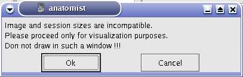
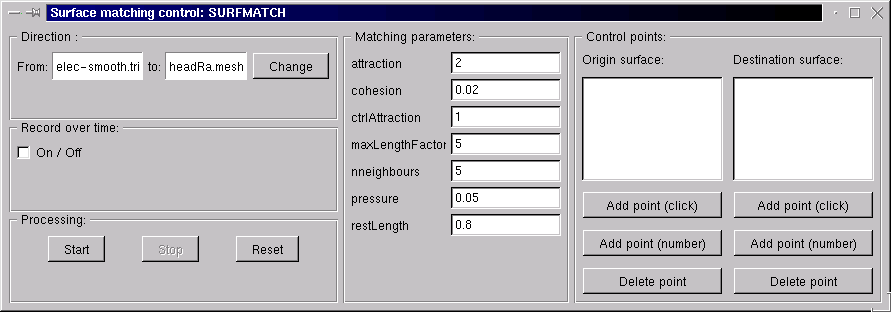

=========================
Anatomist user manual (2)
=========================

Combining objects
=================

Objects superimposing
---------------------

General definition
++++++++++++++++++

Objects superimposing consists in placing several objects in the same window. For example, you can superimpose hemispheres meshes or regions of interest with the matching anatomy (cf. examples below). So there is no specific menu to do that but you can change objects color to have a better display. For example, you can modify transparency, or lights on a mesh.

Be careful, superimposed objects must be in coherent referentials in order to get informative display. This means that if superimposed objects do not come from the same object (like hemispheres meshes that comes from a T1 MRI) or if they are non equivalent volumes (different subject, modality, point of view, voxels resolution...), you'll probably have to load trnasformations between referentials in order to put all objects in the same coordinates system.

Application: Superimposing an anatomy and regions of interest (grey central nuclei)
+++++++++++++++++++++++++++++++++++++++++++++++++++++++++++++++++++++++++++++++++++

In the following example, 3 objects are loaded in Anatomist:

* Object1 (O1): anatomy
* Object2 (O2): regions of interest graph drawn from the anatomy. So these 2 objects are in the same referential.
* Object3 (O3): nomenclature to associate colors to regions of interest according to their name. This   object does not have to be put in a window. Link between names in the nomenclature and in regions of interest is done automatically by Anatomist.

These 2 objects are in the same coordinates system, so they will be placed in the same referential, that is to say they will have the same color circle (red by default).

  Superimposing an anatomy and regions of interest

Application: Superimposing hemispheres meshes and head mesh
+++++++++++++++++++++++++++++++++++++++++++++++++++++++++++

In the following example, 3 objects are loaded in Anatomist:

* Object1 (O1): head mesh, object obtained from a T1 MRI with BrainVISA anatomical pipeline. Opacity is decreased in the example below to enable visualization of the other objects.
* Object2 (O2): right hemisphere mesh, object obtained from the T1 MRI with BrainVISA anatomical pipeline.
* Object3 (O3): left hemisphere mesh, maillage de l'hemisphère gauche, object obtained from the T1 MRI with BrainVISA anatomical pipeline.

These three objects are in the same coordinates system, so they will be placed in the same referential, that is to say they will have the same color circle (red by default).

  Superimposing hemispheres meshes and head mesh

.. _object_fusion:

Objects fusion
--------------

General definition
++++++++++++++++++

Objects fusion enables to create a new object from 2 or more other objects. Indeed, if you only put two volumes in the same window, you will see only one. To see the two volumes, you need to mix voxels from the two volumes in order to obtain a new volume. Note that fusionning more than 2 objects is only possible since 1.30 version. Besides, several new features have been added for fusion management. Several fusion combinations between objects are available,but for the moment, let's see a fusion between two 3D volumes for example:

* **STEP 1:** Load the images to merge. Here, we will fusion an anatomy and the brain mask obtained from BrainVISA anatomical pipeline.
* **STEP 2:** Select the two volumes in objects list with **Ctrl + left button**.
* **STEP 3:** Then click on fusion button  |fusion|.
* **STEP 4:** A new window pop up to select objects order and fusion type (fusion types offered differs according to selected objects, this will be detailled later, in advanced part of the manual).

.. figure:: images/fusion1.png

  Fusion type

* **STEP 5:** Click on **Ok** to create the new **Fusion2D** object.
* **STEP 6:** Put the **Fusion2D** object in a window.
* **STEP 7:** If the **Fusion2D** object is all in black, you must change fusion mode. So right click on **Fusion2D** object to get its menu. Choose **Fusion => Control 2D fusion**. This window opens:

  Fusion control

* **STEP 8:** You can change the mapping mode. The default is **Linear**: it does a linear combination of the two volumes. The **Geometric** mode does RGB channels multiplication. For linear fusions, you can set objects transparency with the cursor **Mixing rate**.
* **STEP 9:** By default, the 2 volumes will have the same palette. To change at least one, do **Right clik menu on a volume => Color => Palette**.

  Example of a linear fusion between two 3D volumes

.. note::

  It is possible to fusion more than 2 objects. For volumes, here is the method: with for example 3 volumes (V1, V2 and V3), Anatomist     actually fusion the last volume and the volume above in the list (V2 and V3 gives V23). Then, from this fusion object, it creates a new fusion with the volume above (V23 and V1 gives V23_1). To set parameters for each fusion, you have to select the fusion's second volume. For example, to set parameters for fusion V23_1, you must select V2.

.. note::

  In this example, we did not have to matter about objects referential management because the brain mask (brain_lesson1.ima) have been generated from the anatomy, so objects are in the same referential. But if we had done a fusion between an anatomical volume and an activation map (which is in another referential since this map comes from a functional volume), we would have to handle referentials to put the objects in a coherent coordinates system.

Types of fusions
++++++++++++++++

The following table shows the available types of fusion according to the type of objects. This list is extensible so all fusion types may not be in this list.

**Fusion descriptions:**

.. raw:: html

  <table class="docutils">
    <thead>
      <tr class="row-odd">
        <th>Objects</th>
        <th>Fusion name</th>
        <th>Description</th>
      </row>
    </thead>
    <tbody>
      <tr class="row-even">
        <td>
          Only one volume or 2D fusion  
          
        </td>
        <td>FusionSliceMethod</td>
        <td>
          Fusion allowing to cut a volume across itself: to view/intersect 2 different slices of the same volume in the same window.
        </td>
      </tr>
      <tr class="row-odd">
        <td>
          2 or more volumes  
          
        </td>
        <td>Fusion2DMethod</td>
        <td>
          The volumes are merged in one volume. A voxel of the resulting volume is a combination of the same voxel in each original volume.
        </td>
      </tr>
      <tr class="row-even">
        <td>
          Volume + Mesh  
          
        </td>
        <td>Fusion3DMethod</td>
        <td>
          Maps on the mesh a texture corrsponding to the volume values.
        </td>
      </tr>
      <tr class="row-odd">
        <td>Mesh + (Volume or 2D fusion)</td>
        <td>FusionCutMeshMethod</td>
        <td>
          Mesh cut by a plane: the cutting plane will have the texture of the volume slice. When you put this object in a 3D window, the "cut mesh" control is available. It enables to control the orientation of the slice (<em>shift</em>) and its position (<em>ctrl</em>) against the mesh.
        </td>
      </tr>
      <tr class="row-even">
        <td>2 textures</td>
        <td>FusionTextureMethod</td>
        <td>Creates a 2D texture from two 1D textures.</td>
      </tr>
      <tr>
        <td>Several textures</td>
        <td>FusionMulitTextureMethod</td>
        <td>Multi-texture: allows to map several textures on a mesh.</td>
      </tr>
      <tr class="row-odd">
        <td>Mesh + Mesh</td>
        <td>SurfaceMatcher</td>
        <td>
          Matching surfaces. This object gives access to a surface deformation algorithm. It tries to transform one surface into the other.
        </td>
      </tr>
      <tr class="row-even">
        <td>Mesh + Texture</td>
        <td>FusionTexSurfMethod</td>
        <td>Textured surface.</td>
      </tr>
      <tr class="row-odd">
        <td>Any object(s)</td>
        <td>FusionClipMethod</td>
        <td>
          Clipping: clips objects with a clipping plane. One side of the plane is cut and not displayed.
        </td>
      </tr>
      <tr class="row-even">
        <td>Volume or 2D fusion</td>
        <td>FusionRGBAVolumeMethod</td>
        <td>
          Converts an intensity-based volume (normally using a colormap) into a RGBA volume representation.
        </td>
      </tr>
      <tr class="row-odd">
        <td>Volume or 2D fusion</td>
        <td>VolumeRenderingFusionMethod</td>
        <td>
          Displays a volumic object in 3D using intensities transparency on the whole volume.
        </td>
      </tr>
      <tr class="row-even">
        <td>Textured mesh + another mesh</td>
        <td>Interpoler</td>
        <td>
          Allows to map and interpolate textures from a mesh to another mesh with a different geometry. To obtain reasonable results, it is recommended to use a "SurfaceMatcher" first, it will warp a surface towards the other one
        </td>
      </tr>
      <tr class="row-odd">
        <td>Mesh</td>
        <td>Fusion2DMeshMethod</td>
        <td>
          Marks the intersection line of a mesh with the view slice plane.
        </td>
      </tr>
      <tr class="row-even">
        <td>Volumes (1 to 3)</td>
        <td>VectorFieldFusionMethod</td>
        <td>
          <b>(new in Anatomist 4.6)</b> Vector field display: draw small lines at voxels locations showing the direction and intensity of a vector field. Vector components may be taken from a 4D (or more) volume, a RGB volume, or a combination of several volumes.
        </td>
      </tr>
    </tbody>
  </table>

Fusion3D parameters
+++++++++++++++++++

The 3D Fusion is a fusion between a volume and a mesh. This fusion can be parameterized through the right click menu on the fusion object.

You can change:

* Fusion mode: Geometrical, linear, rate.
* Methods of interpolation: the method to estimate the value for the intersection between the mesh and the volum at each point.

  **Interpolation methods:**

  .. raw:: html

    <table class="docutils">
      <thead>
        <tr class="row-odd">
          <th>Section</th>
          <th>Description</th>
        </tr>
      </thead>
      <tbody>
        <tr class="row-even">
          <td>Point to point</td>
          <td>
            the simplest: only the information coming from the voxel directly under the mesh vertex is used, directly. Do not use the depth and the step prameters.
          </td>
        </tr>
        <tr class="row-odd">
          <td>Point to point with depth offset (inside/outside) </td>
          <td>
            Only one voxel is taken into account, but its position is shifted along the normal to the mesh (either inside the mesh or outside), for each mesh vertex (&lt;Step&gt; is not used here).
          </td>
        </tr>
        <tr class="row-even">
          <td>Line to point </td>
          <td>
            Information is taken along the normal line, both inside and outside, with a sampling (depth and step) specified by appropriate parameters.
          </td>
        </tr>
        <tr class="row-odd">
          <td>Inside line to point</td>
          <td>
            The value corresponds to &lt;the_choosen_submethod&gt; value for the interpolation for a inside line localized at &lt;Depth&gt; and for a sampling &lt;Step&gt;
          </td>
        </tr>
        <tr class="row-even">
          <td>Outside line to point </td>
          <td>
            The value corresponds to &lt;the_choosen_submethod&gt; value for the interpolation for a ouside line localized at &lt;Depth&gt; and for a sampling &lt;Step&gt;
          </td>
        </tr>
        <tr class="row-odd">
          <td>Sphere to point</td>
          <td>
            A sampling into a sphere (depth and step parameters apply) is used to get locations in the 3D volume
          </td>
        </tr>
      </tbody>
    </table>

* Submethods: This only applies to interpolation methods that are not single-voxel (such as point to point methods)

  **Interpolation sub-methods:**

  .. raw:: html

    <table class="docutils">
      <thead>
        <tr class="row-odd">
          <th>Section</th>
          <th>Description</th>
        </tr>
      </thead>
      <tbody>
        <tr class="row-even">
          <td>Max</td>
          <td>
            The maximum value of all voxels of the volume at the sampled locations is mapped on the mesh
          </td>
        </tr>
        <tr class="row-odd">
          <td>Min</td>
          <td>
            The minimun value of all voxels of the volume at the sampled locations is mapped on the mesh
          </td>
        </tr>
        <tr class="row-even">
          <td>Mean</td>
          <td>
            Standard mean (sum of values divided by the number of locations)
          </td>
        </tr>
        <tr class="row-odd">
          <td>Corrected mean</td>
          <td>
            Only non-nul values are taken into account in the mean computation: this is more suitable for thresholded activation maps for instance to avoid blurring the mapped values.
          </td>
        </tr>
        <tr class="row-even">
          <td>Enhanced mean</td>
          <td>
            In the enhanced mean variant, a weighting of the final value is applied depending on the proportion of null values in the set of mixed values.
          </td>
        </tr>
      </tbody>
    </table>

* Parameters: definition of localization of another point to do an interpolation

  **Interpolation parameters:**

  .. raw:: html

    <table class="docutils">
      <thead>
        <tr class="row-odd">
          <th>Section</th>
          <th>Description</th>
        </tr>
      </thead>
      <tbody>
        <tr class="row-even">
          <td>Depth</td>
          <td>Position of the other point</td>
        </tr>
        <tr class="row-odd">
          <td>Step</td>
          <td>Sampling step. Always inferior to Depth.</td>
        </tr>
      </tbody>
    </table>

.. note::

  Be aware that all this is only a visualization toy and is not very robust: no real interpolation of the volume values is performed to get a continuous intersection along the mesh: especially the methods taking points along normals can produce inaccurate results on high curvature regions (produce discontinuities, map the same voxel value on several vertices etc). The sphere mode is more robust but involves an averaging (blurring) effet, and can take values outside the brain or grey matter...

.. _about-referentials:

About referentials
==================

.. _load_and_display_objects:

Load and display objects
------------------------

Loading and displaying are two different actions in Anatomist. Loading is reading data stored in memory. While displaying is visualizing the object in Anatomist windows, with maybe modifications. For example, you can load data written in radiological convention and display it in neurological convention. The display options does not change data on disk.

Axis orientation
++++++++++++++++

Axis in Anatomist  are oriented like this:

* X axis: right => left
* Y axis: anterior => posterior
* Z axis: top => bottom
* T axis: 4th dimension to visualize a volume with an adding cursor to move from volume to volume; This axis can stand for the time in functional volumes vizualisation or directions for a diffusion sequence.

Neurological and radiological convention managing
+++++++++++++++++++++++++++++++++++++++++++++++++

Reading volumes on disk
#######################

When loading a volume, data organisation is supposed to match axis organisation describe before. That is to say data is supposed to be in radiological convention. In this case, data is not modified for displaying in radiological convention.

For volumes in ANALYZE format, reading and displaying data depends on the following properties (attributes in ``.minf`` file and ``.aimsrc`` configuration file):

* Attributes *spm_normalized* and *spm_radio_convention* in .minf file of the volume (GIS format).
* ``.aimsrc`` configuration file of the user.
* ``.aimsrc`` configuration file of the site.
* ``.aimsrc`` configuration file of the package.
* By default, the SPM2 mode is used.

.. note::

  If *spm_radio_convention* attribute value is 1, data in ANALYZE format is in radiological convention on disk. Else, if *spm_radio_convention* value is 0, data is in neurological convention.

  See :aimsdata:`AIMS Configuration file .aimsrc <html/en/config.html>`.

.. _mSPM99:

What is SPM99 mode ?
####################

**The following explanations are valid only if your site / computer is configured as ours according to the flip parameter of SPM99.** So for us, non normalized volumes are in radiological convention and volumes nomralized by SPM99 are in neurological convention. That's why volumes identified as normalized volumes (according to their size in mm) are automatically flipped, to have a coherent display with data in radiological convention.

To go on working in SPM99 mode, your ``.aimsrc`` file must be configured like this:

::

  attributes = {
      '__syntax__': 'aims_settings',
      'spm_input_radio_convention': 1,
      'spm_input_spm2_normalization': 0,
      'spm_output_radio_convention': 1,
      'spm_output_spm2_normalization': 0,
  }

Volumes in analyze format are read in radiological convention (``'spm_input_radio_convention': 1``) and normalized volumes in neurological convention (``'spm_input_spm2_normalization': 0``).

**Reading normalized volumes in SPM99 mode**

As it is said before, in SPM99 mode, Aims tests the volume dimensions to see if it is normlized or not. A volume is considered as a normalized volume if its dimensions in mm are 152 < x < 165, 185 < y < 195, 130 < z < 145 or 178 < x < 185, 215 < y < 220, 178 < z < 185. In this case, the volume is supposed to be in neurological convention and it is automatically flipped at loading to display it in radiological convention.

.. _mSPM2:

What is SPM2 mode ?
###################

It is different for volumes normalized with SPM2. Indeed, there is a parameter *defaults.analyze.flip* which indicates if input data must be flipped. (for more details, see SPM2 documentation). So data normalized with SPM2 can be either in radiological convention or in neurological convention. The aim is to keep the same convention for input and output data (before and after normalization).

To work in SPM2 mode (input convention = output convention), your ``.aimsrc`` file must be configured like this if your data is in radiological convention:

::

  attributes = {
      '__syntax__': 'aims_settings',
      'spm_input_radio_convention': 1,
      'spm_input_spm2_normalization': 1,
      'spm_output_radio_convention': 1,
      'spm_output_spm2_normalization': 1,
  }

.. note::

  We will not deal with the case where input data is in radio convention and output data (normalized data) in neuro convention.

Anatomist needs make this kind of guess because there is no reliable information to indicate the convention in the Analyze format. Some header attributes have this information but it can be incorrect or out of date.

For this reason **it is strongly recommended not to use the Analyze format**, but to prefer more "modern" volume formats such as NIFTI.

Origin of volumes
+++++++++++++++++

Reading origin
##############

The origin of volumes is the voxel whose coordinates are (0, 0, 0). This voxel is located forward, on top and on the right of the volume. So, in an axial Anatomist window, this point will be at the top left corner if you keep the radiological display mode. If the origin is in mm, the origin of the volume is the centre of the voxel located at the origin.

Coordinates system
------------------

Real world sampling: coordinates in mm and in voxels
++++++++++++++++++++++++++++++++++++++++++++++++++++

Definition
##########

When loading any object (volume, mesh, ROI graph...), the real world is sampled. That is to say, the view is sampled according to the image matrix and the voxels resolution. So coordinates can be expressed in mm (real world) and in voxels (after sampling).

Mecanism
########

When you click on an object in a window, the position of the cursor appears in the console. This position is given in mm and in voxel if the object is a volume. After the position, you find the value of the voxel.

If the window contains several objects, the coordinates of each objects are displayed.

  Coordinates in mm / coordinates in voxel

Coordinates systems
###################

There are several coordinates systems (referentials) managed by Anatomist more or less automatically. That is to say some transformations can be loaded automatically either via BrainVISA, or by Anatomist. For example, if a volume is identified as a normalized volume (SPM), then the transformation toward SPM referential is loaded.

* **Object referential**: this is the real world sampled like explained before.
* **Talairach-AC/PC-Anatomist referential**: In BrainVISA Morphologist pipeline (T1 anatomical images segmentation), an affine transformation  is computed: it is based on AC and PC points indicated by the user on the anatomy.
* **Talairach-MNI template-SPM referential**: Transformation applicated if the volume is normalized.

.. note::

  Anatomist always loads a transformation from Talairach-AC/PC-Anatomist referential to Talairach-MNI template-SPM referential.

Linked cursor position
++++++++++++++++++++++

The linked cursor position is defined from the origin of the object. You can move the cursor to an exact position by fixing x, y, and z via the window menu: *Scene => Manually specify linked cursor position*. You can also use the shortcut *Ctrl + P*. You specify the coordinates in mm like this: x y z.

.. _referential:

Referentials and transformations in Anatomist
---------------------------------------------

General definition
++++++++++++++++++

A referential stands for a coordinates system and can be allocated to an object. So an object can moved from its referential to another if it exists a transformation between the two referentials. This transformation enables to change the corrdinates.

A referential can be allocated to an object or to a window. A transformation between two objects enables to align one object with the other. Whereas a transformation between an object and a window  changes the point of view for visualizing the object.

Transformation format
+++++++++++++++++++++

Anatomist manages affine transformations: translation, rotation, zoom. It uses its own ``.trm`` format. It is an ASCII file, so it can be opened and modified with any text editor. It contains a 3x3 matrix and a translation vector.

  Example of a transformation ``.trm`` file

This means:

+-------+--------+-------+
| *Tx*  | *Ty*   | *Tz*  |
+-------+--------+-------+
| *Rxx* | *Rxy*  | *Rxz* |
+-------+--------+-------+
| *Ryx* | *Ryy*  | *Ryz* |
+-------+--------+-------+
| *Rzx* | *Rzy*  | *Rzz* |
+-------+--------+-------+

This format defines a translation *T* and a rotation matrix *R*. Let *R1* the refenential of a first volume and *R2* the referential of a second volume. The file ``R1_TO_R2.trm`` specifies a transformation that moves from *R1* to *R2*. So we have the following relation between coordinates of the two referentials: ``X2 = R *  X1 + T``. This can also be written using a classical 4x4 matrix, where *T* is the 4th column.

The name of transformation file is generally ``*TO*.trm`` where each ``*`` is a referential. For example: ``refimage_TO_Talairach.trm``. These transformations apply between two referentials  and modifies only display of corresponding objects. Data on disk is not modified.

Referential of an object
++++++++++++++++++++++++

Definition
##########

Each object has an associated referential. Referentials are useful to compare objects. Without referentials each objects would be in its own coordinates system (sampling of the real world according to volume dimensions and voxels size) and objects coming from different modalities or acquisition would not be comparable. With identified referentials and transformations to move from one to another, it is possible to put objects in the same referentials in order to superimpose or merge them in a consistent way.

Why changing the referential of an object, and how ?
####################################################

**Why:**

* Put an object in a new referential and load a transformation to another object in order to compare the two objects. For example, you have registered an fMRI to a T1 MRI and obtained a transformation file. You can use this transformation to visualize the two original images in a consistent way: put each object in a referential and load the transformation from fMRI referential to T1 MRI referential.

* Put a new object (o1) in the referential of another object (o2) which has already a transformation to the referential of a third object. In this case o1 and o2 are supposed to be in the same coordinate system. For example, o1 can be a mesh obtained from the anatomy o2.

**How:** Click on the object and select *Referential => Load* And then choose an existing referential or create a new one if needed.

Referential of a window
+++++++++++++++++++++++

Definition
##########

Each window is associated to a referential. This referential is used to visualize objects. If the referential of the window is different from the referential of the containing objects, it can change the point of view if there is a transformation between the two referentials.

Why changing the referential of a window, and how ?
###################################################

**Why**: For example to see several anatomical MRI in the same referential, Talairach-AC/PC-Anatomist based on AC and PC points defined in the process **Prepare subject** of BrainVISA.

**How:**

* Click on the colored bar indicating the referential. See the figure below:

  .. figure:: images/ref_fen1.png

    Modifying the referential of a window (1)

* A new window opens and you can create a new referential or choose an existing one:

  .. figure:: images/ref_fen2.png

    Modifying the referential of a window (2)

Managing referentials and transformations
+++++++++++++++++++++++++++++++++++++++++

Most of the management is done using the **Referentials window**. To open it, use the menu *Settings => Referential window*.

* In this window, referentials are displayed as colored spheres.
* Two special referentials are always present: the *Talairach-AC/PC-Anatomist* referential, whish is displayed as the red icosahedron, and the *Talairach-MNI template-SPM* referential, which is light blue.
* transformations are displayed as arrows joining the referential spheres.
* Implicit transformations (combining several explicit transformatons) are displayed in light.

The windows displays a 3D view with similar interactions as regular Anatomist 3D windows:

* the middle button rotates the view
* *shift + middle button*, or mouse wheel, controls the zoom
* *control + middle button* translates the view
* *right button* opens a popup menu

Anatomist older than 4.6 was using a 2D view with colored circles. This view is still present, it can be switched using the popup menu "legacy 2D view", but the 3D view is likely to be clearer.

When the mouse gets over a referential (sphere) or a transformation, the corresponding object is highlighted, and information about it is displayed on an overlay on the window:

Info display can be toggled on or off by pressing the ``I`` key.

In this view, implicit transformations are present and are visible in very light colors: they can also display information and be used for interactions.

Interacting with referentials and transformations can be done in several ways:

* by using the popup menu while the mouse cursor is over the background: allows to create referentials, load transformations with referential information, clear unused or duplicate referentials...
* by using the popup menu while the mouse cursor is over a referential: allows to delete the referential, load its information, duplicate it, or show objects in this coordinates system.
* by using the popup menu while the mouse cursor is over a transformation: allows to delete the transformation, load a different transformation matrix, invert it, or merge the referenrtials linked by this transformation.
* by dragging with the mouse a link between two unlinked referentials: allows to load a new transformation from a ``.trm`` file.
* by dragging with the mouse and *control* key pressed, a link between two unlinked referentials: allows to create an identity transformation between two referentials.
* by dragging with the mouse and *shift* key pressed, a link between two referentials, either unlinked or linked by an identity transfortmation: allows to merge both referentials into a single one.

These actions are detailed a bit more below.

* When many referentials are present in the view, it is sometimes not so easy to distinguish all transformation arrows. It can be useful to rotate the view, or to rearrange the referentials positions. This can be done by pressing the ``F5`` key. Referentials positions are taken randomly, then optimized by a placement algorithm which tries to limit arrows crossings for explicit transformations.

* Alternately the 3D view can arrange referentials on a "semi-flat" map (the default), or around a sphere. Switching between modes can be done using the background popup menu, or by pressing ``S`` (sphere) or ``F`` (flat). In sphere mode, ``F5`` also rearranges the referentials positions around the sphere.

Loading a transformation between two referentials
#################################################

To load a transformation between two referentials:

* open the referentials window
* To load the transformation, draw an arrow with the mouse from one referential to the other (take care of the direction). While dragging, a semi-transparent brown arrow will be drawn. If the mouse cursor gets over an incompatible referential (already linked to the source referential), the drawn arrow will become more transparent.
  Then a file dialog opens and you select the transformation file.
* Windows and objects associated to these referentials are updated.

Actions on transformations: delete, save...
###########################################

The transformation menu is available by right click on the arrow representing the transformation (in the window *Settings => Referential window*). Here is this menu:

* **Delete transformation**: deletes the transformation between the two referentials.
* **Invert transformation**: inverts the direction of the transformation.
* **Reload transformation**: enables to change the transformation information by choosing a .trm file.
* **Merge referentials**: only enabled if the transformation is **identity**, in which case both referentials represent the same coordinates system, and can be merged into a single one.
* **Save transformation**: saves the transformation in a file. Used in transformation control (manual registration).

Creating an identity transformation between two referentials
############################################################

In many cases we have to tell Anatomist that two distinct, existing, unlinked, referentials, are actually in the same coordinates system. We can draw an **identity** transformation between them.

To do so, draw an arrow with the mouse from one referential to the other, while maintaining the *Control* key pressed. While dragging, a semi-transparent purple line will be drawn. If the mouse cursor gets over an incompatible referential (already linked to the source referential), the drawn line will become more transparent.

Merging two referentials
########################

This can be done between two referentials which are not linked (neither directly nor indirectly), or which are linked by an **identity** transformation. This will tell Anatomist that both are in the same coordinates system, and that we will merge them into a single one. Transformations between them and other referentials will be preserved.

To do so, draw an arrow with the mouse from one referential to the other, while maintaining the *Shift* key pressed. While dragging, a semi-transparent green double-arrow will be drawn (it represents two referentials that will join together). If the mouse cursor gets over an incompatible referential (already linked to the source referential by a non-identity transformation), the drawn arrows will become more transparent.

Alternately, if an identity transformation already exists between the referentials to be merged, the merge action is also available on the right-click menu on the transformation.

Application: loading a transformation (coming from registration) between an anatomical volume and a functional volume.
######################################################################################################################

For example, we want to visualize an antomical image (``anat.nii``) and a functional image (``func.nii``). We need to align the volumes using a transformation matrix (previously computed ``anatTOfunc.trm``). Each volume has its own coordinates system.

* **STEP 1:** Load volumes, set a new referential for ``func.nii`` and create a linear fusion between ``anat.nii`` and ``func.nii``.
* **STEP 2:** Select the menu **Settings => Referential window**.
* **STEP 3:** Then you see the referentials window.
* **STEP 4:** Draw a line with the mouse from one referential to the other according to the direction of the transformation. A file dialog will open.
* **STEP 5:** We can see that there is a now transformation between the two referentials and that the fusion display is updated.

.. raw:: html

  
  

    

      <object type="application/x-shockwave-flash" data="_static/images/registration.swf" width="900" height="700">
        <param name="movie" value="_static/images/registration.swf"><param name="loop" value="true">
      </object>
    

    

      <video align="center" preload="auto" autoplay="false" controls>
        <source src="_static/images/registration.ogg" />
        Your browser does not support the video tag.
      </video>
    

    

      <button type="button" class="video_type_btn" onclick="return changeVideoType(event);">Flash
      </button>
    

    
    Loading a transformation between an anatomical volume and a functional volume.
  

How to get a transformation file ?
++++++++++++++++++++++++++++++++++

There are several ways to get a ``.trm`` file:

* Using Aims commands to register 2 volumes (AimsMIRegister and AimsManualRegistration).
* Using Anatomist transformation control in order to do a manual registration.
* Convert SPM ``.mat`` files into ``.trm`` files using BrainVISA processes: **fMRI => converters => SPM to AIMS transformation converter** and **fMRI => converters => SPM sn3d to AIMS transformation converter**. Only the affine part of the transformation is converted.
* You can write your own transformation file.

.. _manual_registration:

Manual registration using Anatomist transformation control
##########################################################

Example: *manual registration* between a functional volume (*Vf*)  and an anatomical volume (*Va*)

#. Load the volumes *Va* and *Vf*.
#. Fusion the 2 volumes to see their relative position.
#. Put the volume that have to be moved, *Vf*, in a window.
#. Select *Vf* in the window:

  * Right click on the window
  * Choose *View / select objects*
  * select Vf in the browser window.</para>

5. In the window containing *Vf*, click on the transformation control.
#. You can move *Vf* in its window using the keyboard shortcuts.

  **NB:** When you move *Vf*, a new referential is assigned to it. Indeed, *Vf* and *Va* are in two different referentials, and the transformation between these referentials is being computed.

  **NB:** While you are moving *Vf* and *Va*, do not forget to look at all views: axial, coronal and sagittal.

7. Save the transformation:

  * *Settings -> Referential window*
  * The referential window opens. Each referential is represented by a colored round.
  * Find the arrow betwenn Va and Vf referentials
  * Right click on it and choose **Save transformation**
  * Generally, the name is something like ``*TO*.trm``, for example ``VfTOVa.trm``

8. Edit the ``.trm`` file with a simple text editor to see the parameters of the transformation.

.. _load_referential_info_man:

Using transformation information contained in SPM/NIFTI headers
+++++++++++++++++++++++++++++++++++++++++++++++++++++++++++++++

SPM and NIFTI formats can store information about referentials and transformations in the header file. This information can be found in attributes *spm_origin, referentials, transformations*. It deals with referentials used in SPM. It can be useful to load these referentials and transformations when you have several images which are aligned in one of these referentials.

The Anatomist feature *Load information from file header* (in *object menu => referential*) loads the referentials and transformations mentionned in the header. If there is no transformation information, the feature does nothing. You can see the new referentials and transformations in the referentials window (in settings menu). The referential assigned to the object also changes. But by default, the display does not changes. Indeed, the default windows referential is *Talairach AC/PC Anatomist* and there is generally no link between this referential and the referential of the object. If there is a transformation between object's referential and another referential and you change the window's referential to this destination referential, the display will change.

If you set the user level to *Expert*, you can see another transformation when using *Load information from file header*: the transformation between the referential of the data on disk and the referential of the loaded object. This information is in the *storage_to_memory* attribute.

See also :ref:`the tutorial <load_referential_info>`

.. _roi_toolbox:

ROI drawing toolbox
===================

Practical questions
-------------------

What is the file format for ROI ?
+++++++++++++++++++++++++++++++++

Regions of interest are stored in a graph where each node is a ROI. Some attributes are associated to the graph and its nodes: the voxels size, name of each region... The file format is a couple ``.arg``/``.data``. The ``.data`` is a directory and contains data of each region. The ``.arg`` is a file and contains the graph's structure, that is to say nodes organisation.

It is also possible to export a ROI as a mask (a binary volume) using the option *Region => Export as mask* in ROI toolbox menu.

Accepted file formats to draw ROIs
++++++++++++++++++++++++++++++++++

You can draw ROI on 2D, 3D and 4D volumes.

How to open the ROI toolbox ?
+++++++++++++++++++++++++++++

You can either click on the icon |fb_roi| in a window containing a volume, or press F1 key (obviously it will work only if there is a window containing a volume).

Some rules ...
++++++++++++++

* A voxel cannot be in more than one region.
* You shouldn't draw on a volume whose voxels size is different from the one of the graph. If it occurs, Anatomist will show a warning message.

  Warning message when volume and graph voxels size are different.

* Be careful to draw in a window which is in the same referential than the volume. Indeed, the voxels are drawn in the referential of the view, so if it is not the referential of the volume, the voxels of the ROI and the voxels of the volume won't be in the same orientation.

ROI management interface
------------------------

Here is the graphical user interface to manage ROIs:

.. figure:: images/roi4_control.png

  *ROI management* interface

*Session* menu
++++++++++++++

A session is actually a ROI graph. This menu enables to create a new graph, open an existing one, closing current graph...

**Session menu:**

+---------+-------------------------------------------------------------------+
| Option  | Description                                                       |
+=========+===================================================================+
| New     | Creates a new ROI graph. The default name is created according to |
|         | the name of the selected volume in the *Image* panel. You can     |
|         | change the name of the graph using the *Save as* option.          |
+---------+-------------------------------------------------------------------+
| Open    | Loads a graph.                                                    |
+---------+-------------------------------------------------------------------+
| Close   | Closes the selected graph.                                        |
+---------+-------------------------------------------------------------------+
| Save    | Saves the selected graph.                                         |
+---------+-------------------------------------------------------------------+
| Save as | Saves and eventually renames the selected graph.                  |
+---------+-------------------------------------------------------------------+
| Clean   | Deletes all isolated voxels. If you have drawn voxels by mistake, |
|         | you can delete them using this option.                            |
+---------+-------------------------------------------------------------------+

*Region* menu
+++++++++++++

This menu enables to manage the regions of the selected graph.

**Region menu:**

.. raw:: html

  <table class="docutils">
    <thead>
      <tr class="row-odd">
        <th>Option</th>
        <th>Description</th>
      </tr>
    </thead>
    <tbody>
      <tr class="row-even">
        <td>
          New
        </td>
        <td>
          Creates a new region in the graph. The set of allowed names depends on the selected framework in the <em>FrameWork</em> option. If you want to choose your own names, use the <em>Free</em> framework (default). You can also load your own framework using the <em>FrameWork => Personal => Load</em> menu.
        </td>
      </tr>
      <tr class="row-odd">
        <td>
          Delete
        </td>
        <td>
          Deletes selected region.
        </td>
      </tr>
      <tr class="row-even">
        <td>
          Fusion
        </td>
        <td>
          Merges several regions. The following window opens and you can select the regions that have to be merged and the name of the final region among selected regions names.  
          
        </td>
      </tr>
      <tr class="row-odd">
        <td>
          Export as a mask
        </td>
        <td>
          Saves selected region as a binary mask (label volume).
        </td>
      </tr>
      <tr class="row-even">
        <td>
          Morphos Stats
        </td>
        <td>
          Displays the volume in mm3 of the selected region in the console used to run Anatomist.
        </td>
      </tr>
    </tbody>
  </table>

*Framework* menu
++++++++++++++++

This menu manages nomenclatures used to name the regions.

**Framework menu:**

+-----------------------+-----------------------------------------------------+
| Option                | Description                                         |
+=======================+=====================================================+
| Neuro, Lateral Neuro, | Pre-defined frameworks.                             |
| Sulci, Rat_wb         |                                                     |
+-----------------------+-----------------------------------------------------+
| Personal              | Enables to create and load custom nomenclatures.    |
+-----------------------+-----------------------------------------------------+
| Free                  | No selected nomencalture, each region name is given |
|                       | by the user.                                        |
+-----------------------+-----------------------------------------------------+

*Personal* sub-menu
+++++++++++++++++++

This menu manages custom nomenclatures.

+---------------+-------------------------------------------------------------+
| Option        | Description                                                 |
+===============+=============================================================+
| New           | Creates a new nomenclature for ROI graphs. First enter a    |
|               | name for the new nomenclature in a pop-up window. Then, a   |
|               | new object is created and shown in Anatomist main window.   |
|               | New sub-menus are available in the *Personal* menu:         |
|               | *Define new region*, *Modify region name* and               |
|               | *Modify region color*. One cannot define two nomenclatures  |
|               | at the same time. If you define a second nomenclature, you  |
|               | should save the first one, otherwise it will be deleted.    |
+---------------+-------------------------------------------------------------+
| Load          | Loads an existing nomenclature.                             |
+---------------+-------------------------------------------------------------+
| Save          | The nomenclature is saved in the Anatomist config directory |
|               | of the current user:                                        |
|               | ``<user_home_directory>/.anatomist/frameworks``. You cannot |
|               | choose the place to save the nomenclature.                  |
+---------------+-------------------------------------------------------------+
| Define new    | Sub-menu available on creating a new nomenclature. Enables  |
| region        | to define a new region by giving its name and color.        |
+---------------+-------------------------------------------------------------+
| Modify region | Sub-menu available on creating a new nomenclature. Enables  |
| name          | to modify the name of the current region.                   |
+---------------+-------------------------------------------------------------+
| Modify region | Sub-menu available on creating a new nomenclature. Enables  |
| color         | to modify the color of the current region.                  |
+---------------+-------------------------------------------------------------+
| Delete region | This option enables to remove the current region from the   |
| name          | nomenclature.                                               |
+---------------+-------------------------------------------------------------+

*Windows* menu
++++++++++++++

**Windows menu:**

+----------+------------------------------------------------------------------+
| Option   | Description                                                      |
+==========+==================================================================+
| Axial    | Opens an axial window containing the volume and the ROI graph    |
|          | selected in image and session panels of the ROI toolbox window.  |
+----------+------------------------------------------------------------------+
| Sagittal | Opens a sagittal window containing the volume and the ROI graph  |
|          | selected in image and session panels of the ROI toolbox window.  |
+----------+------------------------------------------------------------------+
| Coronal  | Opens a coronal window containing the volume and the ROI graph   |
|          | selected in image and session panels of the ROI toolbox window.  |
+----------+------------------------------------------------------------------+
| 3D       | Opens an 3D window containing the volume and the ROI graph       |
|          | selected in image and session panels of the ROI toolbox window.  |
+----------+------------------------------------------------------------------+

ROI painting
------------

  *Paint* tab

*Brush* panel
+++++++++++++

**Brush panel:**

+---------+-------------------------------------------------------------------+
| Action  | Description                                                       |
+=========+===================================================================+
| Brush   | * *Point*: draw one voxel at a time.                              |
|         | * *Disk*: draw a "disk" within a radius of the "brush radius"     |
|         |   size on one slice at a time.                                    |
|         | * *Ball*: draw a sphere within a radius of the "brush radius"     |
|         |   size on several slices.                                         |
+---------+-------------------------------------------------------------------+
| Brush   | Brush size in voxel or mm according to the chosen option in the   |
| radius  | *Modes* panel                                                     |
+---------+-------------------------------------------------------------------+
| Opacity | Sets the opacity of drawn ROIs. Decrease it to increase           |
|         | transparency.                                                     |
+---------+-------------------------------------------------------------------+

*Modes* panel
+++++++++++++

**Modes panel:**

+--------------+--------------------------------------------------------------+
| Action       | Description                                                  |
+==============+==============================================================+
| Line         | * *On*: outlines that you draw will be continuous even if    |
|              |   you draw rapidly.                                          |
|              | * *Off*: if you draw rapidly, lines will not be continuous.  |
+--------------+--------------------------------------------------------------+
| Replace      | * *On*: Each voxel on which you draw will be added to the    |
|              |   current region, even if it was already in another region.  |
|              |   For examle, if a voxel V is in a region A and you are      |
|              |   drawing a region B passing on voxel V, this voxel will     |
|              |   move to region B.                                          |
|              | * *Off*: a voxel which is already in a region cannot be put  |
|              |   in another one.                                            |
+--------------+--------------------------------------------------------------+
| LinkedCursor | * *On*: you can see your ROI in several views simultaneously |
|              |   while drawing.                                             |
|              | * *Off*: you cannot see your ROI in several views            |
|              |   simultaneously while drawing.                              |
+--------------+--------------------------------------------------------------+
| BrushUnit    | * *Voxel*: the unit for the brush radius size is the voxel.  |
|              | * *mm*: the unit for the brush radius size is the mm.        |
+--------------+--------------------------------------------------------------+

Mathematical morphology
-----------------------

This tab offers basic tools for mathematical morphology: operations (dilation, erosion...) realized on selected ROIs. You can choose the structuring element radius in voxels or in mm and realize 4 types of actions: erosion, dilatation, opening, closure.

  *Mathematical morphology* tab

**Structuring element radius:**

+---------------------+-------------------------------------------------------+
| Action              | Description                                           |
+=====================+=======================================================+
| Structuring element | The structuring element is a shape composed of a set  |
| radius              | of points. The center of the element is applied in    |
|                     | each voxel of the ROI. Here, the structuring element  |
|                     | is a neighbourhood with a 6-connectivity.             |
+---------------------+-------------------------------------------------------+

**Distance mode:**

+--------+----------------------------------------------+
| Action | Description                                  |
+========+==============================================+
| *mm*   | The structuring element radius is in mm.     |
+--------+----------------------------------------------+
|*voxel* | The structuring element radius is in voxels. |
+--------+----------------------------------------------+

**Mathematical morphology actions:**

+------------+----------------------------------------------------------------+
| Action     | Description                                                    |
+============+================================================================+
| *Dilation* | Outline erosion: if the structuring element placed in a point  |
|            | of the ROI has an intersection with the volume outside the     |
|            | ROI, these intersection points are added to the ROI.           |
+------------+----------------------------------------------------------------+
| *Erosion*  | Outline dilatation: if the structuring element placed in a     |
|            | point of the ROI has an intersection with the volume outside   |
|            | the ROI, this point is removed from the ROI.                   |
+------------+----------------------------------------------------------------+
| *Opening*  | Erosion then dilatation. This action enables to remove some    |
|            | little isolated regions, to smooth outline and to separate     |
|            | objects weakly linked.                                         |
+------------+----------------------------------------------------------------+
| *Closing*  | Dilatation then erosion. This action enables to remove some    |
|            | little holes and to connect objects.                           |
+------------+----------------------------------------------------------------+

Connectivity threshold
----------------------

This module enables to make a semi-automatic segmentation of a volume. You define a band of gray levels by selecting a low level threshold and high level threshold. Corresponding regions are highlighted  and added to current region when you click on them. You can also export this region as a mask.

.. figure:: images/roi7_seuilcnx.png

  *Connectivity threshold* tab

At the the histogram of the volume is displayed: the y coordinate is the frequency of a gray level and the x coordinate is its value.

**Connectivity threshold panel:**

+----------------+------------------------------------------------------------+
| Field name     | Description                                                |
+================+============================================================+
| *Bins*         | Number of bins splitting the gray levels scale.            |
+----------------+------------------------------------------------------------+
| *Ingnore under | This option enables to update the frequencies of gray      |
| low*           | levels in the histogram according to the values of *high   |
|                | level* and *low level*.                                    |
+----------------+------------------------------------------------------------+
| *Histo Image / | * *Histo Image*: show the histogram of the volume for      |
| Histo ROI*     |   which connectivity threshold is activated.               |
|                | * *Histo ROI*: show the histogram of each ROI of the       |
|                |   selected graph.                                          |
+----------------+------------------------------------------------------------+
| *Save Histos*  | Save all histograms (volume and ROIs histograms) in a      |
|                | text file. The format of this file is ``.anahis``.         |
|                | The extension is optional and the file is readable with    |
|                | any text editor. See appendix                              |
|                | :ref:`anahis format <a_fanahis>`                           |
+----------------+------------------------------------------------------------+
| *Activate      | * *Activate threshold preview*: enable this option. If     |
| threshold      |   this button is not on, none of the other action is       |
| preview*       |   available.                                               |
|                | * *Deactivate threshold preview*: disable this option.     |
+----------------+------------------------------------------------------------+
| *Low level*    | Move the cursor to set the low threshold of gray levels.   |
+----------------+------------------------------------------------------------+
| *High level*   | Move the cursor to set the high threshold of gray levels.  |
+----------------+------------------------------------------------------------+
| *Dimension*    | * *2D*: the region will be a 2D volume, it will be only in |
|                |   the selected slice.                                      |
|                | * *3D*: the region will be a 3D volume.                    |
+----------------+------------------------------------------------------------+
| *Mix method*   | * *Geometric*: geometric fusion between the volume and the |
|                |   region defined by the threshold.                         |
|                | * *Linear*: linear fusion between the volume and the       |
|                |   region defined by the threshold.                         |
+----------------+------------------------------------------------------------+
| *Mixing        | Mixing factor used for the *linear* fusion.                |
| factor*        |                                                            |
+----------------+------------------------------------------------------------+

Blob segmentation
-----------------

In a PET exam, you can use this module in order to isolate a region according to a local maximum. A *blob* is a region around a minimum or a maximum. Here is the steps of this segmentation:

* Click on a point with *Shift + left button* near an extremum.
* The algorithm searches for the closest maximum.
* From this maximum, the region grows under 2 conditions:
  * the region size must not exceed the maximum size given by the field *region max size* (in mm3).
  * the values must not be lower than the threshold given in the field *percentage of extremum*.
* When the segmentation is over, the region is displayed.
* **NB:** it can occur that the region does not contain the original voxel; in this case a warning message indicates that you have to click closer.

**Blob segmentation:**

+----------------+------------------------------------------------------------+
| Field name     | Description                                                |
+================+============================================================+
| *Region max    | Maximum volume for the blob in mm3. For example, if the    |
| size*          | voxel resolution is 4x4x4 mm (the volume of a voxel is     |
|                | 64mm3) and you set 1280 mm3, the region size is 20 voxels. |
+----------------+------------------------------------------------------------+
| *Percentage of | Percentage of the maximum value. It is possible to change  |
| extremum       | between a maximum and a minimum using keys *Shift+B* (to a |
|                | maximum) and *Control+B* (to a minimun).                   |
+----------------+------------------------------------------------------------+

ROI drawing mode by label selection
-----------------------------------

Some volumes are called *image of labels*, that is to say each part/structure of the volume is identified by a voxel value: a numerical label. For example, in the following image, the volume contains the background, the left and right hemispheres and the cerebellum. And each part is associated to a label: voxels have value 1 in the left hemisphere, 2 in the right hemisphere, and 3 in the cerebellum.

  Image of labels (displayed in radiological convention)

With this control, you can select regions according to a label. For example, if a volume *V* has the labels: 1, 2 and 3:

.. |fb_name| image:: images/fb_name.png

* Load the volume *V* in Anatomist.
* Put it in a window and click on the ROI control.
* Create a ROI graph *G* and a region *R* to store your selection.
* In the window containing the volume *V* and the graph *G*, click on the label selection control |fb_name|.
* Click on a voxel which value is the required label.
* A warning message appears if the data is huge, click on *yes* to go on.
* You will see better your region in a 3D window.
* The region *R* of the graph *G* now contains the selected region. You can store this ROI graph or export this region as a mask to get a volume.
* **NB:** in advanced use, you can substract sub-regions using the control options.

.. _surfpaint_man:

Surface paint module
====================

A surface painting module is present in Anatomist. This tool allows to draw textures on a mesh, using several drawing tools. This module has been primarily developed in the specific aim of drawing sulcal constraints to build a 2D coordinates system on the brain (see the Cortical Surface toolbox in BrainVisa), but can be used in a general way to draw any texture values.

..
  A demonstration video is available here: `Surface Paint movie <http://pages-perso.esil.univmed.fr/~le-troter/movies/files/page4-1006-pop.html>`_.

To use this module:

.. |palette| image:: images/palette.png
  :width: 24pt
.. |sulci| image:: images/sulci.png
  :width: 24pt

.. |magic| image:: images/magic_selection.png
  :width: 24pt

.. |magicbrush| image:: images/magic_pencil.png
  :width: 24pt
.. |distmap| image:: images/geodesic_distance.png
  :width: 24pt

* Load a mesh.
* Select it and click on |sulci| in Anatomist main window.
* Click on the *Ok* button on the new popup window. The options in this window are useful only to build a 2D coordinates system on the cortical surface.
* A new 3D window containing the mesh opens.
* A new control |palette| should be available in the 3D window. Select it.
* Several new icons and parameters are now available in the 3D window to allow drawing on the surface.

The following table shows the meaning of the buttons and actions in this tool:

**Surface paint module actions:**

+------------------+----------------------------------------------------------+
| Action           | Description                                              |
+==================+==========================================================+
| |stylo|          | Manual drawing on the mesh (unconstrained).              |
+------------------+----------------------------------------------------------+
| |colorpicker|    | Texture value picking tool. Click on the mesh to select  |
|                  | the texture value at the selected position. This value   |
|                  | will be used in later drawing operations.                |
+------------------+----------------------------------------------------------+
| |erase|          | Erase a drawing. Restores the initial texture values at  |
|                  | erased positions.                                        |
+------------------+----------------------------------------------------------+
| |magic|          | Fill a closed region. The points included in the region  |
|                  | are computed and shown to the user who must validate the |
|                  | drawing. A tolerance may be set to adjust the selected   |
|                  | region boundaries on continuous floating point textures. |
+------------------+----------------------------------------------------------+
| |shortest|       | Draw the shortest path between 2 points. The tool        |
|                  | suggests a path that must be validated with |valide|.    |
+------------------+----------------------------------------------------------+
| |sulci|          | Draw with anatomical constraints. The drawing path is    |
|                  | computed trying to follow the depth of the sulci.        |
+------------------+----------------------------------------------------------+
| |gyri|           | Draw with anatomical constraints. The drawing path is    |
|                  | computed trying to follow the top of the gyri.           |
+------------------+----------------------------------------------------------+
| |magicbrush|     | Magic brush. Draws on the mesh, in the same way as the   |
|                  | draw tool, but draws continuous lines by adding junction |
|                  | segments as needed.                                      |
+------------------+----------------------------------------------------------+
| |valide|         | Validate a drawing suggested by an automatic tool like   |
|                  | the magic wand or the constrained paths.                 |
+------------------+----------------------------------------------------------+
| |clear|          | Cancel a drawing suggested by an automatic tool like the |
|                  | magic wand or the constrained paths.                     |
+------------------+----------------------------------------------------------+
| |distmap|        | Distance maps tool. Click on the mesh: it will fills the |
|                  | texture with the geodesic distance to the click point    |
|                  | position.                                                |
+------------------+----------------------------------------------------------+
| |undo|           | Undo the last action, which may be either a fully        |
|                  | validated action (complete path, fill, brush stroke), or |
|                  | the last unvalidated action in a compound action (last   |
|                  | control point in a curve...)                             |
+------------------+----------------------------------------------------------+
| |redo|           | Redo the last undone action (or sub-action, see undo     |
|                  | above).                                                  |
+------------------+----------------------------------------------------------+
| |surfpaint_save| | Save the drawing in a texture file.                      |
+------------------+----------------------------------------------------------+
| Texture value    | Change the current texture value used to draw on the     |
|                  | mesh.                                                    |
+------------------+----------------------------------------------------------+
| Tolerance        | Determines the tolerance of the magic wand tool          |
|                  | selection values.                                        |
+------------------+----------------------------------------------------------+
| Tension          | Changes the smoothness of curves drawn by the geodesic   |
|                  | path tools (with constraints).                           |
+------------------+----------------------------------------------------------+

In addition to these tool buttons, and as in other Anatomist controls, several keyboard and mouse shortcuts are available in the surface paint mode: see the :ref:`SurfPaint control description <surfpaint_control>`

See also the :ref:`Surface paint module tutorial <surfpaint>`

.. _handling_graph:

Handling a graph
================

As we saw before, graphs enable to represent structured data with nodes and associated attributes. Graphs also have global attributes defining characteristics shared by all nodes, as for example voxels size. Nodes also can be linked by relations. This is used in sulci graphs to represent several units extracted from a sulcus. You can see these relations by selecting the neighbours of a node.

Graph nodes contain structures labels (for sulci and ROI graphs), which may be stored in two possible attributes, *name* and *label*. These two attributes have the same role: naming a node. Then, it is possible to make a link with a nomenclature file in order to associate a color to each value of attributes *name* or *label*.

*So, what's the use of having two different attributes with the same role ?* In some cases, we need a double identification. For example, in a automatic sulci recognition, nodes are renamed by *computer experts*. When consulting the results, you might want to rename a sulcus and keep the original identification, which is highly recommended.

Browsing a graph through its nodes
----------------------------------

Follow these steps:

* Put the graph in a 3D window.
* Right click on the window and select the menu *View / select objects*. A browser window opens.
* Then, you can select a node in the browser window, it will be highlighted in the 3D window.
* Conversely, when the selection control is active in a 3D window, clicking on a node in the 3D view will select it, both in 3D views and in browser windows. See next section for details.

If you do not want to see all the nodes of the graph because it is a big graph and you want to see only chosen nodes, you can use the object menu *Display => Add without nodes* available by right clicking on the graph. Select a window and use this feature, the graph will be loaded in the window but its nodes will not be visible. If there is no open window, Anatomist will open a new 3D window and load the graph in it. If there are several windows and none is selected, Anatomist will load the graph in each window. Then, you can use the menu *View / select objects* to select the nodes you want to see.

Selecting nodes
---------------

.. |fb_select| image:: images/fb_select.png

* Move to selection mode by clicking on the selection control |fb_select| of the 3D window containing the graph.
* Then you can **select visible nodes clicking on them**. The selected node change color in the 3D window and become selected also in the corresponding browser window. You can select several nodes keeping *ctrl* key pressed.
* You can also **select neighbours** of a node by choosing *select neighbours* in right-click menu. A node has neighbours when there are relations between the nodes. So you can select neighbours in a sulci graph where such relations exist, but generally not in ROI graph because there's no link between different regions.
* You can **undo selection** by choosing *unselect* in right-click menu. This feature undo selection for all nodes currently selected. These nodes retrieve their original color.
* Finally, it is possible to remove nodes from the window by selecting them and choosing *remove from this window* in the right-click menu.

Graph parameters
----------------

The graph parameters configuration window is available through: *Settings* => *Graph parameters*

  Graph parameters window

Graph 3D display mode
+++++++++++++++++++++

* Display triangulations: object surface is smoothed.
* Display facets: display "voxels".
* Display: display both smoothed surface and voxels.
* Display first object: nodes in a graph can be made up of several objects that can be displayed by Anatomist. For example, in a sulci graph, nodes are made up of 4 displayable objects: 3 buckets (voxels lists) and 1 mesh. By choosing this option, only the first of these objects is displayed for each node. In a sulci graph, the first object is the mesh representing the sulcus.

Colors (2D / 3D)
++++++++++++++++

* Use Nomenclature/color bindings (if any): enables to link attributes of the loaded nomenclature and of the loaded graphs.
* Use attribute Label/name: nomenclatures and graphs are linked through *Label* or *Name* attribute.
* Display Tooltips: display information tooltips when the mouse passes on objects. Afficher les bulles: affiche les bulles d'informations lorsque la souris est déplacée sur les objets.

Selection color
+++++++++++++++

* Use inverse color: the color of the object is inverted when it is selected.
* Constant color: the color of selected objects is always the same. You can change it by clicking on the colored square.

IO saving settings
++++++++++++++++++

* Default (as loaded)
* Use one file per sub-object type
* Use one file per individual sub-object
* Save only modified sub-objects
* Set sub-objects dir. from graph filename

Using nomenclatures
-------------------

Using a nomenclature file (icon: |list_nomenclature|) offers another way to browse a graph. For example, you load 2 labelled sulci graphs and the nomenclature of sulci recognition. Then you can select a sulcus by choosing its name in the nomenclature. So the choosen sulcus is displayed in each graph window.

Using a nomenclature also enables to associate a color to a *label* and/or a *name*. Thus you can standardize the display of graphs. A specific label or name will be displayed with the same color in every graph.

A nomenclature file has the ``.hie`` extension and is a simple text file.
<para>Handle a nomenclature:

* Put the nomenclature in a browser window.
* You can now select nodes in graphs by clicking on the nomenclature's nodes. It is organized hierarchically. This means that you can select all the graph nodes that are under a nomenclature name by clicking on this name. For example, if you click on the name of a lobe, all sulci in this lobe become selected. And when you click on "brain" in a sulci nomenclature, all identified sulci become selected (but not thosewith the label "unknown"). It makes it easy to visualize and select things by region.

.. note::

  Simple nomenclature files for ROIs can be created using *Nomenclature => Personal* menu in the ROIs module in Anatomist.

.. note::

  The nomenclature must match the graph type: value of *graph_syntax* attribute in the nomenclature must match the *Value* column displayed for the graph in a browser window (eg: *"CorticalFoldArg"* for a sulci graph).

Modifying the value of graph attributes and saving a new graph
--------------------------------------------------------------

You may need to modify some attributes values in a graph. For example, when you check sulci automatic recognition in a sulci graph obtained through a BrainVISA process. Indeed, during this process, each recognized sulcus is labelled using *label* attribute. Then, when you check the recognition, you can use the *name* attribute as a validation. Using the two attributes *label* and *name* enables to keep the automatic labelling and your manual labelling.

Modifying the name attribute in a node and recording a new graph:

* Load the graph.
* Put the graph in a browser window.
* Unroll the node you want to modify.
* Go to the *name* attribute.
* Right click on it to display a menu.
* Choose *Modify attribute*.
* Type a new value for the attribute.
* When all modifications are done, go to the graph in Anatomist list of objets in the main window (left panel).
* Right click on the graph and choose *File => Save* in order to save the graph with the modifications. You can choose a new name or to keep the same but in this case the original graph will be erased.

Anatomist surface matching module
=================================

Surface matcher
---------------

This module allows to drive the deformation of a mesh towards another. It was written originally to be used for EEG applications, where the EEG model (generally a sphere) needed to be matched to the subject head to get the coordinates of EEG electrodes.

* Load 2 meshes in Anatomist
* Perform a fusion of both meshes, using the "Surface matcher" mode. This results in a new *SurfMatch* object.
* Select this *SurfMatch* object contol panel via the right-click menu *Object manipulations => Fusion =>Surface matching window*.
* Open the *SurfMatch* obect tree. It contains 3 children objects:

  * the two initial surfaces
  * a new mesh: *matchsurf.mesh*. This one will be the mesh actually deforming.

* Open a 3D window
* Put the target surface and the *matchsurf.mesh* mesh in the window. At the beginning, the deforming surface os not visible (it is uninitialized, and empty).

.. image:: images/ctrl_matcher.gif
  :align: center

  Surface matcher control window. Note the antique anatomist 1.17 graphical interface... The module has not changed a lot since this age...

* select the transformation direction in the surface matching window using the *Change* button
* Click on *Reset*: the deforming surface appears, and is identical to the source mesh.
* To see a bit more clearly, it may be useful to set different color materials to the 3 meshes, and some transparency on the target mesh (decrease the alpha coef of the :ref:`diffuse material <change_opacity_mesh>`).
* Set the matching parameters in the central column, *Matching parameters*.
* If needed, add some **control points**: pairs of points directly attracted between both surfaces.
* the *Record over time* option allows to keep the whole iterative deformation sequence in the *matchsurf.mesh* mesh, in a time sequence. The sequence can be saved on disk as a regular mesh (it contains a timestep cursor). **Warning**: it may require quite much memory since all deformed mesh steps are kept in memory, especially if the source mesh contains many vertices/polygons.
* When everything is setup, the matching begins by clicking the *Start* button.
* It is possible to interactively change matching parameters, and to add or remove control points while the deformation is still processing: changes will be taken into account at the next processing step.
* When the user is OK with the result, processing can be stopped with the *Stop* button. **Note** that the processing will **not stop on its own**: there is no convergence criterion.

.. image:: images/surfmatch_3Dfinal.jpg

A deformed mesh has the same topology as the source mesh: same number of vertices and polygons, in the same order. Just the position of vertices have changed (to fit the destination mesh). Thus one can map textures suitable for the source mesh on the deformed one:

.. image:: images/surfmatch_texture.jpg

Intepolation of functional data from one surface to another
-----------------------------------------------------------

This interpolation is meant to map texture data on a mesh which is finer than the mesh it is normally associated with. Typically, map EEG data acquired on a set of electodes locations (generally 64, 128 or 256) on a head mesh with several thousands of vertices.

To work properly, the ineterpolation should use two "registered" meshes: the source mesh should be deformed to match the destination mesh geometry, which is typically done using the `Surface Matcher`_ feature.

If the matching has not been done, the interpolation will probably produce erratic and ugly results.

* Load both meshes
* Load the texture for the source mesh (functional data)
* Build a *Textured Surface* fusion between the source mesh and the functional texture (ie EEG electrodes net mesh, deformed to match the subject head, and EEG data)
* Make a second fusion between the textured surface (1st fusion) and the target mesh (ie head mesh). Select *Interpoler* mode.
* Put this *Interpoler* object in a 3D window, and change its palette

.. image:: images/ctrl_interpoler.gif
  :align: center

The interpolation is a linear one (fast and simple).

Interpolation takes place on the fly, time slider actions may be slower than on a regular texture.

.. _a_options:

Appendix: *anatomist* command options
=====================================

::

      [ -i | --input <vector of string>]  loads these files (conataining either Anatomist/AIMS objects, or .ana commands files)
      [ -p | --pipe <vector of string>]   open named pipe to read commands from (differs from normal .ana files loading in that the pipe is not closed once read,
        the pipe is reopened once flushed - using -p for a regular file results in infinite rereading of the same commands file)
      [ -b | --batch <boolean>]  batch mode: no control window (for remote control only, normally used with -p or a .ana input)
      [ -s | --server <S32>]  server mode: anatomist will listen on the given TCP port for command stream connections
      [ -u | --userprofile <string>]  user profile: all personal data will use the directory<home_dir>/.anatomist-<userprofile> rather than
        the default<home_dir>/.anatomist
      [ --enable-unstable <boolean>]  Enables unstable features which may make Anatomist badly crash (experts only) (and nobody could tell you which features this incudes)
      [ --cout <string>]        redirect outpout messages to a file
      [ --cerr <string>]        redirect error messages to a file
      [ --verbose [ <S32>]]     Set verbosity level (default = 0, without value = 1)
      [ -h | --help <boolean>]  show help message
      [ --version <boolean>]    show Cartograph version
      [ --info <boolean>]       show libraries information (install, plugins, paths, etc.)

.. _a_aims:

Appendix: Loading convention according to Aims version
======================================================

Guesses for Analyze format images

Aims version older than 2.13
----------------------------

Non-normalized images were read in radiological convention and displayed according to Anatomist configuration.

Normalized images were read in neurological convention because of SPM 99. Indeed, SPM 99 always write normalized images in neurological convention.

Aims version >= 2.13
--------------------

Since this version, normalized images are managed differently by Anatomist because of SPM 2. Indeed, images normalized with SPM2 can be in radiological or neurological convention, it depends on the source image. The output image keep the convention of the input image.

So by default, Anatomist loads and displays images in radiological convention.

A configuration file enables to modify theses loading and displaying parameter for a site or a user. For more details, see :aimsdata:`AIMS Configuration file <html/en/config.html>`.

.. _a_fscriptana:

Anatomist script files (``.ana``)
=================================

All actions done in Anatomist interface are stored in a file ``history.ana`` in your ``.anatomist`` directory (in C:\Documents and Settings\user_name under windows and /home/user_name under linux). You can save and reload this script to retrieve rapidly a session. When your session is ready (objects loaded, windows opened...), you have to save the ``history.ana`` by changing its name or copying it in another place else it will be erased the next time you start Anatomist. When you want to reload the session, start Anatomist using the anatomist command with the script filename as a parameter. For example:

::

  anatomist /tmp/history.ana

You can also load a script file by using the menu *File => Replay scenario*.

.. _a_add_palette:

Adding a new palette
====================

* Go into your ``.anatomist`` directory. It is ``C:\Documents and Settings\user_name\.anatomist`` under windows and ``/home/user_name/.anatomist`` under Unix.
* Create a directory ``rgb`` if it doesn't exist yet.
* Put the palette files in it. It can be for example in GIS or JPG format, or any image/volume format readable by *Anatomist*.
* This new palette will be available in the list of palettes in *Anatomist* when *Anatomist* is restarted. If it is aleady running, use the menu *Settings => Reload palettes*.

.. _obj_minf_properties:

Objects properties used at load time
====================================

When loading objects, the reading system loads any supported format file, then tries to read an additional ``.minf`` file, which is specific to the Anatomist/Aims/BrainVISA framework. This additional file is text-based and may contain a set of properties to be added to the loaded object. Some properties may carry information which does not fit in all file formats (like image properties, diffusion information), coordinates systems specification, or any additional property.

The .minf format may be "python dictionary" (similar to json), or XML.

Some of these properties are interpreted by Anatomist, and may bring information with objects.

.. |referential_prop_doc| replace::
  referential identifier. The referential property is the one used directly for the object coordinates system. It may be a string identifier for a known referential, or an UUID (unique identifier), with the shape "9a839283-7642-d21a-f67a-836a205be5e3" for instance. Referential identifiers may be used in transformations to handle coordinates systems. String identifiers refer to "standard" referentials, and are mostly derived from the NIFTI referentials identifiers: "Scanner-based anatomical coordinates", "Talairach-MNI template-SPM", "Talairach-AC/PC-Anatomist", "Talairach", "Coordinates aligned to another file or to anatomical truth".

.. |referentials_prop_doc| replace::
  This is a list of referentials, used as destinations for transformations. The "transformations" property should be the same size as referentials: there is a one-to-one mapping between them. The values are interpreted the same way as for referential.

.. |transformations_prop_doc| replace::
  A list of affine transformation matrices. Each of them transforms from the object referential (see the "referential" property) to another referential listed in the "referentials" property. Each transformation is given as a list of affine matrix (4x4) coefficients: 16 numbers, the matrix is written as lines.

.. |palette_prop_doc| replace::
  A dictionary of palette properties. These properties have the same syntax as the :anadev:`SetObjectPalette command <commands.html#setobjectpalette>`.
  In addition, in Anatomist 4.5 and later, palette properties can include additional information to define new, personal, palettes:

.. |colors_prop| replace::
  **colors**: list of R, G, B or R, G, B, A values, all in one line, int values between 0 and 255. Depending on the "color_mode" property, values will be grouped by 3 or 4 to form colors.

.. |color_mode_prop| replace::
  **color_mode**: "RGB" or "rgb", "RGBA" or "rgba": tells if "colors" values should have 3 or 4 chanels.

.. |image_prop| replace::
  **image**: image file name for palette. If "colors" is specified, it has priority and "image" is not taken into account in such a case. File names can be absolute, or relative to the current object file.

.. |palette2_prop| replace::
  **colors2**, **color_mode2**, **image2**: same as above for the 2nd palette, if any.

.. |material_prop_doc| replace::
  A dictionary of material properties. These properties have the same syntax as the :anadev:`SetMaterial command <commands.html#setmaterial>`

.. |texture_properties_prop_doc| replace::
  List of texture properties. Each element in the list applies to one texture (for multi-textured objects), and is a dictionary of properties. Properties are:

.. |tex_mode_prop| replace::
  **mode**: mapping mode: "geometric", "linear", "replace", "decal", "blend", "add", "combine", or "linear_on_nonnul".

.. |tex_filtering_prop| replace::
  **filtering**: texture filtering: "nearest", "linear".

.. |tex_generation_prop| replace::
  **generation**: texture generation mode: "none", "object_linear", "eye_linear", "sphere_map", "reflection_map", "normal_map".

.. |tex_rate_prop| replace::
  **rate**: mixing rate (0. - 1.)

.. |tex_interpolation_prop| replace::
  **interpolation**: color interpolation mode: "palette" (standard), or "rgb".

.. |tex_gen_params_1_prop| replace::
  **generation_params_1**:

.. |texture_filenames_prop_doc| replace::
  A mesh file may include textures specification for meshes, making it a textured mesh. The property is a list, each being a one texture filename, thus multitexturiong is allowed this way.

.. |texture_names_prop_doc| replace::
  list of names assigned to each texture read from the "texture_names" property. Texture names values "red", "green" and "blue" are used as the special case of RGB textures: in this case each is assigned to the red, green and blue channel, respectively.

+--------------------+---------------------+-------------------------------+
| Property:          | Applies to:         | Description:                  |
+====================+=====================+===============================+
| referential        | all geometrical     | |referential_prop_doc|        |
|                    | objects             |                               |
+--------------------+---------------------+-------------------------------+
| referentials       | all geometrical     | |referentials_prop_doc|       |
|                    | objects             |                               |
+--------------------+---------------------+-------------------------------+
| transformations    | all geometrical     | |transformations_prop_doc|    |
|                    | objects             |                               |
+--------------------+---------------------+-------------------------------+
| palette            | textured objects    | |palette_prop_doc|            |
|                    |                     |                               |
|                    |                     | * |colors_prop|               |
|                    |                     | * |color_mode_prop|           |
|                    |                     | * |image_prop|                |
|                    |                     | * |palette2_prop|             |
+--------------------+---------------------+-------------------------------+
| material           | geometrical objects | |material_prop_doc|           |
+--------------------+---------------------+-------------------------------+
| texture_properties | textured objects    | |texture_properties_prop_doc| |
|                    |                     |                               |
|                    |                     | * |tex_mode_prop|             |
|                    |                     | * |tex_filtering_prop|        |
|                    |                     | * |tex_generation_prop|       |
|                    |                     | * |tex_rate_prop|             |
|                    |                     | * |tex_interpolation_prop|    |
+--------------------+---------------------+-------------------------------+
| texture_filenames  | meshes              | |texture_filenames_prop_doc|  |
+--------------------+---------------------+-------------------------------+
| texture_names      | meshes              | |texture_names_prop_doc|      |
+--------------------+---------------------+-------------------------------+

Sulci nomenclature
==================

.. note::

  **TODO:** link to the Morphologist / BSA doc.

.. _a_fanahis:

``.anahis`` format: histogram data obtained via the connexity threshold tool
============================================================================

Data obtained from a T1 volume and a ROI (region1) drawn with the ROI drawing module. Bin = 10

::

      lesson1.ima histogram :
      Bin|          Color|         Number| Percentage (%)
      0|              0|    3.47895e+06|        48.9364
      1|        36.7755|         633689|        8.91373
      2|        73.5509|         448951|        6.31513
      3|        110.326|         608268|        8.55614
      4|        147.102|         906758|        12.7548
      5|        183.877|         632822|        8.90153
      6|        220.653|         369769|        5.20132
      7|        257.428|          24945|       0.350886
      8|        294.204|           4518|       0.063552
      9|        330.979|            457|     0.00642835
      10|        367.755|              7|    9.84648e-05

      lesson1_ROI histogram :  region1 Mean Value = 1915.45 Sdt Deviation = 443.36 Histogram :
      Bin|          Color|         Number| Percentage (%)
       0|              0|            229|      0.0877408
       1|          409.5|           3140|        1.20308
       2|            819|          10576|        4.05217
       3|         1228.5|          17805|        6.82194
       4|           1638|          72446|        27.7575
       5|         2047.5|          81685|        31.2974
       6|           2457|          75089|        28.7702
       7|         2866.5|             26|     0.00996184
       8|           3276|              0|              0
       9|         3685.5|              0|              0

=======================
Complementary resources
=======================

Anatomist Frequently Asked Questions (FAQ)
==========================================

:doc:`faq`

Glossary
========

:doc:`glossary`

