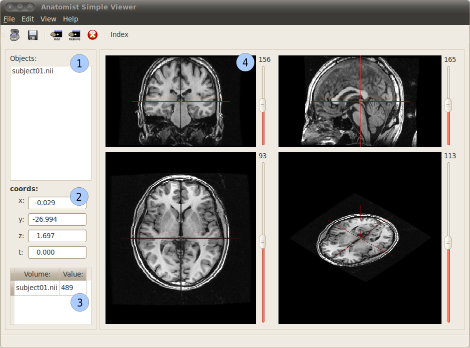
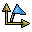

.. toctree::
   :maxdepth: 3

.. image:: images/anatomist.png
  :align: center

.. _anatomist_index:

Anatomist
=========

Official web site: http://anatomist.info or http://brainvisa.info

.. |news| image:: ../html/images/new.gif

|news| `Changelog and news <../html/en/changelog.html>`_

Getting started
---------------

Have you tried :ref:`AnaSimpleViewer <anaSimpleViewer>` ? This simplified version of Anatomist allows far less possibilities, but is simpler to manipulate, and offers a more "conventional" look.

.. |overview| image:: ../html/images/overview.png
  :height: 48pt
  :target: overview.html
.. |overview_slides| image:: ../html/images/overview.png
  :height: 48pt
  :target: ../anatomist_overview.pdf

To start in good conditions, the reader may:

* |overview| :doc:`Have a look at some overview images <overview>`
* |overview_slides| :anatomist:`Have a look at an overview presentation <anatomist_overview.pdf>`

More complete docs
------------------

.. |man| image:: ../html/images/manual.png
  :height: 48pt
  :target: ana_man/en/html/index.html
.. |tuto| image:: ../html/images/manual.png
  :height: 48pt
  :target: anatomist_tutorial.html
.. |pyana| image:: ../html/images/program.png
  :height: 48pt
  :target: ../dev_doc/index.html

|man|  :anatomist:`Manual <ana_man/en/html/index.html>`

|tuto| :doc:`anatomist_tutorial`

|pyana| :anadev:`Developers documentation <index.html>`

Quick help elements
-------------------

.. |surfmatch| image:: ../html/images/texture.jpg
  :height: 48pt
  :target: surfmatch.html
.. |roi| image:: ../html/images/roi.png
  :height: 48pt
  :target: ../ana_man/en/html/ch09.html
.. |surfpaint| image:: ../ana_man/en/html/images/geodesic_distance.png
  :height: 48pt
  :target: ../ana_man/en/html/ch10.html

`Which data formats are currently supported ? <../ana_man/en/html/ch05.html#N103BF>`_

|roi| `Regions of interest drawing <../ana_man/en/html/ch09.html>`_

|surfpaint| `SurfPaint: drawing on a surface <../ana_man/en/html/ch10.html>`_ (:ref:`tutorial <surfPaint>`)

|referentials| :anatomist:`Slides on the referentials system <anatomist_referentials.pdf>`

|surfmatch| The :doc:`Surface matching module <surfmatch>`, which is not documented in the manual.

Old illustrations...
--------------------

.. image:: ../html/images/visualize.png
  :height: 64pt
  :target: museum.html#volumes
.. image:: ../html/images/fusion.png
  :height: 64pt
  :target: museum.html#fusions-2d
.. image:: ../html/images/tms.png
  :height: 64pt
  :target: museum.html
.. image:: ../html/images/graph.png
  :height: 64pt
  :target: museum.html
.. image:: ../html/images/texture.jpg
  :height: 64pt
  :target: museum.html#surfacic

:doc:`museum`

