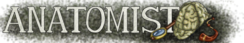
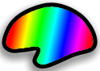

.. toctree::
   :maxdepth: 3

.. _anatomist_index:

Anatomist
=========

Official web site: http://brainvisa.info

.. |news| image:: images/new.gif

|news| :doc:`Changelog and news <changelog>`

Getting started
---------------

Have you tried :ref:`AnaSimpleViewer <anaSimpleViewer>` ? This simplified version of Anatomist allows far less possibilities, but is simpler to manipulate, and offers a more "conventional" look.

.. image:: images/anasimpleviewer.png
  :width: 400px
  :align: center
  :target: anatomist_tutorial.html#anasimpleviewer

To start in good conditions, the reader may:

* |overview| :doc:`Have a look at some overview images <overview>`
* |overview_slides| :anatomist:`Have a look at an overview presentation <anatomist_overview.pdf>`

More complete docs
------------------

.. |man| image:: images/manual.png
  :height: 48pt
  :target: anatomist_manual1.html
.. |tuto| image:: images/manual.png
  :height: 48pt
  :target: anatomist_tutorial.html
.. |pyana| image:: images/program.png
  :height: 48pt
  :target: ../dev_doc/index.html

|man|  :doc:`anatomist_manual1`

|tuto| :doc:`anatomist_tutorial`

|pyana| :anadev:`Developers documentation <index.html>`

Quick help elements
-------------------

.. |surfmatch| image:: images/texture.jpg
  :height: 48pt
  :target: surfmatch.html
.. |roi| image:: images/roi_win.png
  :height: 48pt
  :target: anatomist_manual2.html#roi-drawing-toolbox

:ref:`Which data formats are currently supported ? <objects_formats>`

|roi| :ref:`Regions of interest drawing <roi_toolbox>`

|surfpaint| :ref:`SurfPaint: drawing on a surface <surfpaint_man>` (:ref:`tutorial <surfPaint>`)

|referentials| :anatomist:`Slides on the referentials system <anatomist_referentials.pdf>`

Old illustrations...
--------------------

.. image:: images/visualize.png
  :height: 64pt
  :target: museum.html#volumes
.. image:: images/fusion.png
  :height: 64pt
  :target: museum.html#fusions-2d
.. image:: images/texture.jpg
  :height: 64pt
  :target: museum.html#surfacic

:doc:`museum`

.. toctree::
  :hidden:

  overview
  changelog
  anatomist_manual1
  anatomist_manual2
  anatomist_tutorial
  config_file
  museum
  faq
  glossary

