Museum of ancient versions of Anatomist
=======================================

Volumes
-------

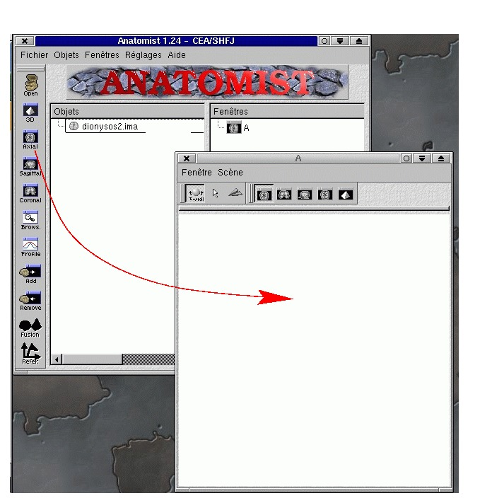

  Anatomist v1... this version had many minor "releases", but was already functional

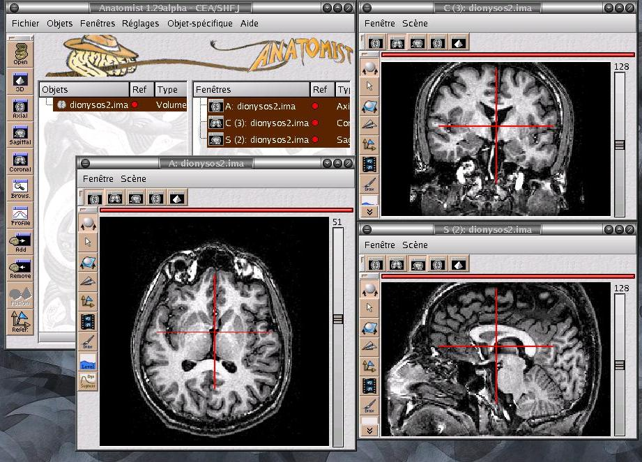
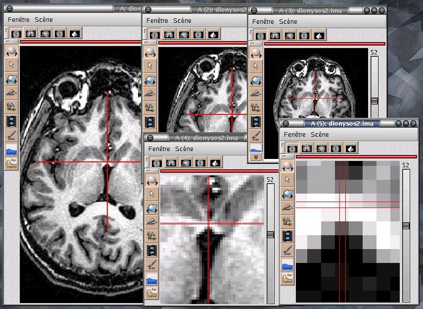
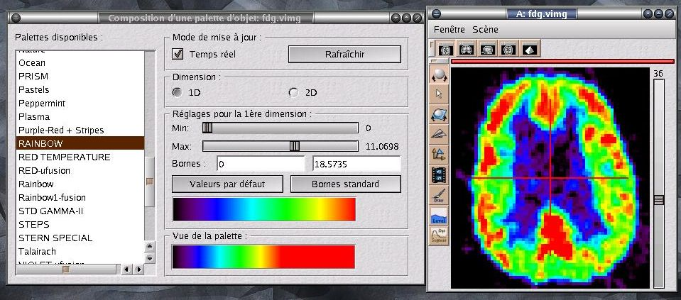
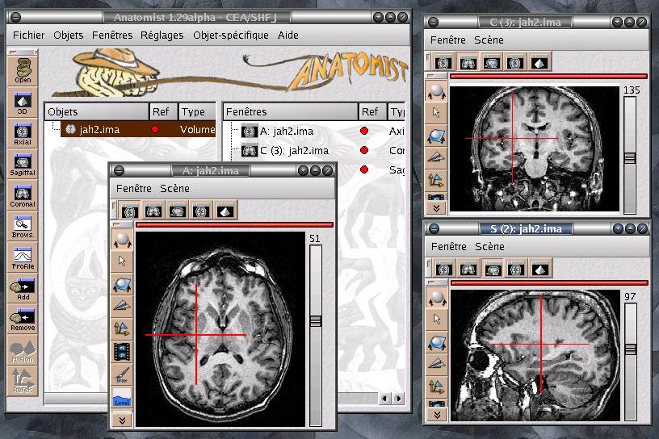
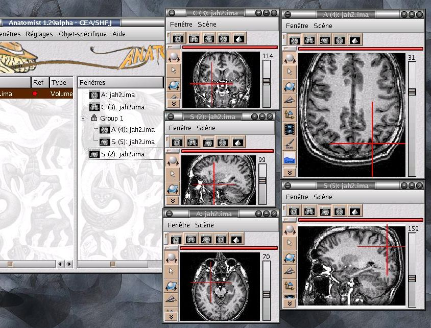
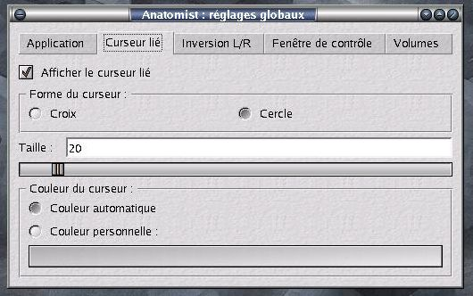
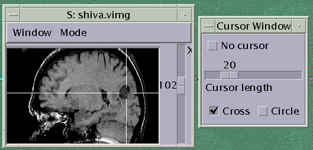
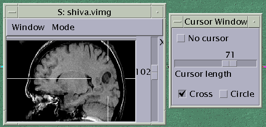
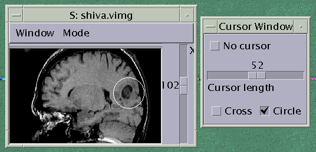

  Linked cursor, illustrated on a Sun/Solaris workstation

Fusions 2D
----------

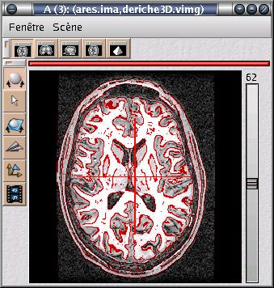
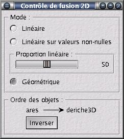

Fusion of a Deriche boundary and a T1 MRI volume

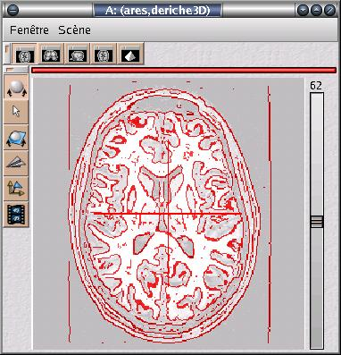
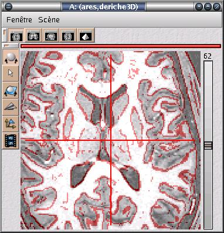
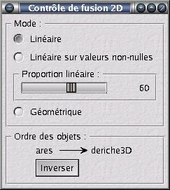

Linear fusion mode

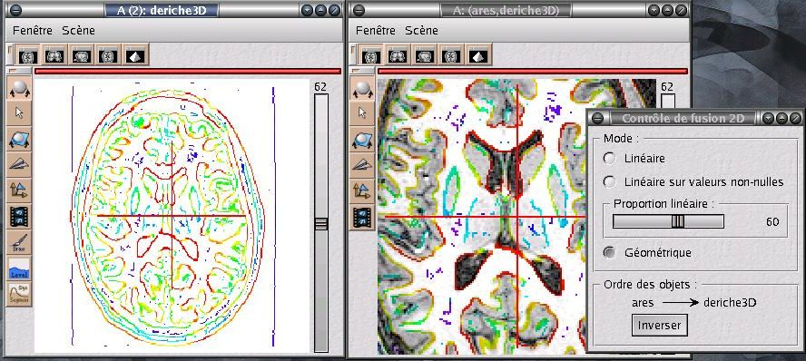

With a rainbow palette on the deriche boundaries

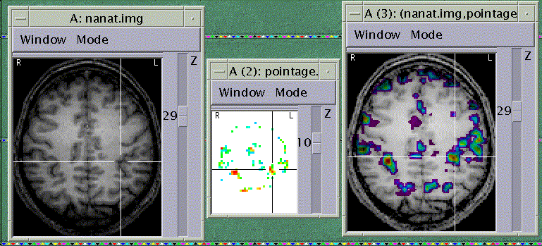

Activation map fusion (Solaris version)

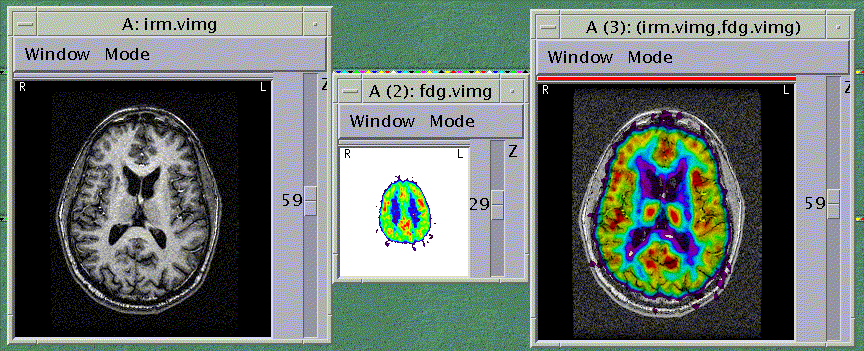
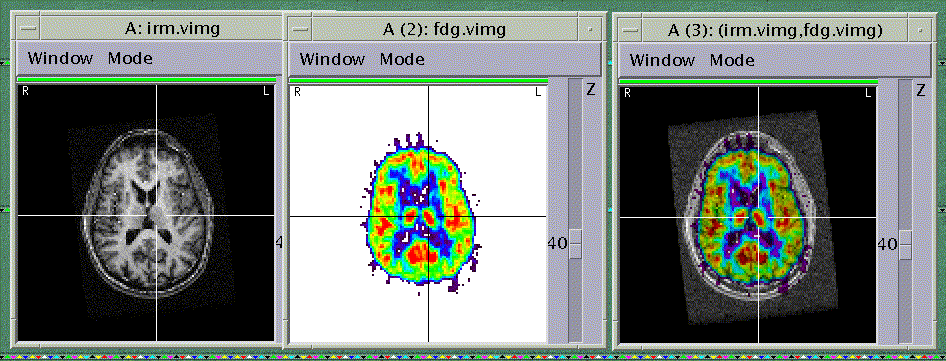
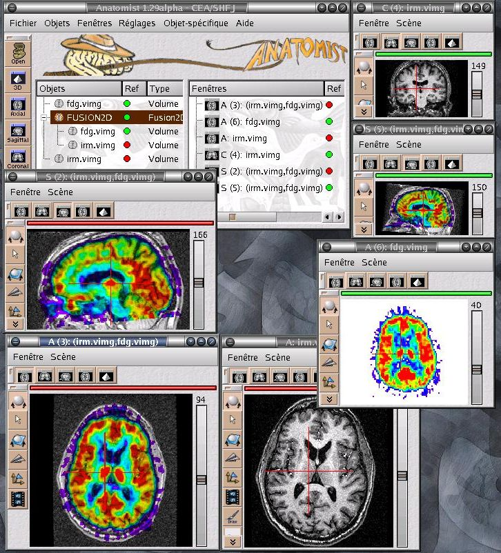

Coordinates transformations

Surfacic
--------

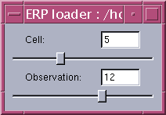

  EEG ERP loader

.. image:: images/texture/texsurface.gif
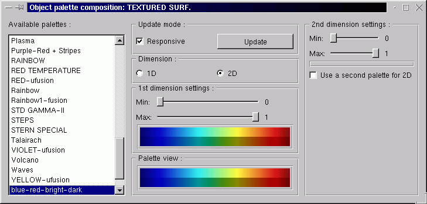
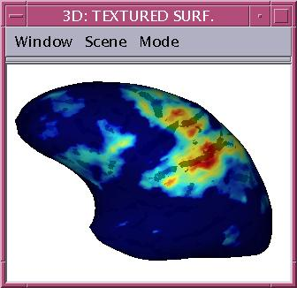

  2D texture with 2D palette

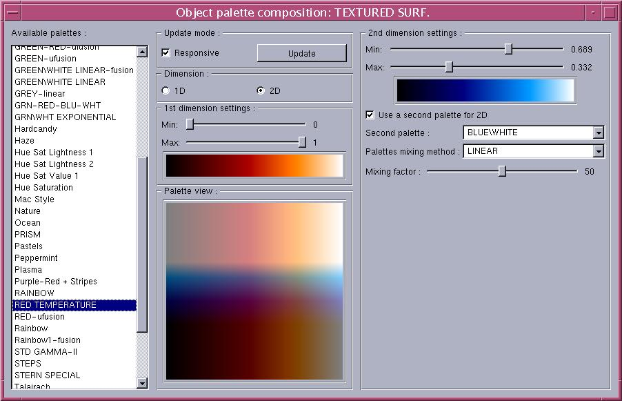
.. image:: images/texture/palette2D_2pal-cervgongl.jpg
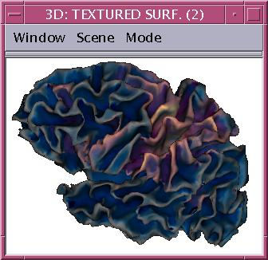

2D palette built from 2 1D palettes

