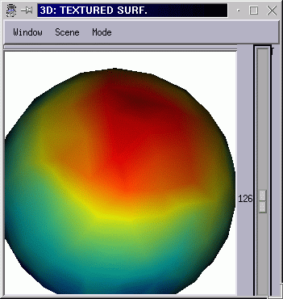

Museum of ancient versions of Anatomist
=======================================

Volumes
-------

  Anatomist v1... this version had many minor "releases", but was already functional

.. image:: images/visualize/zoom.jpg

.. image:: images/visualize/group.jpg
.. image:: images/visualize/settings_curs.jpg

  Linked cursor, illustrated on a Sun/Solaris workstation

Fusions 2D
----------

Fusion of a Deriche boundary and a T1 MRI volume

.. image:: images/fusion/linear60.jpg
.. image:: images/fusion/linear60-2.jpg

Linear fusion mode

With a rainbow palette on the deriche boundaries

.. image:: images/fusion/activation.gif

Activation map fusion (Solaris version)

.. image:: images/fusion/rouge.gif
.. image:: images/fusion/toutvert.gif

Coordinates transformations

Surfacic
--------

.. figure:: images/texture/erpLoader.gif

  EEG ERP loader

.. image:: images/texture/palette2D_1pal.gif
.. figure:: images/texture/palette2D_1pal-cervgongl.jpg

  2D texture with 2D palette

.. image:: images/texture/palette2D_2pal-cervgongl.jpg

2D palette built from 2 1D palettes

